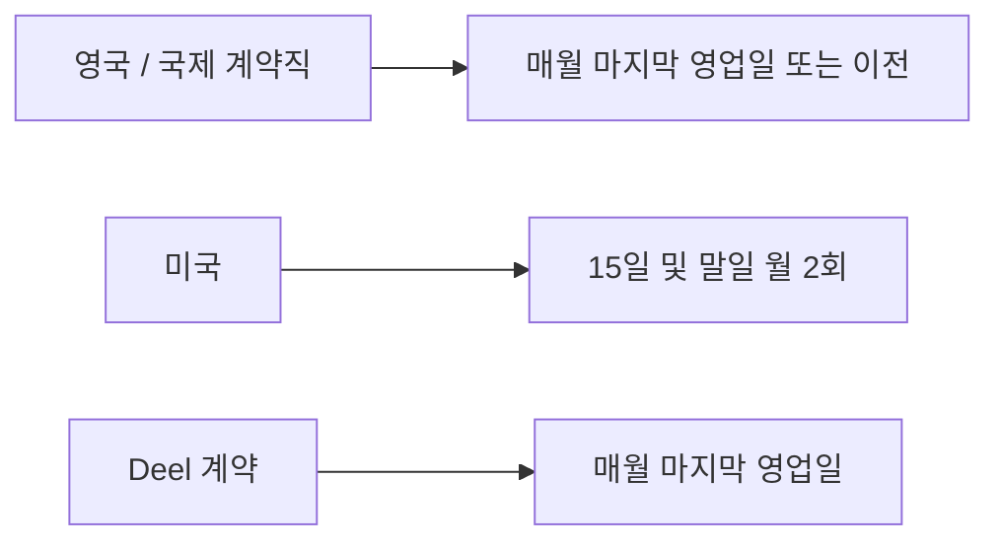

PostHog의 고용 형태, 급여 지급 일정, 수습기간, 그리고 퇴직 시 적용되는 퇴직금 정책을 정리한다.

## 고용 계약 형태

PostHog는 세 개 지역에 법인을 두고 있으며, 해당 국가 구성원은 직접 고용한다.[^1]

| 지역 | 고용 형태 |
|---|---|
| 미국 | PostHog 또는 자회사에 직접 고용 |
| 영국 | PostHog 또는 자회사에 직접 고용 |
| 독일 | PostHog 또는 자회사에 직접 고용 |
| 기타 국가 | [Deel](https://app.letsdeel.com/)을 통한 국제 고용 대행(EOR) |

- 미국·영국·독일 이외 거주자는 Deel이 공식 고용주 역할을 하며, 이는 구성원의 권리나 복지에 영향을 주지 않는다.[^2]
- 일부 경우 독립 계약직(independent contractor)으로 Deel을 통해 월별 인보이스를 발행하며, 이 경우 세금은 본인이 책임진다.[^3]
- Deel은 거의 모든 국가와 통화를 지원한다.[^4]

## 급여 지급 일정

| 지역 | 지급 주기 |
|---|---|
| 영국 | 월 1회 — 해당 월 마지막 영업일 또는 이전 |
| 국제 계약직 | 월 1회 — 해당 월 마지막 영업일 또는 이전 |
| 미국 | 월 2회 — 15일, 말일 |
| Deel (EOR) | 월 1회 — 마지막 영업일 |

[^5]

## 수습기간

### 일반 수습기간 (3개월)

입사 후 첫 3개월이 수습기간이다.[^6]

- **구성원이 종료를 원하는 경우:** 1주일 사전 통보
- **PostHog가 종료를 결정하는 경우:** 기본급 4주치 지급, 통상 당일 퇴직 처리

### 연장 수습기간 (6개월)

아래 두 경우는 6개월 수습기간이 적용된다.[^7]

| 대상 | 이유 |
|---|---|
| 영업직 (예: Account Executive) | 계약 체결 여부를 3개월 내에 판단하기 어려운 영업 사이클 특성 |
| 독일 거주 구성원 | 현지 시장 관행 및 고용 관계 종료의 운영적 어려움을 고려 |

독일 구성원의 경우 수습 중 어느 쪽이든 **1개월 사전 통보**로 계약을 종료할 수 있다.[^8]

### 수습기간 중 관리

매니저는 수습기간 전반에 걸쳐 성과를 모니터링하고 검토한다.[^9] 성과 우려 사항이 있거나 장기 적합성에 대한 의문이 있으면 즉시 구성원과 논의해야 한다.[^10]

수습기간 종료 시 별도의 합격 통보는 없다 — 30·60·90일 체크인을 통해 이미 명확히 파악한 것이 기본이다.[^11]

## 퇴직금

PostHog에서는 평균적인 성과에도 후한 퇴직금을 제공한다.[^12]

| 구분 | 내용 |
|---|---|
| 적용 시점 | 수습기간 종료 후 (일반 3개월, 영업직 6개월) |
| 퇴직금 | 기본급 **총 4개월** (법적 의무 기간 포함) |
| 조건 | 표준 퇴직 후 증명서 또는 면책 동의서 서명 |
| 독일 구성원 | 6개월 수습 완료 후 현지 법령에 따름 |

- 즉시 업무 중단 후 급여 지급으로 대체하거나 "가든 리브(garden leave)"로 처리할 수 있다.[^13]
- **자발적 퇴직:** 통상 1개월 사전 통보 (국가 법률이나 계약 조건에 따라 다를 수 있다).[^14]
- 커미션·보너스 요소가 있는 역할은 퇴직일 기준 발생분을 지급한다.[^15]
- 중대한 비위(gross misconduct)로 계약이 종료되는 경우에는 사전 통보 없이 해고될 수 있다.[^16]
- 이 정책이 현지 법과 충돌할 경우 현지 법률이 우선한다.[^17]

> **관련 페이지:** 급여 산정 구조는 [보상 체계](pages/6544a7daa7ca.md) 참고. 주식 옵션 조건은 [주식 옵션](pages/1500fc2731c7.md) 참고.

[^1]: 08-compensation.md, Contracts — "We currently operate our employment contracts in the three geographic regions where we have business entities: United States of America, United Kingdom, Germany"
[^2]: 08-compensation.md, Contracts — "If you live outside the US, the UK or Germany, we use Deel as our international employer of record. This means you are technically employed by Deel on our behalf. This doesn't affect your rights or benefits."
[^3]: 08-compensation.md, Contracts — "In some cases, you may be an independent contractor, in which case you will invoice us monthly via Deel. As a contractor, you will be responsible for your own taxes."
[^4]: 08-compensation.md, Contracts — "Deel offers pretty much all countries and currencies."
[^5]: 08-compensation.md, Payroll — "In the UK and for international contractors, we run payroll monthly, on or before the last working day of the month. In the US, we run payroll twice a month, on the 15th and on the last day of the month. Deel runs payroll on the last working day of the month."
[^6]: 08-compensation.md, Probation period — "the first 3 months of your employment with PostHog is a probation period. During this time, you can choose to end your contract with 1 week's notice. If we choose to end your contract, PostHog will pay you 4 weeks' base salary pay, but usually ask you to finish on the same day."
[^7]: 08-compensation.md, Probation period — "People in sales roles, such as Account Executives, have a 6 month probation period... German employees also have a 6 month probation period"
[^8]: 08-compensation.md, Probation period — "During probation, either PostHog or the German employee may choose to end the employment contract with 1 month notice."
[^9]: 08-compensation.md, Probation period — "Your manager is responsible for monitoring and specifically reviewing your performance throughout this initial period."
[^10]: 08-compensation.md, Probation period — "If under-performance is a concern, or if there is any hesitation regarding the future at PostHog, this should be discussed immediately with you and your manager."
[^11]: 08-compensation.md, Probation period — "At the end of your probation period, you won't usually receive formal confirmation that you've passed probation, the default is no communication. By that point, you should already have a clear understanding of your performance and progress through your 30/60/90-day check-ins with your manager."
[^12]: 08-compensation.md, Severance — "At PostHog, average performance gets a generous severance."
[^13]: 08-compensation.md, Severance — "In some cases, we might ask you to stop working right away and pay you instead of having you work through your notice period, or set up a 'garden leave' depending on what is most appropriate for your location and contract."
[^14]: 08-compensation.md, Severance — "If the decision to leave is yours, then we generally just require 1 month of notice, though this can vary depending on your country's laws or the specifics of your contract."
[^15]: 08-compensation.md, Severance — "If you are in a role with a commission/bonus component, you will be paid the amount you are owed as of your last day at PostHog."
[^16]: 08-compensation.md, Severance — "if your contract is terminated due to gross misconduct then you may be dismissed without notice."
[^17]: 08-compensation.md, Severance — "If this policy conflicts with the requirements of your local jurisdiction, then those local laws will take priority."
