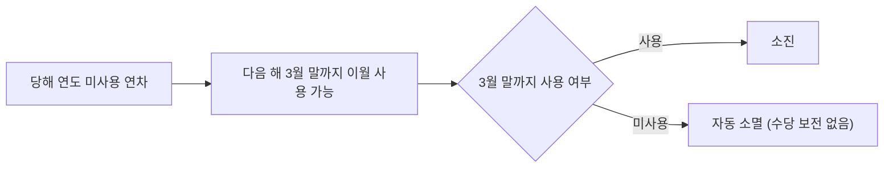

2026년 하반기 기준으로 전 직원에게 적용되는 연차 휴가 산정 기준, 이월 규정, 신청 절차를 정리한다.

## 연차 발생 기준

연차는 입사일을 기준으로 매년 산정된다[^1]. 근속 기간에 따라 부여 일수가 달라진다[^2].

| 근속 기간 | 연차 부여 방식 |
|---|---|
| 입사 1년 미만 | 1개월 개근 시 1일 유급휴가 |
| 입사 1년 이상 | 근속연수에 따라 15일 ~ 최대 25일 |

## 이월 규정

당해 연도에 사용하지 않은 연차는 다음 해 3월 말까지만 이월하여 사용할 수 있다[^3]. 3월 말까지 사용하지 않은 이월 연차는 자동 소멸되며, 별도의 수당으로 보전되지 않는다[^4].

## 신청 절차

연차 신청은 사용 희망일 최소 3영업일 전에 사내 근태 시스템을 통해 제출해야 하며, 팀장의 승인을 받아야 최종 확정된다[^5].

[^1]: document-101, 연차 발생 기준 — "연차는 입사일을 기준으로 매년 산정합니다."
[^2]: document-101, 연차 발생 기준 — "입사 1년 미만 근로자는 1개월 개근 시 1일의 유급휴가를 부여하며, 입사 1년 이상 근로자는 근속연수에 따라 15일부터 최대 25일까지 부여됩니다."
[^3]: document-101, 이월 규정 — "당해 연도에 사용하지 않은 연차는 다음 해 3월 말까지만 이월하여 사용할 수 있습니다."
[^4]: document-101, 이월 규정 — "3월 말까지 사용하지 않은 이월 연차는 자동 소멸되며, 별도의 수당으로 보전되지 않습니다."
[^5]: document-101, 신청 절차 — "연차는 사용 희망일로부터 최소 3영업일 전에 사내 근태 시스템을 통해 신청해야 하며, 팀장의 승인을 받아야 최종 확정됩니다."
