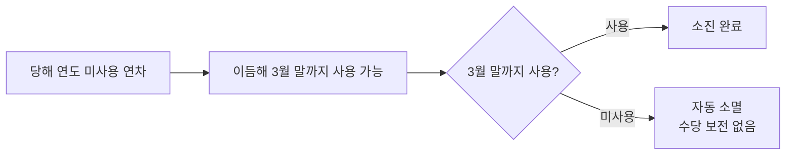

전 직원을 대상으로 한 2026년 하반기 연차 휴가 산정·이월 규정 및 신청 절차를 정리한 페이지입니다.

## 연차 발생 기준

연차는 입사일을 기준으로 매년 산정합니다[^1]. 근속 기간에 따른 연차 일수는 아래 표를 참고합니다.

| 근속 기간 | 연차 일수 |
|---|---|
| 1개월 미만 | — |
| 1개월 이상 (1년 미만) | 1개월 개근 시 1일 (유급) |
| 1년 이상 | 15일 ~ 최대 25일 (근속연수에 따라 증가) |

## 이월 규정

당해 연도에 사용하지 않은 연차는 다음 해 3월 말까지만 이월하여 사용할 수 있습니다[^2]. 이월 기한을 넘긴 연차는 자동 소멸되며, 별도 수당으로 보전되지 않습니다[^3].

## 신청 절차

연차 신청은 사용 희망일로부터 최소 3영업일 전에 사내 근태 시스템을 통해 제출해야 하며, 팀장 승인 후 최종 확정됩니다[^4].

| 단계 | 내용 |
|---|---|
| 신청 시점 | 사용 희망일 기준 최소 3영업일 전 |
| 신청 방법 | 사내 근태 시스템 |
| 승인자 | 팀장 |
| 확정 조건 | 팀장 승인 완료 |

[^1]: document-101, ## 연차 발생 기준 — "연차는 입사일을 기준으로 매년 산정합니다."
[^2]: document-101, ## 이월 규정 — "당해 연도에 사용하지 않은 연차는 다음 해 3월 말까지만 이월하여 사용할 수 있습니다."
[^3]: document-101, ## 이월 규정 — "3월 말까지 사용하지 않은 이월 연차는 자동 소멸되며, 별도의 수당으로 보전되지 않습니다."
[^4]: document-101, ## 신청 절차 — "연차는 사용 희망일로부터 최소 3영업일 전에 사내 근태 시스템을 통해 신청해야 하며, 팀장의 승인을 받아야 최종 확정됩니다."
