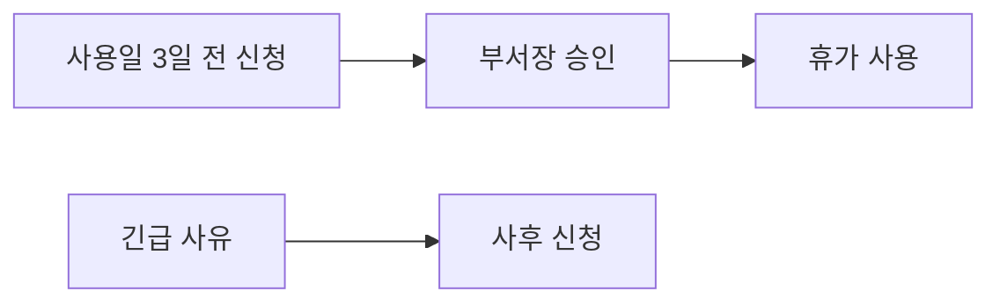

회사의 연차유급휴가 부여·사용에 관한 운영지침을 정리한다. 근로기준법 제60조에 따른 유급휴가를 기준으로 하며, 모든 재직 임직원에게 적용된다[^1]. 다만 계약에서 달리 정한 경우에는 해당 계약을 따른다[^2].

## 부여 기준

1년간 80% 이상 출근한 임직원에게 **20일**의 유급휴가를 부여한다[^3]. 이는 2024년 3월 인사위원회 의결로 기존 15일에서 상향된 것이다[^4].

계속근로기간이 1년 미만인 임직원에게는 **1개월 개근 시 1일**의 유급휴가를 부여한다[^5].

| 구분 | 부여 일수 | 조건 |
|------|-----------|------|
| 일반 (1년 이상) | 20일 | 80% 이상 출근 |
| 신입 (1년 미만) | 월 1일 | 해당 월 개근 |
| 가산휴가 | 매 2년마다 +1일 | 계속근로 3년 이상 |
| 상한 | 25일 | 가산 포함 최대 |

## 가산휴가

계속근로기간이 3년 이상인 임직원에게는 최초 1년을 초과하는 매 2년마다 1일을 가산한다. 가산휴가를 포함한 총 휴가일수는 **25일**을 한도로 한다[^6].

## 휴가일수 산정

휴가일수는 **회계연도**(1월 1일~12월 31일) 기준으로 산정한다[^7]. 입사 첫 해에는 근무기간에 비례하여 계산하며, 단수는 올림 처리한다[^8].

## 사용 신청 절차

연차휴가를 사용하려면 **사용일 3일 전까지** 결재 시스템을 통해 신청하고 부서장의 승인을 받아야 한다[^9]. 긴급한 사유가 있는 경우에는 사후 신청이 가능하다[^10].

## 시기 변경

부서장은 업무에 중대한 지장이 있다고 인정되는 경우 사용 시기의 변경을 요청할 수 있다. 이 경우 **변경 사유를 서면으로 통지**해야 한다[^11].

## 사용 촉진제도

회사는 미사용 휴가에 대하여 사용기간이 끝나기 **6개월 전**을 기준으로 10일 이내에 사용 시기를 정하도록 서면 촉구할 수 있다[^12].

> **참고:** 근무시간 등 기본 근로 조건은 취업규칙을 참고한다.

[^1]: 연차휴가 운영지침.md, 제1장 총칙 제1조 — "임직원의 연차유급휴가 부여와 사용에 관한 사항을 정함으로써 근로기준법이 정한 기준을 충족하고 휴가 사용을 장려하는 데 목적이 있다"
[^2]: 연차휴가 운영지침.md, 제1장 총칙 제2조 — "계약의 성격상 달리 정한 경우에는 해당 계약이 정하는 바에 따른다"
[^3]: 연차휴가 운영지침.md, 제2장 부여 기준 제4조 — "1년간 80퍼센트 이상 출근한 임직원에게 20일의 유급휴가를 부여한다"
[^4]: 연차휴가 운영지침.md, 제2장 부여 기준 제4조 — "2024년 3월 인사위원회 의결로 기존 15일에서 상향되었다"
[^5]: 연차휴가 운영지침.md, 제2장 부여 기준 제4조 — "계속근로기간이 1년 미만인 임직원에게는 1개월 개근 시 1일의 유급휴가를 부여한다"
[^6]: 연차휴가 운영지침.md, 제2장 부여 기준 제5조 — "계속근로기간이 3년 이상인 임직원에게는 최초 1년을 초과하는 매 2년마다 1일을 가산한다. 이 경우 가산휴가를 포함한 총 휴가일수는 25일을 한도로 한다"
[^7]: 연차휴가 운영지침.md, 제2장 부여 기준 제6조 — "휴가일수는 회계연도를 기준으로 산정하며"
[^8]: 연차휴가 운영지침.md, 제2장 부여 기준 제6조 — "입사 첫 해에는 근무기간에 비례하여 계산한다. 단수는 올림하여 처리한다"
[^9]: 연차휴가 운영지침.md, 제3장 사용 절차 제7조 — "연차휴가를 사용하려는 임직원은 사용일 3일 전까지 결재 시스템을 통해 신청하고 부서장의 승인을 받아야 한다"
[^10]: 연차휴가 운영지침.md, 제3장 사용 절차 제7조 — "긴급한 사유가 있는 경우에는 사후 신청할 수 있다"
[^11]: 연차휴가 운영지침.md, 제3장 사용 절차 제8조 — "부서장은 업무에 중대한 지장이 있다고 인정되는 경우 사용 시기의 변경을 요청할 수 있다. 이 경우 변경 사유를 서면으로 통지한다"
[^12]: 연차휴가 운영지침.md, 제3장 사용 절차 제9조 — "회사는 미사용 휴가에 대하여 사용기간이 끝나기 6개월 전을 기준으로 10일 이내에 사용 시기를 정하도록 서면 촉구할 수 있다"
