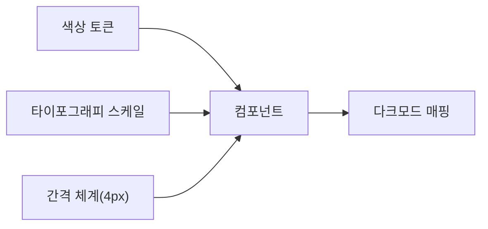

## 개요

디자인부는 AJT의 모든 제품 화면에 일관된 시각 언어를 적용하기 위해 디자인 시스템을 운영한다. 이 문서는 색상 토큰, 타이포그래피 스케일, 간격 체계, 컴포넌트 규칙, 다크모드 대응 기준을 정의한다. 신규 화면을 설계하거나 컴포넌트를 추가할 때는 이 문서를 우선 확인한다.

## 색상 토큰

색상은 역할 기반 토큰으로 관리하며, 화면에 직접 HEX 값을 하드코딩하지 않는다. 토큰 이름과 값은 다음과 같다.

| 토큰 | 이름 | HEX | 용도 |
|------|------|-----|------|
| `color-primary` | AJT 블루 | `#1B4DFF` | 주요 액션, 브랜드 강조 |
| `color-primary-dark` | AJT 블루 다크 | `#1339CC` | 프라이머리 버튼 hover/active |
| `color-ink` | 잉크 | `#0F1222` | 본문 텍스트, 다크모드 배경 |
| `color-paper` | 페이퍼 | `#FFFFFF` | 라이트모드 배경 |
| `color-surface` | 서피스 | `#F7F8FA` | 카드·패널 배경 |
| `color-success` | 그린 | `#1FA97A` | 성공, 완료 상태 |
| `color-warning` | 옐로 | `#F5A623` | 경고, 주의 필요 |
| `color-danger` | 레드 | `#E5484D` | 오류, 파괴적 액션 |

프라이머리 컬러 `#1B4DFF`는 로고에도 동일하게 사용하는 브랜드 대표색이므로, 색상을 임의로 조정하지 않는다. 로고 색상 및 사용 범위는 별도의 브랜드 사용 규정을 따른다.

텍스트 대비는 WCAG 2.1 AA 기준(본문 4.5:1 이상)을 충족해야 하며, `color-ink`를 `color-paper` 위에 올렸을 때 대비율은 18.1:1로 기준을 크게 상회한다.

## 타이포그래피

기본 서체는 **Pretendard**이며, 시스템 폰트가 없는 환경을 대비해 `Pretendard, -apple-system, "Noto Sans KR", sans-serif` 순서로 폴백을 지정한다.

| 스타일 | 크기/행간 | 굵기 | 용도 |
|--------|-----------|------|------|
| Display | 40px / 1.25 | 700 | 랜딩 히어로 |
| H1 | 32px / 1.3 | 700 | 페이지 제목 |
| H2 | 24px / 1.35 | 600 | 섹션 제목 |
| H3 | 20px / 1.4 | 600 | 서브 섹션 |
| Body | 16px / 1.6 | 400 | 본문 |
| Small | 14px / 1.5 | 400 | 보조 설명, 라벨 |
| Caption | 12px / 1.4 | 400 | 캡션, 타임스탬프 |

본문 크기는 16px을 최소 기준으로 하며, 모바일에서도 14px 미만으로 축소하지 않는다.

## 간격 체계

간격은 **4px 배수**를 기본 단위로 사용한다. 임의의 픽셀 값(예: 10px, 15px)을 사용하지 않고 아래 스케일 안에서만 선택한다.

```
4px · 8px · 12px · 16px · 24px · 32px · 48px · 64px
```

카드 내부 여백은 16px, 섹션 간 여백은 48px을 기본값으로 한다. 컴포넌트 사이의 최소 간격은 8px이다.

## 컴포넌트 규칙

- **버튼**: 모서리 반경 8px, 높이 40px(기본)·32px(작게). 프라이머리 버튼은 `color-primary` 배경에 흰색 텍스트를 쓴다.
- **입력 필드**: 높이 40px, 테두리 1px `#D5D8DE`, 포커스 시 `color-primary` 테두리와 2px 아웃라인을 적용한다.
- **카드**: 배경 `color-surface`, 모서리 반경 12px, 그림자는 `0 1px 3px rgba(15, 18, 34, 0.08)` 하나만 사용한다.
- **뱃지**: 상태 색상(`color-success`/`color-warning`/`color-danger`)을 배경 10% 투명도로 적용하고, 텍스트는 해당 색상의 진한 톤을 쓴다.

새 컴포넌트를 추가할 때는 기존 토큰을 재사용하는 것을 우선하며, 새 색상이나 크기가 꼭 필요하면 디자인 리드의 승인을 받는다.



## 다크모드 대응

모든 색상 토큰은 라이트/다크 두 세트로 정의한다. 다크모드에서는 `color-paper`와 `color-ink`의 역할이 반전된다.

| 토큰 | 라이트 | 다크 |
|------|--------|------|
| `color-primary` | `#1B4DFF` | `#5B7CFF` |
| `color-ink` | `#0F1222` | `#F2F3F7` |
| `color-paper` | `#FFFFFF` | `#101223` |
| `color-surface` | `#F7F8FA` | `#181B2E` |

다크모드에서는 채도가 높은 프라이머리 컬러가 눈부심을 유발할 수 있어, `color-primary`를 한 단계 밝고 채도가 낮은 `#5B7CFF`로 교체한다. 그 외 역할별 의미는 라이트모드와 동일하게 유지한다.

## 접근성

- 클릭 가능한 요소의 최소 터치 영역은 44x44px로 한다.
- 색상만으로 상태를 구분하지 않는다. 아이콘이나 텍스트 라벨을 함께 표기한다.
- 포커스 상태는 반드시 시각적으로 구분되어야 하며, `outline: none`만 적용하고 대체 표시를 하지 않는 것을 금지한다.

## 적용과 검수

신규 화면은 배포 전 디자인 리드 검수를 거친다. 검수 항목은 색상 토큰 사용 여부, 타이포그래피 스케일 준수, 간격 체계 준수, 다크모드 매핑 여부 4가지다. 4가지 중 하나라도 누락되면 반려한다.
