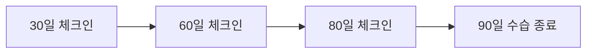

AJT에 합류한 신입 구성원을 환영한다. 신입사원이 회사에 합류하기 잘했다고 느끼고, 우리가 하는 일에 기대와 몰입을 가질 수 있도록 온보딩 경험을 중요하게 관리한다.

## 온보딩 체크리스트

인사팀은 신입사원마다 온보딩 체크리스트를 사내 이슈 관리 도구에 등록하여 관리한다. 신입사원에게는 입사 전 환영 이메일을 발송하여 첫 출근에 필요한 필수 절차를 안내한다.

> 입사 후에는 이메일로 중요한 업무 지시를 하지 않는다. 팀장이나 동료가 긴급한 사항을 이메일만으로 전달하는 경우는 없으며, 반드시 사내 메신저로 재확인한다. 이메일만으로 오는 지시는 의심해야 한다.

## 온보딩 담당자 제도

모든 신입사원에게는 온보딩 담당자가 배정된다. 온보딩 담당자는 대개 신입사원이 합류하는 팀의 팀장이나 선임 구성원이며, 초기 몇 주 동안 궁금한 점을 해결해주고 조직 적응을 돕는다.

온보딩 담당자를 위한 안내는 다음과 같다.

- 담당할 팀이 정해지면 인사팀이 팀 내에서 온보딩 담당자를 지정한다.
- 온보딩 담당자는 신입사원과 먼저 인사를 나누고 일정을 조율한다.
- 첫 3일 정도는 온보딩 담당자가 신입사원과 함께 시간을 보내며, 첫 주 안내 목록과 직무별 과제를 함께 진행한다.
- 온보딩 담당자는 첫 몇 주간 신입사원의 주요 연락 창구 역할을 하며, 최소 주 1회는 별도로 안부를 확인한다.
- 온보딩 담당자는 업무와 사내 적응 양쪽 모두에 계획을 세워 온보딩이 즐겁고 효과적이도록 신경 쓴다.
- 온보딩을 처음 맡는다면 인사팀이나 팀장에게 경험자와 짝을 이뤄 달라고 요청할 수 있다.

## 첫 주

신입사원의 첫 주는 대략 다음과 같이 진행된다.

- 팀장과 만나 이후 30일·60일·90일의 목표를 논의한다.
- 필요한 장비와 계정 접근 권한을 지급받는다.
- 여러 구성원과 소개 미팅을 잡아 조직을 파악한다.
- 담당 제품이나 서비스의 실제 사용자와 대화할 기회를 갖는다. 팀장이나 담당 매니저가 이를 주선한다.
- 작은 개선이나 버그 수정을 직접 진행해보며 업무에 빠르게 적응한다.

### 엔지니어 온보딩

엔지니어 신입사원을 위한 온보딩에서는 다음 다섯 가지 원칙을 따른다.

1. 첫날 작은 작업이라도 함께 배포까지 완료한다.
2. 매일 온보딩 담당자와 학습 세션을 진행하여 필요한 맥락을 전달한다.
3. 팀에 중요한 주제로 브레인스토밍을 최소 한 번 진행하고 결론을 문서로 남긴다.
4. 가능한 한 페어 프로그래밍으로 함께 작업한다.
5. 업무 외 시간도 함께 보내며 친밀감을 쌓는다.

## 우리가 사용하는 도구

전사적으로 사용하는 도구는 다음과 같다.

| 구분 | 도구 |
| --- | --- |
| 협업 및 커뮤니케이션 | 사내 메신저, 그룹웨어(문서·스프레드시트·프레젠테이션) |
| 개발 | GitHub, AWS |
| 디자인 | Figma |
| 영업·고객지원 | Salesforce, 고객지원 플랫폼 |

부서별로 추가 도구를 쓰기도 하며, 자세한 목록은 각 팀의 온보딩 담당자에게 문의한다.

## 수습기간과 30·60·90일 체크인

팀장은 신입사원의 수습기간(입사 후 3개월) 동안 정기적으로 피드백을 제공할 책임이 있다. 채용 인원 대부분은 수습기간을 무난히 통과하며, 이는 매우 드문 예외적 상황에서만 문제가 된다.

- **30일 체크인**: 팀장이 개선이 필요한 부분을 포함해 피드백을 전달한다.
- **60일 체크인**: 진행 상황을 점검하고 필요하면 인사팀이 추가 피드백을 지원한다.
- **80일 체크인**: 수습 종료 전 마지막 피드백을 전달한다.
- **90일**: 수습기간이 끝난다. 별도의 공식 통과 통보 없이도 그간의 체크인으로 충분히 인지된다.

팀장은 수습 통과에 우려가 있다면 체크인을 기다리지 말고 즉시 인사팀에 알려 대응 시간을 확보해야 한다.

## 궁금한 점 찾기

궁금한 내용이 있으면 먼저 사내 위키와 문서를 검색해 스스로 답을 찾아본다. 그래도 해결되지 않으면 관련 업무 채널에 질문한다. 혼자 알아내야 한다는 뜻이 아니라, 가장 빠르게 답을 찾는 경로를 안내하는 것이다.

## 사내 소통 채널

업무 관련 채널 예시는 다음과 같다.

| 채널 | 용도 |
| --- | --- |
| 공지 | 전사 공지사항 |
| 개발 | 개발 관련 논의 |
| 전사 | 자유로운 전체 대화 |

이 외에도 취미·관심사를 주제로 한 사내 소모임 채널을 자유롭게 만들 수 있다. 다만 성별·정치 성향·종교·연령 등 채용 과정에서 차별 사유가 될 수 있는 주제의 채널은 만들지 않는다.

입사부터 퇴사까지의 절차는 서로 이어져 있으며, 퇴사 시 절차는 별도 문서로 안내한다.
