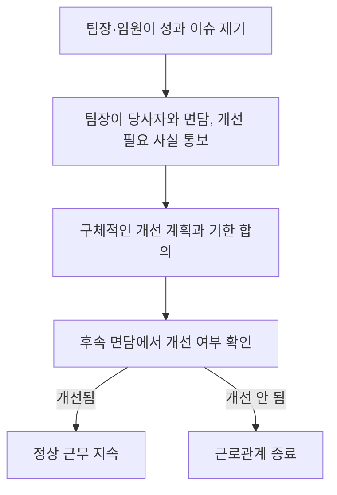

구성원의 퇴사는 민감한 시기다. 이 절차는 퇴사 과정이 어떻게 진행되는지 투명하게 알리기 위한 것이다. 단기 계약으로 일하는 프리랜서·외주 인력에게는 이 절차를 적용하지 않는다.

## 자발적 퇴사

구성원 본인의 선택으로 회사를 떠나는 경우다.

원칙적으로 30일의 사전 통보 기간을 요청하며(현지 법령상 다른 상한·하한이 있는 경우는 예외), 이 기간 동안 정상적으로 근무할 것을 기대한다. 후임을 채용하고 인수인계할 시간을 확보하기 위함이다.

> 퇴사를 고민하고 있다면 결정을 내리기 전에 팀장이나 인사팀과 먼저 이야기해보기를 권한다. 불만이 있는 구성원을 억지로 붙잡으려는 것은 아니지만, 회사를 떠나는 것보다 지금 있는 곳에서 상황을 바꾸는 것이 더 나은 해법일 수도 있다. 대화 후에도 퇴사가 최선이라고 판단되면 인사팀에 퇴사 의사를 통보한다. 이후 인수인계에 필요한 사항을 함께 논의한다.

## 비자발적 퇴사

회사가 구성원과의 근로관계를 종료하는 경우다.

주로 성과 문제나 회사의 필요 변화로 해당 역할이 더 이상 정당화되지 않을 때 발생한다. 성과 문제로 인한 경우에는 이미 당사자에게 피드백을 전달하고 개선할 시간을 준 뒤에도 문제가 해결되지 않았을 때에 한한다.

성과 관리 절차는 상황에 따라 다소 다르게 적용되지만, 일반적으로 다음과 같은 흐름을 따른다.

- 팀장이나 임원이 성과 문제를 제기하면 문제와 개선 계획을 논의한다.
- 팀장이 당사자에게 현재 성과가 기대에 미치지 못하며, 개선되지 않으면 근로관계를 지속하기 어렵다는 점을 명확히 전달한다.
- 기대하는 성과 수준과 개선 계획, 개선 기한을 함께 정한다. 통상 신입에게는 몇 주, 재직 기간이 긴 경우 더 길게 부여한다.
- 후속 면담에서 개선 여부를 확인하고, 개선되었다면 근무를 지속하며 그렇지 않다면 근로관계를 종료한다.

역할 자체가 더 이상 필요하지 않아 종료하는 경우에는 경영진이 결정한 뒤 곧바로 당사자에게 통보한다.

어느 경우든 통보 즉시 근무를 중단하도록 요청하는 것이 일반적이며, 최종급여와 퇴직 관련 보상은 아래 기준에 따라 산정한다.

## 퇴사 사실 전달

자발적 퇴사의 경우 본인이 향후 계획을 팀에 공유하고 싶은지 먼저 확인한다. 비자발적 퇴사의 경우에는 개인정보를 존중하는 범위에서 최대한 투명하게 사유를 공유하려 노력하지만, 모든 경우에 구체적인 사유를 밝힐 수 있는 것은 아니다.

## 재직증명 및 평판조회

회사는 전·현직 구성원에 대한 개인적·업무적 평판을 따로 제공하지 않는다. 외부에서 재직 여부를 문의하면 재직 기간만 안내한다.

재직 중인 구성원에게 다음을 당부한다.

- 전·현직 동료에 대한 문의를 받으면 직접 답하지 말고 인사팀으로 넘긴다.
- 해당 인물의 성과나 퇴사 사유에 대한 의견이나 세부 사항을 공유하지 않는다.
- 회사를 대표해 말하는 것처럼 보이는 발언을 하지 않는다.

## 퇴사 절차

퇴사가 결정되면 담당 부서가 계정과 접근 권한 해지를 함께 진행한다. 수동으로 처리해야 하는 항목은 담당자가 별도로 안내하고 완료 여부를 확인한다.

이후 퇴사자에게 다음 항목을 정리한 안내를 전달한다.

1. 최종급여
2. 부여된 스톡옵션(해당하는 경우)
3. 회사 자산 반납
4. 업무 관련 비용 정산
5. 개인 이메일로의 자료 이관(선택)

### 최종급여

최종급여는 재직 기간과 퇴사 사유에 따라 다음과 같이 산정한다.

| 퇴사 사유 | 지급 기준 |
| --- | --- |
| 자발적 퇴사 | 마지막 근무일까지 급여 지급, 미사용 연차는 회사 규정에 따라 수당으로 정산 |
| 비자발적 퇴사(성과·조직 개편) — 재직 3개월 이상(영업직군 6개월 이상) | 법정 예고수당을 포함해 4개월분 급여 지급 |
| 비자발적 퇴사(성과·조직 개편) — 재직 3개월 미만 | 1개월분 급여 지급 |
| 중대한 계약 위반에 따른 해고 | 법정 최소 기준만 지급, 별도 예고 없음 |

법정 예고수당 이상의 보상을 받으려면 퇴사자는 퇴직 관련 합의서에 서명해야 하며, 서명하지 않으면 법정·계약상 최소 기준만 지급한다. 현지 법령이 위 기준보다 더 유리하다면 그 법령을 따른다.

### 스톡옵션

스톡옵션을 부여받은 구성원이 퇴사하는 경우, 회사는 베스팅된 수량과 행사 절차를 확인해준다. 퇴사 후에도 8년의 행사 유예기간을 부여하며, 중대한 계약 위반으로 해고된 경우가 아니라면 대부분 우호적 퇴사자로 분류되어 이 유예기간을 적용받는다.

## 퇴사자 체크리스트

퇴사자 체크리스트는 인사팀 내부 이슈 관리 시스템에 템플릿으로 등록되어 있으며, 퇴사자가 발생할 때마다 인사팀이 새 항목을 생성해 관리한다. 팀장이 퇴사하는 경우에는 후임 팀장 지정 계획을 퇴사 발표 전 또는 발표와 함께 준비한다.
