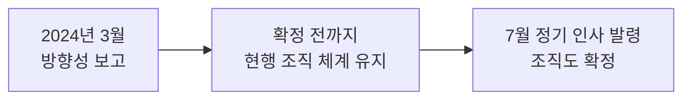

2024년 3월 14일 본사 3층 대회의실에서 개최된 정기 인사위원회의 의결 사항과 주요 논의 내용을 정리한다[^1]. 연차유급휴가 상향과 출장 식비 신설은 각각 [연차유급휴가 규정](pages/67910e3f5c0c.md) 및 [출장비(여비) 정산 안내](pages/8300a3625b5f.md) 페이지에 상세 내용이 반영되어 있다.

## 회의 개요

| 항목 | 내용 |
|------|------|
| 일시 | 2024년 3월 14일(목) 15:00 ~ 16:20 |
| 장소 | 본사 3층 대회의실 |
| 참석자 | 인사팀장 김도윤, 경영지원본부장 이서준, 재무팀장 박하은, 서기 정지훈 |
| 배석·불참 | 없음 |

## 안건 및 의결 결과

이번 회의에서 다룬 4개 안건과 의결 결과는 다음과 같다[^2].

| 안건 | 구분 | 의결 결과 |
|------|------|-----------|
| 1. 하반기 조직개편 방향 보고 | 보고 | 방향성 확인, 확정은 7월 정기 인사 발령 시 |
| 2. 연차유급휴가 일수 상향 조정 | 의결 | 15일 → 20일 상향 (찬성 4, 반대 0) |
| 3. 출장 식비 신설 | 의결 | 1일 3만 원 정액 신설 (찬성 4, 반대 0) |
| 4. 경조사 휴가 기준 정비 | 후속 조치 | 인사팀 표준 기준표 마련 후 전사 재공지 |

## 하반기 조직개편 방향

경영지원본부장 이서준이 하반기 조직개편 초안을 보고하였다[^3]. 주요 내용은 아래와 같으며, 구체적인 조직도는 7월 정기 인사 발령 시 확정된다[^4].

- 개발본부 산하 **플랫폼팀 신설**
- 경영지원본부 소속 총무팀·인사팀의 **업무 분장 일부 조정**

그 전까지는 현행 조직 체계를 유지하며, 인력 재배치가 예산에 미치는 영향은 다음 회의에 별도 보고하기로 하였다[^5].

## 경조사 휴가 기준 정비

경조사 휴가 일수가 부서별로 상이하게 안내되어 온 사례가 확인되었다[^6]. 이번 회의에서는 의결 사항이 아닌 **후속 조치**로 처리하기로 하였으며, 인사팀이 표준 기준표를 마련하여 전사에 재공지한다[^6]. 이후 확정된 경조사 지원 기준(경조금·휴가 일수)은 [경조사 지원 기준](pages/754b18f663d4.md)에서 확인할 수 있다.

## 시행 일정

의결된 사항은 2024년 4월 1일부터 적용되며, 임직원 안내는 4월 1일 이후 사내 공지를 통해 이루어진다[^7].

| 사항 | 시행일 | 비고 |
|------|--------|------|
| 연차 20일 상향 | 2024년 4월 1일 | 이미 발생한 15일 기준 연차는 소급 조정 없음 |
| 출장 식비 신설 | 2024년 4월 1일 | 해당일 이후 출발하는 출장부터 적용 |
| 하반기 조직개편 | 2024년 7월 정기 인사 발령 | 확정 전까지 현행 조직 유지 |

## 이후 회의

2024년 6월 정기 팀리더 회의에서는 재택근무 시범 도입 및 대체휴일 승인 절차 표준화가 의결되었다. 자세한 내용은 [2024년 6월 팀리더 정기회의 주요 의결 사항](pages/47163eb98e6b.md)에서 확인할 수 있다.

## 차기 안건 예고

다음 인사위원회(2024년 4월 중 개최 예정)에서는 다음 사항을 함께 점검하기로 하였다[^8].

- 하반기 조직개편 확정안
- 경조사 휴가 표준 기준표
- 연차 상향 및 출장 식비 신설 시행 초기 안착 현황

[^1]: 02-hr-committee-minutes-2024-03.pdf, 개회 — "인사팀장 김도윤이 개회를 선언하고, 지난 2월 회의록 승인 여부를 확인하였다."
[^2]: 02-hr-committee-minutes-2024-03.pdf, 안건 — "1. 하반기 조직개편 방향 보고의 건 2. 연차유급휴가 일수 상향 조정의 건 3. 출장 식비 신설의 건 4. 경조사 휴가 기준 정비의 건"
[^3]: 02-hr-committee-minutes-2024-03.pdf, 안건 1: 하반기 조직개편 방향 보고 — "경영지원본부장 이서준은 하반기 **조직개편** 초안을 보고하였다."
[^4]: 02-hr-committee-minutes-2024-03.pdf, 안건 1: 하반기 조직개편 방향 보고 — "구체적인 조직도는 7월 정기 인사 발령 시 확정하기로 하고, 이번 회의에서는 방향성만 보고하는 것으로 정리하였다."
[^5]: 02-hr-committee-minutes-2024-03.pdf, 참석자 발언 요지 — "인사팀장 김도윤은 조직개편에 따른 인력 재배치가 예산에 미치는 영향은 별도로 산정해 다음 회의에 보고하겠다고 답하였다."
[^6]: 02-hr-committee-minutes-2024-03.pdf, 안건 4: 경조사 휴가 기준 정비 — "**경조사** 휴가 일수가 부서별로 상이하게 안내되어 온 사례가 확인되어, 인사팀이 표준 기준표를 마련해 전사에 재공지하기로 하였다."
[^7]: 02-hr-committee-minutes-2024-03.pdf, 추가 논의: 시행 일정 — "경영지원본부장 이서준은 세 사항 모두 4월 1일 이후 사내 공지를 통해 임직원에게 안내할 것을 당부하였다."
[^8]: 02-hr-committee-minutes-2024-03.pdf, 차기 안건 예고 — "다음 회의에서는 조직개편 확정안과 경조사 휴가 표준 기준표를 함께 보고하기로 하였다."
