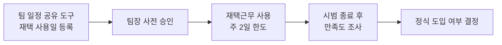
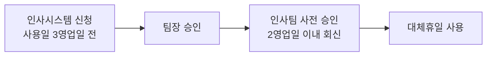

2024년 6월 11일 본사 5층 소회의실에서 개최된 정기 팀리더 회의의 의결 사항과 주요 논의 내용을 정리한다[^1]. 이 회의에서는 **재택근무 시범 도입**과 **대체휴일 승인 절차 표준화** 두 건이 의결되었다.

## 회의 개요

| 항목 | 내용 |
|------|------|
| 일시 | 2024년 6월 11일(화) 10:00 ~ 11:00 |
| 장소 | 본사 5층 소회의실 |
| 참석자 | 개발팀장 최우진, 디자인팀장 한소율, 인사팀장 김도윤, 경영지원본부장 이서준 |
| 배석·불참 | 없음 |

## 안건 및 의결 결과

이번 회의에서 다룬 5개 안건 중 2건이 의결되었다[^2].

| 안건 | 구분 | 의결 결과 |
|------|------|-----------|
| 1. 하반기 채용 계획 공유 | 보고 | 채용 공고 7월 초 게시 예정 |
| 2. 팀별 OKR 진행 현황 점검 | 보고 | 개발팀 70%, 디자인팀 조기 달성 |
| 3. 재택근무 시범 도입 | 의결 | 주 2일 한도, 2024년 7월 1일부터 3개월 시범 운영 (찬성 4, 반대 0) |
| 4. 대체휴일 승인 절차 정비 | 의결 | 인사팀 사전 승인 추가, 3영업일 전 신청 (찬성 4, 반대 0) |
| 5. 하반기 전사 회식 일정 조율 | 논의 | 9월 중 진행, 총무팀이 별도 공지 |

## 의결 1: 재택근무 시범 도입

재택근무를 주 2일 한도로 시범 도입하기로 의결하였다[^3]. 시범 기간은 2024년 7월 1일부터 3개월이며, 팀장 사전 승인을 받아 사용한다[^3].

### 시범 운영 세부 사항

인사팀장 김도윤이 제안한 세부 운영 기준은 다음과 같다[^4].

| 항목 | 내용 |
|------|------|
| 사용 한도 | 주 2일 |
| 시범 기간 | 2024년 7월 1일 ~ 2024년 9월 30일 (3개월) |
| 사전 신청 | 팀 내 일정 공유 도구에 재택 사용일 사전 등록 |
| 응답 의무 | 재택 중에도 사내 메신저 응답 근무시간 내 상시 유지 |
| 도입 결정 | 시범 기간 종료 후 만족도 조사를 실시하여 정식 도입 여부 결정 |

개발팀장 최우진은 재택 중 협업 도구 접속 로그를 별도로 수집하지 않는 조건이면 팀원들의 수용도가 높을 것이라는 의견을 밝혔다[^5].

## 의결 2: 대체휴일 승인 절차 표준화

휴일 근무 후 대체휴일 사용이 팀별로 제각각 운영되어 형평성 문제가 제기됨에 따라[^6], 인사팀 사전 확인 절차를 거치도록 표준화하기로 의결하였다[^7].

### 변경된 대체휴일 신청 절차

| 항목 | 변경 전 | 변경 후 |
|------|---------|---------|
| 승인 주체 | 팀장 승인 | 팀장 승인 + **인사팀 사전 승인** 추가 |
| 신청 기한 | 별도 기준 없음 | 사용 희망일 **3영업일 전**까지 인사시스템 등록 |
| 승인 회신 | 별도 기준 없음 | 신청 접수 후 **2영업일 이내** 회신 |

사전 승인 절차 도입의 취지는 다음과 같다[^8].

- 휴일 근무 발생 시점과 대체휴일 사용 시점의 간극을 관리하기 위함
- 팀별 인력 공백을 인사팀이 사전에 파악하여 업무 차질을 줄이기 위함

디자인팀장 한소율은 처리 기한을 명확히 안내해 줄 것을 요청하였고, 인사팀장 김도윤은 신청 접수 후 2영업일 이내 승인 여부를 회신하겠다고 답하였다[^9].

## 기타 보고·논의 사항

### 하반기 채용 계획

인사팀장 김도윤은 개발팀 3명, 디자인팀 1명 충원을 목표로 하며, 채용 공고를 7월 초 게시할 예정이라고 안내하였다[^10]. 개발팀장 최우진은 플랫폼팀 신설 계획과 맞물려 신규 인력의 소속을 미리 조율할 필요가 있다고 언급하였고, 인사팀장 김도윤은 7월 조직개편 확정 이후 채용 공고에 반영하겠다고 답하였다[^11]. 조직개편 방향은 [2024년 3월 인사위원회 주요 의결 사항](pages/b886acd7fe33.md)에서 확인할 수 있다.

### 팀별 OKR 진행 현황

개발팀은 목표 대비 70% 수준의 진척도를, 디자인팀은 신규 디자인 시스템 구축 목표를 조기 달성하였다[^12].

### 하반기 전사 회식

경영지원본부장 이서준은 하반기 전사 회식을 9월 중 진행할 것을 제안하였으며, 구체적인 일정과 장소는 총무팀이 각 팀 의견을 수렴하여 별도 공지하기로 하였다[^13].

## 차기 안건 예고

다음 회의에서는 재택근무 시범 운영 중간 점검, 채용 진행 현황, 대체휴일 신청 처리 현황을 함께 보고하기로 하였다[^14].

[^1]: 06-teamlead-minutes-2024-06.pdf, 개회 — "경영지원본부장 이서준이 개회를 선언하고, 지난 5월 회의록 승인 여부를 확인하였다."
[^2]: 06-teamlead-minutes-2024-06.pdf, 안건 — "1. 하반기 채용 계획 공유의 건 2. 팀별 OKR 진행 현황 점검의 건 3. 재택근무 시범 도입의 건 4. 대체휴일 승인 절차 정비의 건 5. 하반기 전사 회식 일정 조율의 건"
[^3]: 06-teamlead-minutes-2024-06.pdf, 의결 — "재택근무를 주 2일 한도로 시범 도입한다. 시범 기간은 2024년 7월 1일부터 3개월로 하며, 팀장 사전 승인을 받아 사용한다."
[^4]: 06-teamlead-minutes-2024-06.pdf, 추가 논의: 재택근무 세부 운영안 — "재택 사용일은 사전에 팀 내 일정 공유 도구에 등록한다. 재택 중에도 사내 메신저 응답은 근무시간 내 상시 유지한다. 시범 기간 종료 시점에 만족도 조사를 실시하여 정식 도입 여부를 결정한다."
[^5]: 06-teamlead-minutes-2024-06.pdf, 추가 논의: 재택근무 세부 운영안 — "개발팀장 최우진은 재택 중 협업 도구 접속 로그를 별도로 수집하지 않는 조건이면 팀원들의 수용도가 높을 것이라고 의견을 덧붙였다."
[^6]: 06-teamlead-minutes-2024-06.pdf, 안건 4: 대체휴일 승인 절차 — "휴일 근무 후 대체휴일 사용이 팀별로 제각각 운영되어 형평성 문제가 제기되었다."
[^7]: 06-teamlead-minutes-2024-06.pdf, 의결 — "대체휴일 사용은 팀장 승인 외에 인사팀 사전 승인을 추가로 받아야 한다. 신청은 사용 희망일 3영업일 전까지 인사시스템으로 등록한다."
[^8]: 06-teamlead-minutes-2024-06.pdf, 추가 논의: 대체휴일 운영 취지 — "휴일 근무 발생 시점과 대체휴일 사용 시점의 간극을 관리하기 위함이다. 팀별 인력 공백을 인사팀이 사전에 파악하여 업무 차질을 줄이기 위함이다."
[^9]: 06-teamlead-minutes-2024-06.pdf, 추가 논의: 대체휴일 운영 취지 — "디자인팀장 한소율은 절차가 추가되는 만큼 처리 기한을 명확히 안내해 줄 것을 요청하였다. 인사팀장 김도윤은 신청 접수 후 2영업일 이내 승인 여부를 회신하겠다고 답하였다."
[^10]: 06-teamlead-minutes-2024-06.pdf, 안건 1: 하반기 채용 계획 공유 — "개발팀 3명, 디자인팀 1명 충원을 목표로 하며, 채용 공고는 7월 초 게시할 예정이라고 안내하였다."
[^11]: 06-teamlead-minutes-2024-06.pdf, 참석자 발언 요지 — "플랫폼팀 신설 계획과 맞물려 신규 인력의 소속을 미리 조율할 필요가 있다고 언급하였다. 인사팀장 김도윤은 7월 조직개편 확정 이후 채용 공고에 반영하겠다고 답하였다."
[^12]: 06-teamlead-minutes-2024-06.pdf, 안건 2: 팀별 OKR 진행 현황 점검 — "개발팀은 목표 대비 70% 수준의 진척도를 보이고 있으며, 디자인팀은 신규 디자인 시스템 구축 목표를 조기 달성하였다고 보고하였다."
[^13]: 06-teamlead-minutes-2024-06.pdf, 안건 5: 하반기 전사 회식 일정 조율 — "경영지원본부장 이서준은 하반기 전사 회식을 9월 중 진행할 것을 제안하였다. 구체적인 일정과 장소는 총무팀이 각 팀 의견을 수렴하여 별도 공지하기로 하였다."
[^14]: 06-teamlead-minutes-2024-06.pdf, 차기 안건 예고 — "재택근무 시범 운영 중간 점검과 채용 진행 현황, 그리고 대체휴일 신청 처리 현황을 함께 보고하기로 하였다."
