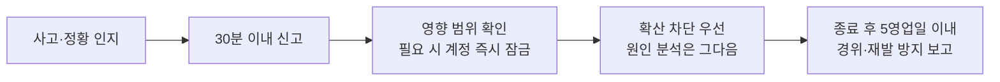

[정보보안 지침](pages/a67336b0c716.md)이 정한 원칙을 **실무에서 어떻게 지키는지** 안내한다. 계정·비밀번호·기밀 문서의 기본 원칙은 그쪽이 정하고, 이 문서는 **자산 등급·개인정보 취급·기기 보안·사고 대응**을 다룬다[^1].

## 정보자산 등급

| 등급 | 볼 수 있는 사람 |
|------|-----------------|
| 공개 | 사외에 공개해도 되는 자산 |
| 사내한정 | 임직원이면 볼 수 있는 자산 |
| 기밀 | 승인된 인원만 |
| 특급기밀 | **경영본부장의 승인**을 받은 인원만 |

정보자산은 네 등급으로 나눈다[^2]. 문서를 만들 때 등급을 정해 **첫머리에 표시**하며, **표시되지 않은 문서는 사내한정으로 본다**[^3].

등급은 만든 사람이 정한다. **상향은 누구나 요청할 수 있으나 하향은 정보보안 담당자의 승인**을 받는다[^4].

## 개인정보 수집과 이용

**업무에 필요한 항목만** 수집한다. 「나중에 쓸지도 모른다」는 이유로 항목을 늘리지 않는다[^5].

수집 당시에 밝힌 **목적 외로 이용하지 않으며**, 목적이 바뀌면 다시 동의를 받는다[^6].

**주민등록번호는 법령에 근거가 있는 경우에만** 수집한다[^7].

## 보관과 파기

보관 기간을 정해 관리하고 **기간이 지나면 지체 없이 파기**한다[^8].

| 대상 | 보관 기간 |
|------|-----------|
| 지원자 서류 | 전형 종료 후 1년 |
| 퇴사자 인사 기록 | 관련 법령이 정한 기간 |

지원자 서류의 보관 기간은 채용 절차와 같다[^9]. 파기할 때에는 **복구할 수 없는 방법으로 삭제하고 파기 일시와 담당자를 기록**한다[^10].

**개인정보가 담긴 파일을 개인 저장소나 메신저에 보관하지 않는다**[^11].

## 처리 위탁

외부 업체에 맡길 때에는 계약서에 **보호 의무와 재위탁 금지**를 명시한다[^12]. 위탁 업체 목록은 **연 1회 점검**하고, 계약이 끝난 업체에는 **보유 자료의 파기 확인서**를 받는다[^13].

## 접근 권한

권한은 **업무에 필요한 최소 범위**로 부여한다[^14].

**분기마다** 계정과 권한을 점검해 쓰지 않는 권한과 퇴사자의 잔여 계정을 회수하며, 부서별 점검 결과는 정보보안 담당자가 취합한다[^15].

## 기기 보안

업무용 기기에는 **디스크 암호화**를 설정하고 **화면 잠금을 5분 이내**로 둔다[^16].

사외에서 사내 시스템에 접속할 때에는 **다단계 인증**을 사용한다. **끄고 접속할 수 있는 예외 계정을 두지 않는다**[^17].

**공용 무선망에 직접 접속하지 않고** 사내 접속 수단을 거친다 — **재택근무 중에도 같다**[^18]. 재택근무 운영 기준은 [근무시간 및 근무형태 안내](pages/2f8c41d7ab90.md)에 있다.

분실·도난 시 **즉시 정보보안 담당자에게 알리고**, 알린 시점을 기준으로 계정을 잠근다[^19].

## 보안 사고 신고

인지 후 **30분 이내**에 정보보안 담당자에게 신고한다[^20]. 담당자는 영향 범위를 확인하고 필요하면 관련 계정을 즉시 잠근다 — **원인 분석보다 확산 차단이 먼저다**[^21].

**신고한 사람에게 사고를 이유로 불이익을 주지 않는다.** 늦게 알려지는 것이 더 큰 피해를 낳기 때문이다[^22].

사고 종료 후 **5영업일 이내**에 경위와 재발 방지 대책을 정리해 경영본부장에게 보고한다[^23].

## 교육

전 임직원은 **연 1회** 정보보안 교육을 이수하고 수료증을 제출한다. **미이수자는 재수강 대상**이다[^24].

신규 입사자는 온보딩 과정에서 함께 받는다[^25].

[^1]: 개인정보 및 정보자산 취급 실무 지침.md, 도입 — "정보보안 지침이 정한 원칙을 실무에서 어떻게 지키는지 정한다. 계정과 비밀번호, 기밀 문서의 기본 원칙은 정보보안 지침이 정하며 이 지침은 그 위에서 자산 등급, 개인정보 취급, 기기 보안, 사고 대응을 다룬다."
[^2]: 개인정보 및 정보자산 취급 실무 지침.md, 1. 정보자산 등급 — "정보자산은 네 등급으로 나눈다."
[^3]: 개인정보 및 정보자산 취급 실무 지침.md, 1. 정보자산 등급 — "문서를 만들 때 등급을 정하고 문서 첫머리에 표시한다. 등급이 표시되지 않은 문서는 사내한정으로 본다."
[^4]: 개인정보 및 정보자산 취급 실무 지침.md, 1. 정보자산 등급 — "등급은 만든 사람이 정하고, 상향은 누구나 요청할 수 있으나 하향은 정보보안 담당자의 승인을 받는다."
[^5]: 개인정보 및 정보자산 취급 실무 지침.md, 2. 개인정보 수집과 이용 — "개인정보는 업무에 필요한 항목만 수집한다. 「나중에 쓸지도 모른다」는 이유로 항목을 늘리지 아니한다."
[^6]: 개인정보 및 정보자산 취급 실무 지침.md, 2. 개인정보 수집과 이용 — "수집한 개인정보는 수집 당시에 밝힌 목적 외로 이용하지 아니한다. 목적이 바뀌면 다시 동의를 받는다."
[^7]: 개인정보 및 정보자산 취급 실무 지침.md, 2. 개인정보 수집과 이용 — "주민등록번호는 법령에 근거가 있는 경우에만 수집한다."
[^8]: 개인정보 및 정보자산 취급 실무 지침.md, 3. 개인정보 보관과 파기 — "개인정보는 보관 기간을 정해 관리하고 기간이 지나면 지체 없이 파기한다."
[^9]: 개인정보 및 정보자산 취급 실무 지침.md, 3. 개인정보 보관과 파기 — "지원자 서류는 전형 종료 후 1년, 퇴사자의 인사 기록은 관련 법령이 정한 기간까지 보관한다."
[^10]: 개인정보 및 정보자산 취급 실무 지침.md, 3. 개인정보 보관과 파기 — "파기할 때에는 복구할 수 없는 방법으로 삭제하고 파기 일시와 담당자를 기록한다."
[^11]: 개인정보 및 정보자산 취급 실무 지침.md, 3. 개인정보 보관과 파기 — "개인정보가 담긴 파일을 개인 저장소나 메신저에 보관하지 아니한다."
[^12]: 개인정보 및 정보자산 취급 실무 지침.md, 4. 개인정보 처리 위탁 — "외부 업체에 개인정보 처리를 맡기는 경우에는 계약서에 보호 의무와 재위탁 금지를 명시한다."
[^13]: 개인정보 및 정보자산 취급 실무 지침.md, 4. 개인정보 처리 위탁 — "위탁 업체 목록은 연 1회 점검하고, 계약이 끝난 업체에는 보유 자료의 파기 확인서를 받는다."
[^14]: 개인정보 및 정보자산 취급 실무 지침.md, 5. 접근 권한 — "권한은 업무에 필요한 최소 범위로 부여한다."
[^15]: 개인정보 및 정보자산 취급 실무 지침.md, 5. 접근 권한 — "분기마다 계정과 권한을 점검하여 쓰지 않는 권한과 퇴사자의 잔여 계정을 찾아 회수한다. 부서별 점검 결과는 정보보안 담당자가 취합한다."
[^16]: 개인정보 및 정보자산 취급 실무 지침.md, 6. 기기 보안 — "업무용 기기에는 디스크 암호화를 설정하고 화면 잠금을 5분 이내로 둔다."
[^17]: 개인정보 및 정보자산 취급 실무 지침.md, 6. 기기 보안 — "사내 시스템에 사외에서 접속할 때에는 다단계 인증을 사용한다. 다단계 인증을 끄고 접속할 수 있는 예외 계정을 두지 아니한다."
[^18]: 개인정보 및 정보자산 취급 실무 지침.md, 6. 기기 보안 — "사외에서는 공용 무선망에 직접 접속하지 아니하며 사내 접속 수단을 거친다. 재택근무 중에도 같다."
[^19]: 개인정보 및 정보자산 취급 실무 지침.md, 6. 기기 보안 — "기기를 분실하거나 도난당한 경우에는 즉시 정보보안 담당자에게 알린다. 알린 시점을 기준으로 계정을 잠근다."
[^20]: 개인정보 및 정보자산 취급 실무 지침.md, 7. 보안 사고 신고와 대응 — "보안 사고 또는 그 정황을 인지한 임직원은 인지 후 30분 이내에 정보보안 담당자에게 신고한다."
[^21]: 개인정보 및 정보자산 취급 실무 지침.md, 7. 보안 사고 신고와 대응 — "신고를 받은 담당자는 영향 범위를 확인하고 필요한 경우 관련 계정을 즉시 잠근다. 원인 분석보다 확산 차단이 먼저다."
[^22]: 개인정보 및 정보자산 취급 실무 지침.md, 7. 보안 사고 신고와 대응 — "신고한 사람에게 사고를 이유로 불이익을 주지 아니한다. 늦게 알려지는 것이 더 큰 피해를 낳기 때문이다."
[^23]: 개인정보 및 정보자산 취급 실무 지침.md, 7. 보안 사고 신고와 대응 — "사고 종료 후 5영업일 이내에 경위와 재발 방지 대책을 정리해 경영본부장에게 보고한다."
[^24]: 개인정보 및 정보자산 취급 실무 지침.md, 8. 교육 — "전 임직원은 연 1회 정보보안 교육을 이수한다. 이수 후 수료증을 제출하며, 미이수자는 재수강 대상이 된다."
[^25]: 개인정보 및 정보자산 취급 실무 지침.md, 8. 교육 — "신규 입사자는 온보딩 과정에서 정보보안 교육을 함께 받는다."
