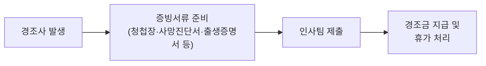

결혼·조사·출산 등 경조사 발생 시 지급하는 경조금과 경조 휴가 일수를 안내한다[^1]. 신청은 인사팀에 증빙서류와 함께 제출한다[^2].

> **참고:** 연차유급휴가 일수·반차 기준은 [연차유급휴가 규정](pages/67910e3f5c0c.md)을 참고한다.

## 경조사별 지원 기준

경조사 유형에 따른 경조금과 휴가 일수는 아래와 같다[^1].

| 구분 | 경조금 | 휴가 |
|------|--------|------|
| 결혼 (본인) | 100만 원 | 5일 |
| 결혼 (자녀) | 20만 원 | 1일 |
| 조사 (부모) | 100만 원 | 5일 |
| 출산 (배우자) | — | 10일 |
| 회갑 (부모) | 20만 원 | — |

## 신청 방법

인사팀에 해당 경조사를 증빙할 수 있는 서류를 함께 제출한다[^2].

[^1]: 03-경조사 지원 기준(개정).md, 경조사 지원 기준 — "결혼(본인): 경조금 100만원, 휴가 5일 / 결혼(자녀): 경조금 20만원, 휴가 1일 / 조사(부모): 경조금 100만원, 휴가 5일 / 출산(배우자): 휴가 10일 / 회갑(부모): 경조금 20만원"
[^2]: 03-경조사 지원 기준(개정).md, 경조사 지원 기준 (개정) — "신청은 인사팀에 증빙과 함께 제출합니다."
