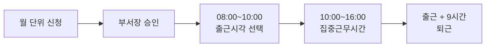
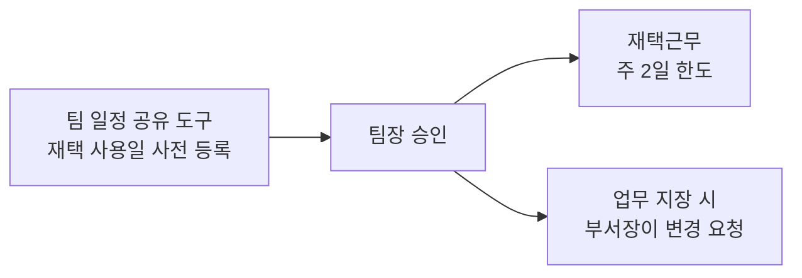

임직원의 근무시간과 근무형태를 안내한다. 소정근로시간은 1일 8시간·주 40시간이며, 기준 근무시간은 09시부터 18시까지다[^1]. 08시부터 10시 사이에서 출근시각을 선택하는 **시차출퇴근제**와 주 2일 한도의 **재택근무**를 함께 운영한다[^3][^7].

## 기본 근무시간

| 구분 | 시각 | 비고 |
|------|------|------|
| 기준 근무 | 09:00 ~ 18:00 | 소정근로 1일 8시간 |
| 휴게 | 12:00 ~ 13:00 | 근로시간에 포함하지 않음 |
| 집중근무 | 10:00 ~ 16:00 | 회의 소집·즉시 응답 요청 가능 |
| 출근 선택 폭 | 08:00 ~ 10:00 | 퇴근은 출근 + 9시간 |

소정근로시간은 1일 8시간, 주 40시간이다[^1]. 12시부터 13시까지는 휴게시간이다[^1].

## 시차출퇴근제

출근시각은 **08시부터 10시 사이에서 선택**하며, 퇴근시각은 선택한 출근시각에 9시간을 더한 시각이다[^2]. 예를 들어 08시 30분에 출근하면 17시 30분에 퇴근한다.

10시부터 16시까지는 **집중근무시간**으로, 전 임직원이 근무하는 시간대다[^3]. 이 시간대에는 회의 소집과 즉시 응답을 요청할 수 있으므로 회의는 이 안에서 잡는 것이 원칙이다.

출근시각 변경은 **월 단위**로 신청하고 부서장의 승인을 받는다[^4]. 긴급한 사유가 있으면 사후 신청할 수 있다[^4].

> **참고:** 통근버스는 본사 08시 40분 도착 기준으로만 운행하므로, 그보다 이른 출근시각을 선택하면 이용할 수 없다. 노선과 신청 방법은 [복지제도 안내](pages/e4b7c92a1f60.md)를 참고한다.

## 연장·야간·휴일근로

연장근로는 당사자 간 합의에 따라 **주 12시간**을 한도로 한다[^5]. 연장·야간·휴일근로는 **부서장의 사전 승인**을 받아야 하며, 승인 없이 수행한 근로에는 가산수당을 지급하지 않는다[^5].

가산 기준은 통상임금의 **100분의 50 이상**이며, 야간근로와 휴일근로도 같다[^6]. 통상임금 산정의 기준이 되는 급여 구성은 [수습 기간·퇴직금·계약 및 급여 지급](pages/583b61b7bedd.md)에서 확인할 수 있다.

## 근무시간 외 연락

계획된 근무시간 외에 받은 업무 연락에는 **응답할 의무가 없다**[^7]. 다만 장애 대응 등 긴급한 사유가 있는 경우에는 예외로 한다[^7].

이 원칙을 도구 설정으로 뒷받침하는 방법(캘린더 근무시간 설정, 비동기 소통 규칙)은 [소통 방식 및 협업 도구 안내](pages/c269f933b6a3.md)에 정리되어 있다. 근무시간 외의 외부 활동을 수행하려는 경우에는 [부업(Side Gig) 정책](pages/1788ac914648.md)의 신고 기준을 함께 확인한다.

## 재택근무

재택근무는 **주 2일**을 한도로 사용한다[^8]. 2024년 7월 1일부터 3개월간 시범 운영을 거쳐 **2024년 10월 1일부로 정식 도입**되었다[^8]. 시범 도입 당시의 의결 경위는 [2024년 6월 팀리더 정기회의 주요 의결 사항](pages/47163eb98e6b.md)에 남아 있다.

재택근무일에도 소정근로시간과 집중근무시간은 사무실 근무와 **동일하게** 적용한다[^9].

| 항목 | 기준 |
|------|------|
| 한도 | 주 2일 |
| 신청 | 팀 내 일정 공유 도구에 사전 등록 |
| 승인 | 팀장 승인 |
| 변경 | 업무에 중대한 지장이 있으면 부서장이 변경 요청 |
| 응답 | 근무시간 내 사내 메신저 응답 상시 유지 |

재택근무 중에도 사내 메신저 응답은 근무시간 내 상시 유지한다[^10]. 회사는 재택근무 여부를 확인할 목적으로 **협업 도구 접속 로그를 별도로 수집하지 않는다**[^10].

## 출장·외근 중 근무시간

출장·외근으로 근무시간의 전부 또는 일부를 사업장 밖에서 근로하여 근로시간을 산정하기 어려운 때에는 **소정근로시간을 근로한 것으로 본다**[^11].

출장에 따른 여비 지급 기준은 이 지침이 아니라 별도 지침이 정한다[^12]. 교통비·식비 정산 절차는 [출장비(여비) 정산 안내](pages/8300a3625b5f.md)를 참고한다.

## 근태 관리

출근시각과 퇴근시각은 근태 시스템에 기록한다[^13]. 기록이 누락되면 해당 월 마감일까지 부서장의 확인을 받아 정정한다[^13].

지각·조퇴·결근이 발생하면 지체 없이 부서장에게 사유를 알린다[^14]. 사전 승인 없는 결근은 **무급**으로 처리하며, 연차유급휴가로 대체하려면 사후 신청할 수 있다[^14].

휴가일수 산정의 기준이 되는 **소정근로일 출근율**은 이 근태 기록을 근거로 산정한다[^15]. 출근율에 따른 휴가 부여 일수는 [연차유급휴가 규정](pages/67910e3f5c0c.md)에서 확인할 수 있다.

## 적용 범위

모든 재직 임직원에게 적용한다[^16]. 다만 근로기준법 제63조에 따른 적용 제외 대상과 계약에서 달리 정한 경우에는 해당 규정 또는 계약을 따른다[^16].

[^1]: 근무시간 및 근무형태 운영지침.md, 제2장 근무시간 제3조 — "소정근로시간은 1일 8시간, 주 40시간으로 한다. 기준 근무시간은 09시 00분부터 18시 00분까지로 하며, 12시 00분부터 13시 00분까지를 휴게시간으로 한다."
[^2]: 근무시간 및 근무형태 운영지침.md, 제2장 근무시간 제4조 — "임직원은 08시 00분부터 10시 00분 사이에서 출근시각을 선택할 수 있다. 이 경우 퇴근시각은 선택한 출근시각에 9시간을 더한 시각으로 한다."
[^3]: 근무시간 및 근무형태 운영지침.md, 제2장 근무시간 제4조 — "10시 00분부터 16시 00분까지는 전 임직원이 근무하는 집중근무시간으로 하며, 이 시간대에는 회의 소집과 즉시 응답을 요청할 수 있다."
[^4]: 근무시간 및 근무형태 운영지침.md, 제2장 근무시간 제4조 — "출근시각의 변경은 월 단위로 신청하며 부서장의 승인을 받는다. 긴급한 사유가 있는 경우에는 사후 신청할 수 있다."
[^5]: 근무시간 및 근무형태 운영지침.md, 제2장 근무시간 제5조 — "연장근로는 당사자 간 합의에 따라 주 12시간을 한도로 한다. 연장·야간·휴일근로는 부서장의 사전 승인을 받아야 하며, 승인 없이 수행한 근로에 대해서는 가산수당을 지급하지 아니한다."
[^6]: 근무시간 및 근무형태 운영지침.md, 제2장 근무시간 제5조 — "연장근로에 대해서는 통상임금의 100분의 50 이상을 가산하여 지급한다. 야간근로와 휴일근로에 대한 가산 기준도 이와 같다."
[^7]: 근무시간 및 근무형태 운영지침.md, 제2장 근무시간 제6조 — "임직원은 계획된 근무시간 외에 수신한 업무 연락에 응답할 의무를 지지 아니한다. 다만 장애 대응 등 긴급한 사유가 있는 경우에는 그러하지 아니하다."
[^8]: 근무시간 및 근무형태 운영지침.md, 제3장 재택근무 제7조 — "임직원은 주 2일을 한도로 재택근무를 할 수 있다. 재택근무는 2024년 7월 1일부터 3개월간 시범 운영을 거쳐 2024년 10월 1일부로 정식 도입되었다."
[^9]: 근무시간 및 근무형태 운영지침.md, 제3장 재택근무 제7조 — "재택근무일에도 소정근로시간과 집중근무시간은 사무실 근무와 동일하게 적용한다."
[^10]: 근무시간 및 근무형태 운영지침.md, 제3장 재택근무 제9조 — "재택근무 중에도 사내 메신저 응답은 근무시간 내 상시 유지한다. 회사는 재택근무 여부를 확인할 목적으로 협업 도구 접속 로그를 별도로 수집하지 아니한다."
[^11]: 근무시간 및 근무형태 운영지침.md, 제4장 출장·외근 제10조 — "출장·외근으로 근무시간의 전부 또는 일부를 사업장 밖에서 근로한 경우로서 근로시간을 산정하기 어려운 때에는 소정근로시간을 근로한 것으로 본다."
[^12]: 근무시간 및 근무형태 운영지침.md, 제4장 출장·외근 제10조 — "출장에 따른 여비의 지급 기준은 별도의 출장비 정산 지침이 정하는 바에 따른다."
[^13]: 근무시간 및 근무형태 운영지침.md, 제5장 근태 관리 제11조 — "임직원은 출근시각과 퇴근시각을 근태 시스템에 기록한다. 기록 누락이 있는 경우 해당 월의 마감일까지 부서장의 확인을 받아 정정한다."
[^14]: 근무시간 및 근무형태 운영지침.md, 제5장 근태 관리 제12조 — "지각·조퇴·결근이 발생한 경우 임직원은 지체 없이 부서장에게 사유를 알린다. 사전 승인 없는 결근은 무급으로 처리하며, 연차유급휴가로 대체하려는 경우에는 사후 신청할 수 있다."
[^15]: 근무시간 및 근무형태 운영지침.md, 제5장 근태 관리 제12조 — "휴가일수 산정의 기준이 되는 소정근로일 출근율은 이 조에 따른 근태 기록을 근거로 산정한다."
[^16]: 근무시간 및 근무형태 운영지침.md, 제1장 총칙 제2조 — "이 지침은 모든 재직 임직원에게 적용한다. 다만 근로기준법 제63조에 따른 적용 제외 대상과 계약에서 달리 정한 경우에는 해당 규정 또는 계약이 정하는 바에 따른다."
