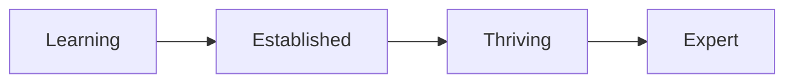
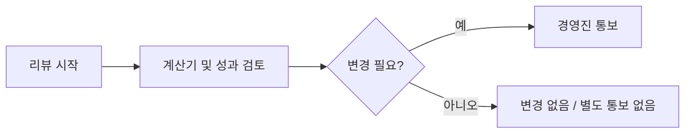

AJT는 투명성을 원칙으로 체계적인 보상 구조를 운영한다. 레벨(Level)·스텝(Step)·벤치마크를 조합해 급여를 산정하며, 연간 2~3회 급여 리뷰를 통해 구성원이 협상을 요청하지 않아도 적정 보상을 받을 수 있도록 한다.[^1]

## 레벨(Level)

레벨은 중요도가 아닌 **AJT 내 임팩트**를 나타낸다. 직위(title)가 아니므로 거대한 직급 체계를 만들지 않는다는 원칙에 기반한다.[^2]

| 레벨 | 설명 |
|---|---|
| Junior | 소규모 또는 기능 특정 프로젝트에 기여 (채용 빈도 낮음) |
| Intermediate | 중소 규모 임팩트의 프로젝트를 주도 |
| Senior | 고임팩트 프로젝트 또는 제품 전체를 주도하며 필요한 모든 것을 실행 |
| Staff | Senior와 동일하지만, 팀·제품·기능을 넘어 회사 전체에 영향을 주는 대형 프로젝트를 **일관성 있게** 주도 |
| Director | 최고 수준에서 운영, 보통 경영진 구성원이며 매니저의 매니저 |
| Principal (Director와 동급) | Staff와 동일하나 극히 희귀한 역량 보유 또는 매우 높은 수준에서 운영 |

레벨 결정은 체크리스트가 아니라 경영진의 판단에 기반하며 사내 다른 구성원과의 비교도 반영된다.[^3]

## 스텝(Step)

각 레벨 내에서 세분화된 단계로 유연성을 제공한다.[^4]

| 스텝 | 설명 |
|---|---|
| Learning | 기대치에 맞춰가는 중 |
| Established | 기대치 충족 |
| Thriving | 기대치 초과 |
| Expert | 기대치를 일관되게 초과 |

경력 초기 단계이거나 해당 역할이 처음인 경우를 제외하고, **기본 채용은 Established 스텝**으로 이루어진다. 이는 성공적인 출발을 위한 여지를 마련하고, 시니어리티를 높이지 않고도 급여 인상의 공간을 남겨 둔다.[^5]

## 벤치마크(Benchmark)

모든 역할의 기준 급여는 **국내 동종 업계 시장 요율**을 기반으로 한다.[^6]

- 주요 데이터 소스: 국내 임금 조사 자료
- 엔지니어링 직군: 시장의 90번째 백분위수(90th percentile) 수준 지급 — 평균과 최상위 엔지니어 간의 10배 차이가 있다고 판단하기 때문[^7]
- 기타 직군: 50번째 백분위수 + 20% 수준 지급[^8]

임원 보상은 별도의 유료 데이터베이스를 사용하며 공개하지 않는다. 임원은 시장 평균 이상이지만 최상위 수준은 아닌 방식으로 보상한다.[^9]

## 급여 리뷰 프로세스

급여 리뷰는 연간 **2~3회** 전 구성원을 대상으로 진행되며, 구성원이 직접 요청하지 않아도 적정 수준으로 유지한다.[^16]

주요 원칙:[^17]

- 급여 인상 요청 빈도는 고려하지 않는다 — 소수집단이 급여 협상을 덜 요청하는 경향을 고려한 포용적 설계
- 급여 검토 시 **인플레이션을 별도로 반영하지 않는다** — 시장 데이터에 이미 반영되어 있기 때문[^18]
- 역할 변경 시 변경 사항은 다음 가장 가까운 리뷰 시점에 적용된다[^19]
- 변경이 있을 경우에만 관련 경영진 구성원이 통보하며, 동일 유지 시에는 별도 통보 없음[^20]

> **참고:** 이 문서는 보상 등급(레벨·스텝) 기준을 다룬다. 승진 판단 방식과 성장 지원 방식은 부서 위키의 경력 개발 문서를 참고한다.

[^1]: 08-compensation.md, ## 운영 방식(How it works) — "AJT는 투명성의 일환으로 정해진 보상 체계를 갖추고 있다."
[^2]: 08-compensation.md, ### 레벨(Level) — "레벨은 중요도가 아니라 AJT 내 임팩트와 연관된다. 레벨은 직위(title)가 아니다 — 모든 구성원이 자신이 속한 회사의 주인이라는 느낌을 가져야 한다고 믿기 때문에, 거대한 직급 위계를 두지 않는다."
[^3]: 08-compensation.md, ### 레벨(Level) — "이는 체크리스트가 아니라는 점을 유의해야 한다. 위 설명은 어디까지나 예시이며, 어느 레벨에 해당하는지는 경영진의 판단과 AJT 내 다른 구성원과의 비교에 따라 어느 정도 재량이 개입된다."
[^4]: 08-compensation.md, ### 스텝(Step) — "각 레벨 내에서 더 유연하게 대응할 수 있도록 세부 단계를 두고 있다."
[^5]: 08-compensation.md, ### 스텝(Step) — "경력 초기 단계이거나 해당 유형의 역할이 처음인 경우를 제외하면, 기본적으로 Established 단계로 채용한다. 이는 모두가 성공적으로 자리 잡을 기회를 제공하고, 시니어리티를 높이지 않고도 급여 인상의 여지를 충분히 남겨 둔다."
[^6]: 08-compensation.md, ### 벤치마크(Benchmark) — "보상 철학에 따라, 채용 중인 각 역할의 벤치마크는 국내 동종 업계 시장 요율을 기준으로 한다."
[^7]: 08-compensation.md, ### 벤치마크(Benchmark) — "엔지니어링 시장은 경쟁이 매우 치열하고, 평균적인 엔지니어와 최상위 엔지니어 사이에 10배의 차이가 있다고 보기 때문에, 시장 상위권에 가깝게 지급한다. 이는 리뷰 시점 기준 90번째 백분위수로 정의한다."
[^8]: 08-compensation.md, ### 벤치마크(Benchmark) — "그 밖의 역할에 대해서는 여전히 시장 상위권을 지향하며, 이는 50번째 백분위수 + 20%로 정의한다."
[^9]: 08-compensation.md, ### 임원 보상(Executive Compensation) — "원칙적으로 임원은 평균 이상이지만 시장 최상위는 아닌 수준으로 보상한다."
[^16]: 08-compensation.md, ## 급여 리뷰(Pay Reviews) — "급여는 연간 2~3회 선제적으로 검토하며, 팀 전원이 매 급여 리뷰 대상이 된다."
[^17]: 08-compensation.md, ### 리뷰 프로세스 진행 방식 — "모두에게 급여 인상의 공정한 기회를 주기 위해, 얼마나 자주 인상을 요청했는지는 고려하지 않는다."
[^18]: 08-compensation.md, ## 급여 리뷰(Pay Reviews) — "급여 리뷰 시에는 인플레이션을 별도로 반영하지 않는데, 이는 시장 데이터에 이미 반영되어 있기 때문이다."
[^19]: 08-compensation.md, ## 급여 리뷰(Pay Reviews) — "이러한 리뷰 시점 이외에는 별도로 변경하지 않는다 — 예를 들어 역할이 바뀌는 경우, 변경 사항은 보통 가장 가까운 다음 리뷰 시점에 반영한다."
[^20]: 08-compensation.md, ### 리뷰 프로세스 진행 방식 — "급여에 변동이 있는 경우에만 연락을 받게 되며, 그대로 유지되는 경우에는 별도 연락이 없다."
