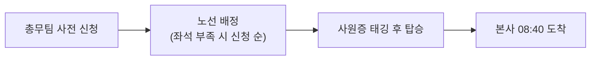

임직원에게 제공하는 복지제도를 한곳에 정리한다. 생활 지원, 건강 지원, 가족 지원의 세 갈래로 운영하며[^1], 재직 중인 정규직과 수습 기간 중인 임직원에게 동일하게 적용한다[^1].

## 한눈에 보기

| 항목 | 지원 내용 | 신청 |
|------|-----------|------|
| 중식 식대 | 월 15만 원 (사원증 충전) | 자동 |
| 석식 | 19시 이후 근무 시 1회 1만 5천 원 한도 실비 | 법인카드 |
| 통근버스 | 강남·판교·잠실 3개 노선, 아침만 운행 | 총무팀 |
| 사내 헬스장 | 지하 1층, 평일 07:00~22:00, 무료 | 자유 이용 (사물함만 신청) |
| 종합건강검진 | 연 1회 전액, 만 35세 이상 상급 항목 추가 | 자동 |
| 심리 상담 | 연 6회 무료 | 총무팀 |
| 자녀 학자금 | 중·고교 자녀 1인당 연 200만 원 | 총무팀 (3월·9월) |

계약직 임직원에게는 식대 지원·통근버스·사내 헬스장·건강검진을 동일하게 적용하고, 자녀 학자금은 적용하지 않는다[^2]. 고용 형태별 처우의 다른 항목은 [수습 기간·퇴직금·계약 및 급여 지급](pages/583b61b7bedd.md)에 정리되어 있다.

## 식대 지원

중식 식대로 **1인당 월 15만 원**을 지원한다[^3]. 지원금은 사원증에 충전되며 사내 카페와 인근 제휴 식당에서 쓸 수 있다[^3]. **미사용 잔액은 이월되지 않고 매월 말일 소멸한다**[^3].

사내 카페의 **음료 구매는 식대 지원 대상이 아니며 개인 부담**이다[^4]. 카페 운영 시간과 결제 방법은 [사내 카페 이용 안내](pages/d7454bb41e34.md)를 참고한다.

19시 이후까지 근무하는 경우 석식 비용을 **1회 1만 5천 원 한도**로 실비 정산하며, 법인카드 사용이 원칙이다[^5].

## 통근버스

평일 아침에 **강남·판교·잠실 3개 노선**을 운행하며, 각 노선은 본사 **08시 40분 도착**을 기준으로 편성한다[^6]. 탑승은 사전 등록제로, 총무팀에 신청한 뒤 사원증을 태깅해 이용한다[^7]. 좌석이 부족한 노선은 신청 순서로 배정한다[^7].

**퇴근 시간대에는 운행하지 않는다**[^8]. 08시 40분보다 이른 출근이 필요하면 통근버스를 이용할 수 없으므로 출근시각 선택 시 이를 고려한다[^8]. 시차출퇴근제의 출근시각 선택 폭은 [근무시간 및 근무형태 안내](pages/2f8c41d7ab90.md)를 참고한다.

## 사내 헬스장

**지하 1층**에 있으며 평일 **07시부터 22시까지** 개방한다[^9]. 이용료는 없고 사원증 태깅으로 출입한다[^9].

샤워실과 운동복은 무료이며 운동복은 **당일 반납**이 원칙이다[^10]. 개인 사물함은 **분기 단위로 신청받아 추첨** 배정한다[^10].

## 건강검진

전 임직원에게 **연 1회** 종합건강검진을 지원하며 비용은 회사가 **전액 부담**한다[^11]. **만 35세 이상**에게는 상급 검진 항목을 추가 지원한다[^11].

배우자 검진은 본인 검진의 **50퍼센트 범위**에서 비용을 지원한다[^12].

**검진 당일은 유급으로 처리하며 연차유급휴가를 차감하지 않는다**[^13]. 연차 부여·사용 기준은 [연차유급휴가 규정](pages/67910e3f5c0c.md)에서 확인할 수 있다.

## 심리 상담

외부 전문기관을 통한 상담을 **연 6회까지 무료**로 지원한다[^14]. **상담 내용은 회사에 공유되지 않으며, 신청 사실도 인사 평가에 반영하지 않는다**[^14].

## 자녀 학자금

**중학교·고등학교에 재학 중인 자녀** 1인당 **연 200만 원** 한도로 지원하며, 대상 자녀 수에는 제한이 없다[^15]. **대학교 학자금은 지원하지 않는다**[^16].

신청은 **매년 3월과 9월**에 받으며 재학증명서와 납입증명서를 함께 제출한다[^17].

## 출산·육아

출산 경조금과 배우자 출산휴가는 경조사 지원 기준을 따른다[^18]. 금액과 휴가 일수는 [경조사 지원 기준](pages/754b18f663d4.md)에서 확인할 수 있다.

**만 8세 이하 자녀**를 둔 임직원은 **육아기 근로시간 단축**을 신청할 수 있으며, 단축 시간과 절차는 근무시간 및 근무형태 운영지침을 따른다[^18].

## 신청 경로 정리

식대 지원과 건강검진은 **별도 신청 없이 자동 적용**한다[^19]. 통근버스·헬스장 사물함·심리 상담·자녀 학자금은 **총무팀에 신청**한다[^19].

교육비·도서 구입비는 이 안내가 아니라 **각 부서의 교육 지원 지침**을 따른다[^20]. 개발부의 경우 개발부 위키의 「교육 및 도서 지원」에 별도로 정리되어 있다.

[^1]: 복지제도 운영 안내.md, 1. 복지제도 개요 — "복지제도는 생활 지원, 건강 지원, 가족 지원의 세 갈래로 운영한다. 모든 항목은 재직 중인 정규직 임직원에게 적용하며, 수습 기간 중인 임직원에게도 동일하게 적용한다."
[^2]: 복지제도 운영 안내.md, 1. 복지제도 개요 — "계약직 임직원에게는 식대 지원, 통근버스, 사내 헬스장, 건강검진을 동일하게 적용하고, 자녀 학자금은 적용하지 아니한다."
[^3]: 복지제도 운영 안내.md, 2.1 식대 지원 — "중식 식대로 1인당 월 15만 원을 지원한다. 지원금은 사원증에 충전되며, 사내 카페와 인근 제휴 식당에서 사용할 수 있다. 미사용 잔액은 이월하지 아니하고 매월 말일 소멸한다."
[^4]: 복지제도 운영 안내.md, 2.1 식대 지원 — "사내 카페의 음료 구매는 식대 지원 대상이 아니며 개인 부담으로 한다."
[^5]: 복지제도 운영 안내.md, 2.1 식대 지원 — "야근으로 19시 이후까지 근무하는 경우 석식 비용을 1회 1만 5천 원 한도로 실비 정산한다. 정산은 법인카드 사용을 원칙으로 한다."
[^6]: 복지제도 운영 안내.md, 2.2 통근버스 — "본사 통근버스는 평일 아침에 3개 노선을 운행한다. 노선은 강남 노선, 판교 노선, 잠실 노선이며, 각 노선은 본사에 08시 40분 도착을 기준으로 편성한다."
[^7]: 복지제도 운영 안내.md, 2.2 통근버스 — "탑승은 사전 등록제로 운영하며, 총무팀에 신청한 뒤 사원증을 태깅하여 이용한다. 좌석이 부족한 노선은 신청 순서에 따라 배정한다."
[^8]: 복지제도 운영 안내.md, 2.2 통근버스 — "퇴근 시간대에는 운행하지 아니한다. 시차출퇴근제로 08시 40분보다 이른 출근이 필요한 임직원은 통근버스를 이용할 수 없으므로 이 점을 고려하여 출근시각을 선택한다."
[^9]: 복지제도 운영 안내.md, 2.3 사내 헬스장 — "사내 헬스장은 지하 1층에 있으며 평일 07시부터 22시까지 개방한다. 이용료는 없으며 사원증 태깅으로 출입한다."
[^10]: 복지제도 운영 안내.md, 2.3 사내 헬스장 — "샤워실과 운동복은 무료로 제공하되 운동복은 당일 반납을 원칙으로 한다. 개인 사물함은 분기 단위로 신청받아 추첨으로 배정한다."
[^11]: 복지제도 운영 안내.md, 3.1 종합건강검진 — "전 임직원에게 연 1회 종합건강검진을 지원한다. 검진 비용은 회사가 전액 부담하며, 만 35세 이상 임직원에게는 상급 검진 항목을 추가로 지원한다."
[^12]: 복지제도 운영 안내.md, 3.1 종합건강검진 — "배우자 검진은 본인 검진의 50퍼센트 범위에서 비용을 지원한다."
[^13]: 복지제도 운영 안내.md, 3.1 종합건강검진 — "검진 당일은 유급으로 처리하며 연차유급휴가를 차감하지 아니한다."
[^14]: 복지제도 운영 안내.md, 3.2 심리 상담 — "외부 전문기관을 통한 심리 상담을 연 6회까지 무료로 지원한다. 상담 내용은 회사에 공유되지 아니하며, 신청 사실도 인사 평가에 반영하지 아니한다."
[^15]: 복지제도 운영 안내.md, 4.1 자녀 학자금 — "중학교·고등학교에 재학 중인 자녀에 대하여 1인당 연 200만 원 한도로 학자금을 지원한다. 지원 대상 자녀 수에는 제한을 두지 아니한다."
[^16]: 복지제도 운영 안내.md, 4.1 자녀 학자금 — "대학교 학자금은 지원하지 아니한다."
[^17]: 복지제도 운영 안내.md, 5. 신청 방법 — "자녀 학자금은 매년 3월과 9월에 신청받으며, 재학증명서와 납입증명서를 함께 제출한다."
[^18]: 복지제도 운영 안내.md, 4.2 출산·육아 — "출산 경조금과 배우자 출산휴가는 경조사 지원 기준이 정하는 바에 따른다. 만 8세 이하 자녀를 둔 임직원은 육아기 근로시간 단축을 신청할 수 있으며, 단축 시간과 절차는 근무시간 및 근무형태 운영지침이 정하는 바에 따른다."
[^19]: 복지제도 운영 안내.md, 5. 신청 방법 — "식대 지원과 건강검진은 별도 신청 없이 자동으로 적용한다. 통근버스, 헬스장 사물함, 심리 상담, 자녀 학자금은 총무팀에 신청한다."
[^20]: 복지제도 운영 안내.md, 6. 다른 제도와의 관계 — "교육비·도서 구입비 지원은 각 부서의 교육 지원 지침이 정하는 바에 따르며 이 안내의 적용을 받지 아니한다."
