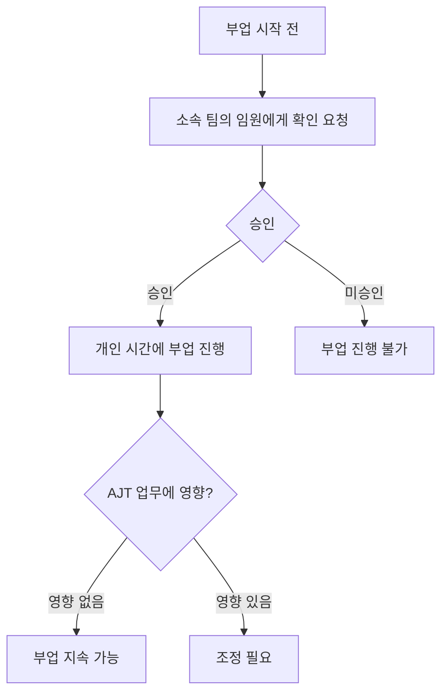

## 요약

부업을 시작하기 전에 소속 팀의 임원에게 사전 확인을 받아야 한다[^13].

---

AJT는 열정 있는 인재를 채용한다. 부업(Side Gig)은 그 열정의 표현으로 인정되며, 회사는 유급 부업을 일정 범위 내에서 허용한다[^1]. 단, AJT가 단순한 월급 수단이 아닌 **주된 동기**가 되어야 하며, 이 때문에 현재 파트타임 근무도 제공하지 않는다[^2].

## 허용 기준 요약

| 구분 | 내용 |
|------|------|
| 유급 부업 | 허용 (월 몇 시간 수준) |
| 무급 부업 | 허용 |
| 파트타임 근무 | 현재 불가 |
| 부업이 주된 집중 대상인 경우 | 불허 |
| AJT 업무 시간 중 부업 | 원칙적으로 불가 |

## 시간 관리

부업이 적절하려면 **AJT 업무에 지장을 주지 않아야 한다**[^3]. 유급 부업은 월 몇 시간 수준이 허용 기준이며, 기본적으로 **개인 시간**에 진행해야 한다[^4].

장기적으로 부업을 본업으로 전환하고자 하는 경우, 미리 알려 주면 장기 목표와 AJT의 필요를 함께 조율하는 계획을 세울 수 있다[^5].

AJT에서 최선을 다하고 있고 건강도 잘 챙기고 있다면, (유급·무급 불문) 매주 약간의 시간을 부업에 사용하는 것은 전적으로 괜찮다[^6].

## 지식재산(IP) 귀속

AJT는 직원이 **개인 시간에** 만든 지식재산(IP)에 대한 소유권을 주장하지 않는다[^7]. 개인 시간, 개인 자원을 활용한 사이드 프로젝트는 별도 허가·검토·승인이 필요하지 않다[^8].

단, 다음 사항을 반드시 지켜야 한다[^9].

- **AJT의 비공개 IP를 외부 프로젝트에 포함하지 않는다.**
- MIT 라이선스로 명시된 AJT 자산은 사용 가능하다.
- 그 외 AJT 자산은 사용 불가다.

### AJT 내부에서 시작된 프로젝트

업무 시간, AJT 코드·데이터·도구·인프라를 활용해 탄생한 프로젝트는 **AJT 소유**이며, AJT 저장소에 보관해야 한다[^10]. 이를 사이드 프로젝트로 발전시키려면 **명시적 허가**가 필요하다[^11].

이 부분에 대해 우려가 있다면 법무 담당자에게 문의한다. 특히 진행 중인 작업이 AJT가 이미 구축했거나 로드맵에 있는 것과 직접 경쟁하는 경우 더욱 중요하다[^12].

## 사전 승인 절차

부업을 시작하기 전에, **소속 팀의 임원**에게 확인을 받아야 한다[^13].

AJT 입사 전부터 존재했던 부업이라면 통상 **온보딩 과정에서** 처리된다[^14].

겸직 허용 여부는 근로계약 조건의 일부이므로, 계약 형태와 급여 지급 등 고용 조건 전반은 [수습 기간·퇴직금·계약 및 급여 지급](pages/583b61b7bedd.md)을 참고한다.

[^1]: 02-side-gigs.md, 부업(Side Gig) 정책 — "AJT는 열정 있는 인재를 채용한다. 이런 열정은 부업을 취미로 갖고 있는 사람들에게서 자주 발견된다."
[^2]: 02-side-gigs.md, 부업(Side Gig) 정책 — "AJT는 규모가 크지 않은 회사라 구성원 각자에게 AJT가 주된 동기부여 대상이 되어야 한다. 이런 이유로 현재 AJT는 파트타임 근무를 선택지로 제공하지 않는다."
[^3]: 02-side-gigs.md, 시간 관리 — "부업이 적절한지를 가르는 핵심 기준은 업무에 미치는 영향과 소요 시간이다."
[^4]: 02-side-gigs.md, 시간 관리 — "유급 부업에 월 몇 시간 정도를 쓰는 것은 괜찮다. 어떤 경우든 부업은 기본적으로 개인 시간에 진행해야 하며, AJT에서의 업무에 지장을 주어서는 안 된다."
[^5]: 02-side-gigs.md, 시간 관리 — "미리 알려 주면 함께 계획을 세울 수 있다. 우리는 구성원이 동기를 유지하는 핵심이 각자의 장기 목표 달성을 돕고, 이를 AJT가 필요로 하는 것과 맞추는 데 있다고 본다."
[^6]: 02-side-gigs.md, 시간 관리 — "AJT를 위해 기대 이상으로 애쓰면서도 스스로를 잘 돌보고 있다면, (유급이든 무급이든) 부업은 전적으로 괜찮다."
[^7]: 02-side-gigs.md, 지식재산 — "AJT는 구성원이 개인 시간에 만든 지식재산(IP)에 대한 소유권을 주장하지 않는다."
[^8]: 02-side-gigs.md, 지식재산 — "개인 시간과 개인 자원으로 진행하는 사이드 프로젝트는 AJT의 허가·검토·승인을 받을 필요가 없다."
[^9]: 02-side-gigs.md, 지식재산 — "자신이 진행하는 프로젝트에 AJT의 비공개 지식재산을 절대 끌어들이지 않도록 각별히 주의해야 한다"
[^10]: 02-side-gigs.md, AJT 내부에서 시작된 프로젝트 — "업무 시간, AJT의 코드, AJT의 데이터, 그 밖의 AJT 도구·인프라를 활용해 시작된 프로젝트는 AJT 소유이며 AJT의 저장소에 있어야 한다."
[^11]: 02-side-gigs.md, AJT 내부에서 시작된 프로젝트 — "이런 프로젝트를 사이드 프로젝트로 계속 발전시키고 싶다면 명시적인 허가가 필요하다."
[^12]: 02-side-gigs.md, AJT 내부에서 시작된 프로젝트 — "특히 진행하려는 작업이 AJT가 이미 구축했거나 로드맵에 있는 것과 직접 경쟁하는 경우라면, 법무 담당자가 최선의 해결책을 함께 찾아준다."
[^13]: 02-side-gigs.md, 사전 승인 — "부업을 진행하기 전에 소속 팀의 임원에게 확인을 받아 승인을 얻어야 한다."
[^14]: 02-side-gigs.md, 사전 승인 — "AJT에 입사하기 전부터 하고 있던 부업이라면, 통상 온보딩 과정에서 함께 처리된다."
