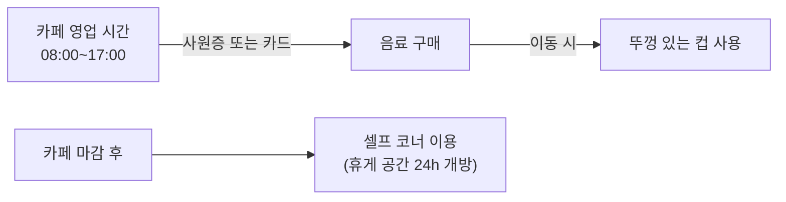

3층 사내 카페의 운영 시간과 결제 수단, 그리고 마감 후 휴게 공간 이용 방법을 안내한다.

## 운영 시간 및 결제

카페는 평일에만 운영하며, 마감 후에도 휴게 공간은 24시간 개방된다[^1].

| 항목 | 내용 |
|---|---|
| 운영 시간 | 평일 08:00 ~ 17:00 |
| 결제 수단 | 사원증 태깅(월급 공제) 또는 카드 |
| 휴게 공간 | 24시간 개방 (카페 마감 후 셀프 코너 이용) |

## 음료 반출

카페 음료를 외부로 가지고 나갈 때에는 반드시 뚜껑 있는 컵을 사용해야 한다[^2].

> **참고:** 사내 회의실 예약 및 이용 기준은 [회의실 예약 안내](pages/6405671924d1.md) 참고.

[^1]: 01-사내 카페 운영 안내.txt, 운영 시간 — "운영 시간: 평일 08:00 ~ 17:00 / 휴게 공간은 24시간 개방되며 카페 마감 후에는 셀프 코너를 이용해 주세요."
[^2]: 01-사내 카페 운영 안내.txt, 운영 시간 — "음료 반출 시 뚜껑 있는 컵을 사용해 주시기 바랍니다."
