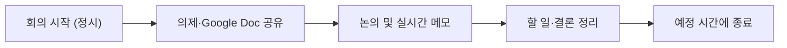
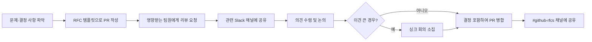

여러 나라에 걸쳐 근무하는 팀원들이 효율적으로 협업할 수 있도록, **비동기 소통을 기본**으로 하는 원칙과 각 도구의 사용 기준을 정리한다[^1].

## 소통의 기본 원칙

| 원칙 | 내용 |
|------|------|
| 긍정적 의도 전제 | 항상 긍정과 배려의 관점에서 소통한다 |
| 의견 표명 | 위치·배경이 다르더라도 자신의 생각·의견·감정을 표현한다 |
| 피드백 | 직접적이되 건설적인 방식으로 서로의 성장을 돕는다 |

[^2a][^2b][^2c]

비동기 소통을 우선시하되, 주요 채널은 GitHub(이슈·풀 리퀘스트)이며 공지는 Slack의 적절한 채널에 올린다[^3]. **업무 시간 외 메시지 응답 의무는 없다**[^4].

## 도구별 사용 기준

| 도구 | 사용 시기 |
|------|-----------|
| GitHub (PR/이슈) | 제품·문서 변경 제안, 프로젝트 추적, 의사결정 |
| Slack | 비공식 소통, GitHub 이슈로 다루기 어려운 즉각적 소통 |
| Google Docs | 회의 노트, 사내 공유 업데이트·지표 등 기밀성 높은 내용 |
| Google Meet | 화상 회의 |
| 이메일 | 법무 승인, 공식 문서(채용 제안·급여 서류), 외부 파트너 소통에 한정 |

[^5]

## GitHub 사용 원칙

### 풀 리퀘스트(PR) 우선

문서나 코드 변경을 제안할 때는 이슈보다 **PR을 먼저 여는 것**이 원칙이다[^6]. PR은 구체적인 변경안을 제시하므로 실행 가능한 논의가 가능하다. 문제를 정의하고 최소한의 변경(MVC)을 제안하는 방식으로, 완전한 합의보다 **빠른 행동**을 지향한다[^7].

### 이슈

코드·문서 변경이 없는 경우(진행 상황 추적, 프로젝트 관리 등)에 이슈를 연다[^8]. 주제를 하나로 좁히고, 원하는 결과를 명확히 정의해 이슈가 오래 열려있지 않도록 한다.

### GitHub 알림 관리

GitHub 활동을 놓치지 않기 위한 방법[^9]:

- GitHub Slack 알림 설정(강력 권장): 멘션·리뷰 요청 발생 시 Slack으로 알림 수신
- `#github-rfcs` 채널 구독: 전사 RFC가 게시되는 채널
- GitHub 이메일 알림 설정 후 팀 활동 필터 적용

## Slack 사용 기준

Slack은 비공식 소통 또는 GitHub 이슈로 다루기 어려운 상황에 사용한다[^10]. 중요한 결정과 맥락은 GitHub에 남긴다[^11].

**Slack 에티켓**[^12]:

1. `#general`은 전사 공지 전용으로 유지한다
2. `@channel` / `@here`는 긴급하거나 즉각적인 주의가 필요한 경우에만 사용한다
3. 답변은 스레드에 달아 채널 알림을 최소화한다
4. 여러 생각은 한 메시지로 묶어서 보낸다
5. 자리를 비운다는 알림은 불필요하다 — 실시간 응답을 기대하지 않는다
6. 프로필에 올바른 이름·성을 유지한다

### 채널 이름 규칙

| 접두사 | 용도 |
|--------|------|
| `#team-[팀명]` | 팀 채널 (teams 페이지 등록 팀에 한함) |
| `#project-[프로젝트명]` | 여러 팀이 참여하는 일회성 이니셔티브 |
| `#ajt-[고객명]` | 고객 전용 공유 채널 |
| `#alerts-[팀명]` | 팀 알림 전용 채널 |
| `#support-[제품명]` | 지원 요청 피드 채널 |
| `#offsite-[팀]-[월]-[연]-[장소]` | 팀 오프사이트 계획 채널 |
| `#hiring-[팀명]` | 채용 논의·후보자 피드백 채널 |
| `#interview-[이름]-[역할]` | 채용 인터뷰 조율 채널 |

[^13]

### 채널 주요 두 가지

최신 제품 현황을 파악하려면 아래 두 채널을 구독한다[^14]:

- **`#changelog`**: 방금 출시된 것. PR 병합 시 자동 업데이트
- **`#coming-soon`**: 곧 출시될 것. 매일 요약 게시

## 내부 회의

회사는 화상 회의에 **Google Meet**을 사용한다[^15]. 대규모 회의에서는 `Cmd + 마이너스(−)` 키로 화면을 축소해 모든 참석자를 볼 수 있다. 대면 회의가 필요한 경우 사내 회의실 예약 규칙은 [회의실 예약 안내](pages/6405671924d1.md)를 따른다.

**회의 진행 기준**[^16]:

1. 회의마다 의제·준비 자료가 담긴 Google Doc 또는 GitHub 이슈를 연결한다
2. 캘린더 초대 시 '게스트가 일정 수정 가능' 옵션을 켠다
3. 가능하면 항상 카메라를 켠다 — 가족·반려동물이 배경에 보여도 환영한다
4. 불필요한 배경 소음이 있으면 마이크를 음소거한다
5. 회의 중 요점과 할 일을 실시간으로 기록한다
6. 정시에 시작하고, 늦은 참석자를 기다리지 않는다
7. 예정 시간에 맞춰 종료한다

### 캘린더 관리

- 휴가·출장·이동 등 부재 일정을 본인 캘린더에 미리 등록한다[^17]
- Google Calendar 설정 → 근무시간 설정: 시간대별 협업 편의를 위해 근무시간을 설정한다
- 공개 범위를 **'AJT에 공개 — 모든 일정 상세 보기'**로 설정하고, 개인 약속이나 민감한 미팅은 개별 일정을 '비공개'로 지정한다[^18]

## 변경 요청(RFC)

RFC(Request for Comments)는 결정 사항을 소통하고 피드백을 모으기 위한 방식이다. 투명성을 높이고 생각을 체계적으로 정리하는 데 도움이 된다[^19].

### RFC 진행 절차

[^20]

### RFC 작성이 적합한 상황

- 한 팀에만 영향을 주거나 비교적 이견이 없는 변경[^21]
- 2~3주 이상의 작업이 필요한 경우
- 새로운 기술 도입
- 제품·회사에 큰 변화를 가져오는 기능·정책

### RFC 작성 시 유의사항

- RFC는 짧아도 된다 — Slack 스레드보다 나은 경우가 많다[^22]
- 결정에 2일이면 충분할 수도 있다 (충분한 의견을 받았을 때)
- 완전한 합의가 목표가 아니다 — 관련 피드백을 수렴한 뒤 결정권자가 판단한다
- RFC는 **원본 사고**를 담아야 하므로 AI에 전면 위임하지 않는다. AI는 리서치·최종 다듬기에만 활용한다[^23]

## 문서화 원칙

- **공개가 기본**: 제품·로드맵·핸드북·전략 등 대부분의 정보는 공개한다[^24]
- **내부 공유**: 재무 성과·보안·채용·펀딩 등
- **비공개**: 보상, 징계 등 개인 정보

중요한 내용은 Slack이 아닌 GitHub 또는 핸드북에 기록해야 한다 — Slack은 검색이 어렵고 맥락을 보존하기 어렵다[^25].

### 문서 작성 스타일

| 항목 | 기준 |
|------|------|
| 두문자어 | 피할 수 있으면 피한다 |
| 링크 텍스트 | "여기"·"클릭하세요" 대신 내용을 설명하는 텍스트 |
| 제목 | 문장 형식 (Sentence case) |
| 숫자 | 1,000 단위 쉼표 또는 10M·100B로 약식 표기 |

[^26]

## 보안 주의사항

AJT 구성원은 피싱·사기 시도의 빈번한 대상이다[^27]. **업무 소통은 Slack에서 이루어지는 것을 기본으로 가정한다.** 전화·SMS·WhatsApp은 요청·승인·민감한 정보 전달에 사용하지 않는다.

Slack 외부에서 연락이 오면 **신뢰하지 않는 것이 기본**이다 — Slack으로 해당 인물에게 직접 확인한 후에만 대화를 이어간다[^28]. 계정 관리·기밀 문서 취급을 포함한 전사 보안 원칙은 [정보보안 지침](pages/a67336b0c716.md)을 따른다.

**임원진은 전신 송금, 상품권, MFA 코드, 접근 권한 변경을 이메일·SMS·WhatsApp·전화로 절대 요청하지 않는다.** 이런 요청은 피싱으로 간주하고 `#phishing-attempts` 채널에 신고한다[^29].

[^1]: 12-communication.md, 개요 — "여러 나라에 흩어져 근무하는 팀원들과 효율적으로 협업하려면 서로 연결되어 있다는 느낌을 유지하면서도 명확하게 소통하는 것이 중요하다."
[^2a]: 12-communication.md, 소통 가치관 — "긍정적 의도를 전제한다. 언제나 긍정과 배려의 태도로 소통을 시작한다."
[^2b]: 12-communication.md, 소통 가치관 — "자기 의견을 형성한다. 우리는 서로 다른 지역에 살고 있고 관점도 다른 경우가 많다. 각자의 생각·의견·감정을 알고 싶다."
[^2c]: 12-communication.md, 소통 가치관 — "피드백은 필수다. 직접적이되 건설적인 방식으로 서로의 성장을 돕는다."
[^3]: 12-communication.md, 황금률 — "가능하면 비동기 소통을 사용한다: 풀 리퀘스트(우선) 또는 이슈. 공지는 적절한 Slack 채널에서 이루어지며"
[^4]: 12-communication.md, 황금률 — "항상 응대 가능한 상태일 필요는 없다. 계획된 근무 시간 외의 메시지에 응답할 의무는 없다."
[^5]: 12-communication.md, 문서 소통 방식 — "사내 이메일은 거의 모든 경우에 피한다. 기능·제품 논의에는 GitHub를 쓰고, GitHub를 쓸 수 없으면 Slack을, 그 외에는 Google Docs를 사용한다."
[^6]: 12-communication.md, 모든 것은 풀 리퀘스트로 시작한다 — "가능하면 이슈 대신 풀 리퀘스트(PR)로 논의를 시작하는 것이 좋은 관행이다."
[^7]: 12-communication.md, 모든 것은 풀 리퀘스트로 시작한다 — "행동을 우선하고 합의를 목표로 삼지 않는다 — 약간의 개선이라도 하지 않는 것보다 낫다."
[^8]: 12-communication.md, 이슈 — "특정 코드나 문서 변경이 제안되거나 필요하지 않은 경우 GitHub 이슈가 유용하다."
[^9]: 12-communication.md, 리뷰·이슈·알림 관리하기 — "이를 관리하기 위해 자신이 멘션된 이슈를 정기적으로 살펴볼 것을 권한다."
[^10]: 12-communication.md, Slack — "Slack은 좀 더 비공식적인 소통, 또는 이슈나 풀 리퀘스트를 만들 만큼은 아닌 상황에 사용한다."
[^11]: 12-communication.md, Slack — "맥락 대부분을 비공개 공간에 두면, 특정 결정의 근거를 이해하려는 사람들에게 불리하게 작용할 수 있다."
[^12]: 12-communication.md, Slack 에티켓 — "#general은 전사 공지 전용으로 유지한다."
[^13]: 12-communication.md, Slack — 채널 이름 규칙(혼동 방지)
[^14]: 12-communication.md, 출시 현황 확인하기 — "AJT의 모든 구성원이 아래 두 채널에 참여해 무엇이 출시됐고 무엇이 곧 출시될지 파악할 것을 권한다."
[^15]: 12-communication.md, 사내 회의 — "AJT는 화상 소통에 Google Meet을 사용한다."
[^16]: 12-communication.md, 사내 회의 — "예정된 회의 대부분은 Google Doc이나 관련 GitHub 이슈가 연결되어 있어야 한다."
[^17]: 12-communication.md, 가용 시간 표시 — "공휴일, 휴가, 이동 시간 등 계획된 부재 시간을 본인 캘린더에 입력한다."
[^18]: 12-communication.md, Google Calendar — "Google Calendar의 접근 권한을 'AJT에 공개 — 모든 일정 세부정보 보기'로 설정할 것을 권한다."
[^19]: 12-communication.md, 변경 요청(RFC) — "RFC는 어떤 결정에 대해 소통하고 피드백을 모으는 데 사용한다. RFC는 우리를 투명하게 유지해주고, 작성 과정에서 생각을 체계적으로 명확히 정리하게 해주므로 유용하다."
[^20]: 12-communication.md, 변경 요청(RFC) — RFC 진행 단계 1-5
[^21]: 12-communication.md, RFC 작성이 적합한 상황 — "스스로 명확히 하고 싶거나, 한 팀에만 영향을 미치는 경우"
[^22]: 12-communication.md, RFC 작성 요령 — "RFC는 아주 짧아도 되며, Slack 스레드로 결정하는 것보다 나은 경우가 많다."
[^23]: 12-communication.md, RFC 작성 시 AI 활용법 — "RFC는 집중적이고 독창적인 사고를 하는 자리다. 이 사고를 AI에 외주 주어서는 안 된다."
[^24]: 12-communication.md, 기본은 공개 — "투명성이 문화의 핵심이기 때문에 기본적으로 정보를 공개한다."
[^25]: 12-communication.md, Slack — "분기 목표, 런북, 스프린트 계획, FAQ 등은 기본적으로 핸드북, Docs, 또는 GitHub RFC·이슈에 있어야 한다."
[^26]: 12-communication.md, 작성 스타일 — "제목은 문장 형식(sentence case)을 사용한다."
[^27]: 12-communication.md, 소통 방법 — "AJT 구성원은 사기·피싱 시도의 빈번한 표적이다."
[^28]: 12-communication.md, 소통 방법 — "누군가 Slack 밖에서 연락해 온다면 검증되기 전까지는 신뢰하지 않는다. Slack으로 메시지를 보내 확인하고, 이후로는 Slack에서만 대화를 이어간다."
[^29]: 12-communication.md, 모범 사례 — "임원진은 전신 송금, 상품권, MFA 코드, 접근 권한 변경을 이메일/SMS/WhatsApp/전화로 절대 요청하지 않는다. 그런 요청은 피싱으로 간주하고 #phishing-attempts에 신고한다."
