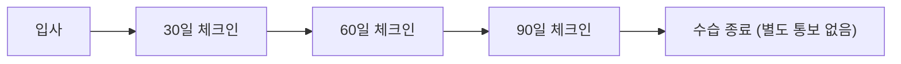

AJT의 고용 관계 시작과 종료, 계약 형태, 급여 지급 방식에 관한 핵심 사항을 정리한다.

> **참고:** 보상 체계(레벨·스텝·급여 리뷰)는 [보상 체계 및 급여 리뷰](pages/d5cf2261fdbb.md), 주식 옵션은 [주식 옵션(Equity) 안내](pages/10e1ea52a0d7.md), 겸직·부업 허용 기준은 [부업(Side Gig) 정책](pages/1788ac914648.md) 참고.

## 수습 기간(Probation Period)

수습 기간은 구성원과 AJT 모두 장기 적합성을 확인하기 위한 기간이다.[^1]

| 구분 | 수습 기간 | 비고 |
|---|---|---|
| 일반 구성원 | 3개월 | 기본 적용 |
| 영업직 (Account Executive 등) | 6개월 | 영업 사이클 특성상 3개월 내 계약 성사 여부 판단이 어렵기 때문 |

[^2a][^2b]

수습 기간 중 **구성원이 계약 종료를 원하는 경우**: 1주일 전 통보.[^3]  
수습 기간 중 **AJT가 계약 종료를 결정하는 경우**: 4주치 기본급 지급, 보통 당일 퇴사.[^4]

매니저는 수습 기간 전반에 걸쳐 성과를 모니터링하고 검토할 책임이 있다. 미달 우려가 있으면 즉시 구성원과 논의해야 한다.[^6] 수습 기간 종료 시 별도 통보는 없으며, 이미 30/60/90일 체크인을 통해 성과와 진행 상황을 충분히 파악했을 것으로 간주한다.[^7]

## 퇴직금(Severance)

AJT는 평균 수준의 성과에도 **넉넉한 퇴직금**을 지급한다.[^8]

수습 기간(3개월/6개월 영업직) 이후 AJT가 계약 종료를 결정하는 경우:
- **총 4개월치 기본급** 지급 (법정 통보 기간 포함)[^9]
- 지급을 위해 표준 계약 종료 확인서 또는 합의서 서명 필요[^10]

구성원이 자발적으로 퇴사하는 경우에는 일반적으로 **1개월 전 통보**가 요구되며, 개별 계약에 따라 다를 수 있다.[^12]

커미션/보너스 구성요소가 있는 역할은 마지막 근무일 기준으로 지급받을 금액을 정산한다.[^13]

> **참고:** 중대한 비위행위로 계약이 해지되는 경우 무통보 해고가 가능하며, 관계 법령이 이 정책과 충돌하면 법령이 우선한다.[^14]

## 고용 계약 형태

AJT는 국내 법인에서 모든 구성원을 직접 고용한다.[^15]

| 구분 | 고용 형태 |
|---|---|
| 정규 구성원 | AJT 직접 고용 |
| 프리랜서 계약자 | 용역 계약, 세금은 본인이 직접 처리 |

[^16]

별도의 고용 대행 없이 AJT가 직접 고용주가 된다.[^17]

프리랜서 계약자의 경우 매월 용역 대금을 청구하며, 세금은 본인이 직접 처리한다.[^18]

## 급여 지급 일정

| 구분 | 지급 주기 | 지급일 |
|---|---|---|
| 전 구성원 | 월 1회 | 매월 25일 (휴일인 경우 직전 영업일) |
| 프리랜서 계약자 | 월 1회 | 매월 25일 |

[^19]

[^1]: 08-compensation.md, ## 수습 기간(Probation Period) — "구성원이 성공적으로 자리 잡을 수 있도록 최선을 다하지만, 구성원과 AJT 사이에 장기적으로 잘 맞는지 확인하는 데는 다소 시간이 걸릴 수 있다는 점도 이해하고 있다."
[^2a]: 08-compensation.md, ## 수습 기간(Probation Period) — "아래에서 설명하는 영업직 구성원에 대한 예외를 제외하면, AJT 입사 후 첫 3개월은 수습 기간이다."
[^2b]: 08-compensation.md, ## 수습 기간(Probation Period) — "Account Executive 등 영업직 구성원의 수습 기간은 6개월이다 — 영업 사이클의 특성상 첫 3개월 안에 계약 체결 역량을 판단하기 어렵기 때문이다."
[^3]: 08-compensation.md, ## 수습 기간(Probation Period) — "이 기간에는 1주일 전 통보로 계약을 종료할 수 있다."
[^4]: 08-compensation.md, ## 수습 기간(Probation Period) — "반대로 AJT가 계약 종료를 결정하는 경우, AJT는 4주치 기본급을 지급하되 보통 당일 근무 종료를 요청한다."
[^6]: 08-compensation.md, ## 수습 기간(Probation Period) — "매니저는 이 초기 기간 동안 성과를 모니터링하고 구체적으로 검토할 책임이 있다. 성과 미달이 우려되거나 AJT에서의 미래에 대해 조금이라도 망설임이 있다면, 이를 즉시 구성원 및 매니저와 논의해야 한다."
[^7]: 08-compensation.md, ## 수습 기간(Probation Period) — "수습 기간이 끝날 때 통상적으로 수습을 통과했다는 공식 통보는 하지 않으며, 기본값은 별도 연락 없음이다. 그 시점이면 매니저와 진행한 30/60/90일 체크인을 통해 이미 자신의 성과와 진행 상황을 명확히 파악하고 있어야 한다."
[^8]: 08-compensation.md, ## 퇴직금(Severance) — "AJT는 평균적인 성과에도 넉넉한 퇴직금을 지급한다."
[^9]: 08-compensation.md, ## 퇴직금(Severance) — "총 4개월치 기본급(법률상 지급해야 하는 기간 포함)을 지급한다."
[^10]: 08-compensation.md, ## 퇴직금(Severance) — "이 혜택을 받으려면 표준 계약 종료 확인서 또는 합의서에 서명해야 한다."
[^12]: 08-compensation.md, ## 퇴직금(Severance) — "퇴사가 본인의 결정인 경우에는 일반적으로 1개월 전 통보만 요구하지만, 이는 개별 계약 내용에 따라 달라질 수 있다."
[^13]: 08-compensation.md, ## 퇴직금(Severance) — "커미션·보너스 요소가 있는 역할을 맡고 있다면, 마지막 근무일 기준으로 지급받아야 할 금액을 지급한다."
[^14]: 08-compensation.md, ## 퇴직금(Severance) — "중대한 비위행위로 계약이 해지되는 경우에는 통보 없이 해고될 수 있다. 이 정책이 관계 법령의 요구사항과 충돌하는 경우에는 법령이 우선한다."
[^15]: 08-compensation.md, ## 고용 계약(Contracts) — "AJT는 국내 법인에서 모든 구성원을 직접 고용한다."
[^16]: 08-compensation.md, ## 고용 계약(Contracts) — "즉 AJT에 입사하면 별도의 대행 없이 AJT의 직원으로 직접 고용된다."
[^17]: 08-compensation.md, ## 고용 계약(Contracts) — "AJT는 국내 법인에서 모든 구성원을 직접 고용한다."
[^18]: 08-compensation.md, ## 고용 계약(Contracts) — "경우에 따라 프리랜서 계약자로 함께 일할 수도 있으며, 이 경우 매월 용역 대금을 청구한다. 계약자로서는 본인의 세금을 스스로 처리할 책임이 있다."
[^19]: 08-compensation.md, ## 급여 지급(Payroll) — "급여는 매월 25일에 월 1회 지급한다. / 지급일이 휴일인 경우에는 직전 영업일에 지급한다. / 프리랜서 계약자의 용역 대금도 같은 날 지급한다."
