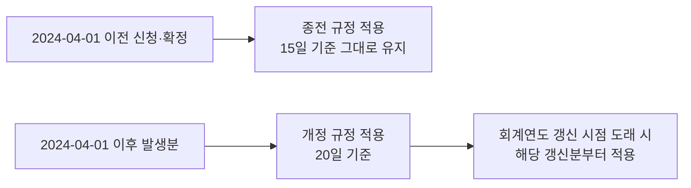
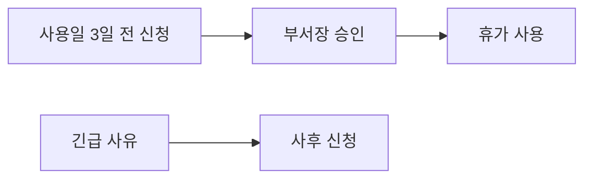
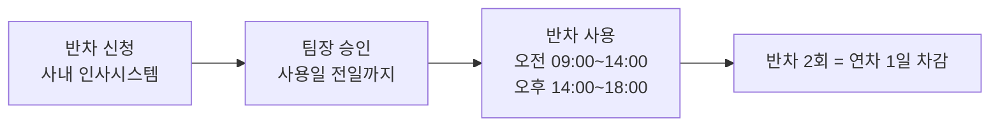

연차유급휴가의 부여 기준, 신청 절차, 반차 사용 방법, 사용 촉진제도를 정리한다. 2024년 3월 인사위원회 의결에 따라 연간 기본 일수가 15일에서 **20일**로 상향 개정되었으며[^2], 2024년 4월 1일부터 시행된다[^3]. 모든 재직 임직원에게 적용되며, 개별 계약에서 달리 정한 경우에는 해당 계약을 따른다[^1a]. 의결 배경과 전체 안건은 [2024년 3월 인사위원회 주요 의결 사항](pages/b886acd7fe33.md)을 참고한다.

## 2024년 개정 사항

2024년 3월 14일 인사위원회 의결에 따라 복무규정 v1.0 제5조(연차일수)가 개정되었다[^2]. 개정 사유는 동종 업계 대비 낮은 연차 일수로 인한 임직원 만족도 저하 해소 및 우수 인재 유지를 위한 근로 조건 경쟁력 확보다[^4].

| 구분 | 개정 전 | 개정 후 |
|------|---------|---------|
| 연간 연차 일수 | 15일 | **20일** |
| 시행일 | 2023-01-02 | 2024-04-01 |
| 입사 1년 미만 | 월 단위 개근 1일 부여 | 변경 없음 |

## 연차유급휴가 부여 기준

1년간 소정근로일의 80% 이상을 출근한 임직원에게 연간 **20일**의 유급휴가를 부여한다[^6]. 계속근로기간이 1년 미만인 임직원은 1개월 개근 시 1일을 부여받는다[^1b]. 휴가일수는 **회계연도**(1월 1일~12월 31일) 기준으로 산정하며, 입사 첫 해에는 근무기간에 비례하여 계산하고 단수는 올림 처리한다[^7].

| 구분 | 부여 일수 | 조건 |
|------|-----------|------|
| 일반 (1년 이상) | 20일 | 80% 이상 출근 |
| 신입 (1년 미만) | 월 1일 | 해당 월 개근 |
| 가산휴가 | 매 2년마다 +1일 | 계속근로 3년 이상 |
| 상한 | 25일 | 가산 포함 최대 |

## 가산휴가

계속근로기간이 3년 이상인 임직원에게는 최초 1년을 초과하는 매 2년마다 1일을 가산한다. 가산휴가를 포함한 총 휴가일수는 **25일**을 한도로 한다[^6a].

## 경과규정

시행일(2024년 4월 1일) 이전에 이미 사용이 확정되어 신청된 연차는 종전 규정(15일 기준)에 따라 처리한다[^7b]. 시행일 이후 새로 발생하는 연차 일수부터 개정된 20일 기준이 적용되며[^7b], 15일 기준으로 소진 계획이 잡혀 있던 부서는 인사팀과 협의하여 잔여 일수를 재산정할 수 있다[^7b].

## 사용 신청 절차

연차휴가를 사용하려면 **사용일 3일 전까지** 결재 시스템을 통해 신청하고 부서장의 승인을 받아야 한다[^9]. 긴급한 사유가 있는 경우에는 사후 신청이 가능하다[^10].

부서장은 업무에 중대한 지장이 있다고 인정되는 경우 사용 시기의 변경을 요청할 수 있으며, 이 경우 **변경 사유를 서면으로 통지**해야 한다[^11].

## 반차 규정

반차 사용 방법 및 신청 절차는 이번 개정 대상이 아니며, 종전 v1.0 규정을 그대로 따른다[^5]. 연차는 반일(半日) 단위로 분할하여 사용할 수 있으며, 반차 2회는 연차 1일로 계산한다[^5].

| 구분 | 사용 시간 | 신청 방법 |
|------|-----------|-----------|
| 오전 반차 | 09:00 ~ 14:00 | 사내 인사시스템 사전 신청 |
| 오후 반차 | 14:00 ~ 18:00 | 사내 인사시스템 사전 신청 |

신청은 사용일 **전일까지** 팀장 승인을 받아야 한다[^5].

## 사용 촉진제도

회사는 미사용 휴가에 대하여 사용기간이 끝나기 **6개월 전**을 기준으로 10일 이내에 사용 시기를 정하도록 서면 촉구할 수 있다[^12].

## 자주 묻는 질문

**Q. 이미 15일 기준으로 연차를 다 소진했는데 추가로 5일이 더 생기나요?**

시행일(2024년 4월 1일) 이후 새로 발생하는 연차 산정 기준이 20일로 바뀌는 것이며, 이미 사용한 연차 일수에 소급하여 5일을 추가하는 것은 아니다[^8]. 회계연도 중 갱신 시점이 도래하는 경우 그 갱신분부터 20일 기준이 적용된다[^8].

**Q. 반차나 경조사 휴가에도 영향이 있나요?**

없다. 이번 개정은 연차유급휴가 일수 조항에 한정되며, 반차 사용 방식과 경조사 휴가 기준 등 그 밖의 휴가 관련 조항은 이번 개정 대상이 아니다[^9b]. 경조사 지원 기준(경조금·휴가 일수)은 [경조사 지원 기준](pages/754b18f663d4.md)을 참고한다.

**Q. 개정 전 승인된 연차 계획은 어떻게 되나요?**

이미 승인이 완료되어 사용이 확정된 연차는 경과규정에 따라 그대로 유지되며, 별도로 재승인을 받을 필요는 없다[^10b].

## 문의

인사팀 내선 1234. 시행일 이후 1개월간 문의 접수 채널을 별도 운영하며, 접수된 질의는 매주 사내 게시판에 공지한다[^11b]. 인사시스템의 "연차 조회" 화면에서 본인의 잔여 연차와 발생 기준일을 확인할 수 있다[^11b].

[^1a]: 연차휴가 운영지침.md, 제1장 총칙 제2조 — "계약의 성격상 달리 정한 경우에는 해당 계약이 정하는 바에 따른다"
[^1b]: 연차휴가 운영지침.md, 제2장 부여 기준 제4조 — "계속근로기간이 1년 미만인 임직원에게는 1개월 개근 시 1일의 유급휴가를 부여한다"
[^2]: 03-service-rules-amendment.md, 개정 사유 — "2024년 3월 14일 개최된 인사위원회에서 연차유급휴가 상향 조정이 의결됨에 따라, 복무규정 v1.0의 연차 조항을 아래와 같이 개정합니다."
[^3]: 03-service-rules-amendment.md, 시행일 — "이 개정 사항은 2024년 4월 1일부터 시행한다."
[^4]: 03-service-rules-amendment.md, 개정 사유 — "동종 업계 대비 낮은 연차 일수로 인한 임직원 만족도 저하 문제를 개선하고, 우수 인재 유지를 위한 근로 조건 경쟁력을 확보하기 위함이 이번 개정의 배경이다."
[^5]: 03-service-rules-amendment.md, 반차 규정 — "반차 사용 방법 및 신청 절차는 이번 개정 사항이 아니므로 종전 v1.0 규정을 그대로 따른다."
[^6]: 연차휴가 운영지침.md, 제2장 부여 기준 제4조 — "1년간 80퍼센트 이상 출근한 임직원에게 20일의 유급휴가를 부여한다"
[^6a]: 연차휴가 운영지침.md, 제2장 부여 기준 제5조 — "계속근로기간이 3년 이상인 임직원에게는 최초 1년을 초과하는 매 2년마다 1일을 가산한다. 이 경우 가산휴가를 포함한 총 휴가일수는 25일을 한도로 한다"
[^7]: 연차휴가 운영지침.md, 제2장 부여 기준 제6조 — "휴가일수는 회계연도를 기준으로 산정하며"
[^7b]: 03-service-rules-amendment.md, 경과규정 — "개정 시행일인 2024년 4월 1일 이전에 이미 사용이 확정되어 신청된 연차는 종전 규정에 따라 처리하며, 시행일 이후 신규로 발생하는 연차 일수부터 개정된 20일 기준을 적용한다. 이미 15일 기준으로 소진 계획이 잡혀 있던 부서는 인사팀과 협의하여 잔여 일수를 재산정할 수 있다."
[^8]: 03-service-rules-amendment.md, 자주 묻는 질문 — "시행일인 2024년 4월 1일을 기준으로, 그 시점 이후에 새로 발생하는 연차 산정 기준이 20일로 바뀌는 것이며, 이미 사용한 연차 일수에 소급하여 5일을 더해주는 것은 아니다."
[^9]: 연차휴가 운영지침.md, 제3장 사용 절차 제7조 — "연차휴가를 사용하려는 임직원은 사용일 3일 전까지 결재 시스템을 통해 신청하고 부서장의 승인을 받아야 한다"
[^9b]: 03-service-rules-amendment.md, 자주 묻는 질문 — "없다. 이번 개정은 연차유급휴가 일수 조항에 한정되며, 반차 사용 방식, 경조사 휴가 기준 등 그 밖의 휴가 관련 조항은 이번 개정의 대상이 아니다."
[^10]: 연차휴가 운영지침.md, 제3장 사용 절차 제7조 — "긴급한 사유가 있는 경우에는 사후 신청할 수 있다"
[^10b]: 03-service-rules-amendment.md, 자주 묻는 질문 — "이미 승인이 완료되어 사용이 확정된 연차는 경과규정에 따라 그대로 유지되며, 별도로 재승인을 받을 필요는 없다."
[^11]: 연차휴가 운영지침.md, 제3장 사용 절차 제8조 — "부서장은 업무에 중대한 지장이 있다고 인정되는 경우 사용 시기의 변경을 요청할 수 있다. 이 경우 변경 사유를 서면으로 통지한다"
[^11b]: 03-service-rules-amendment.md, 시행 이후 안내 계획 — "인사팀은 시행일 이후 1개월간 문의 접수 채널을 운영하며, 접수된 질의는 매주 정리하여 사내 게시판에 공지할 예정이다. 개별 사례 확인이 필요한 경우 인사시스템의 "연차 조회" 화면에서 본인의 잔여 연차와 발생 기준일을 확인할 수 있다."
[^12]: 연차휴가 운영지침.md, 제3장 사용 절차 제9조 — "회사는 미사용 휴가에 대하여 사용기간이 끝나기 6개월 전을 기준으로 10일 이내에 사용 시기를 정하도록 서면 촉구할 수 있다"
