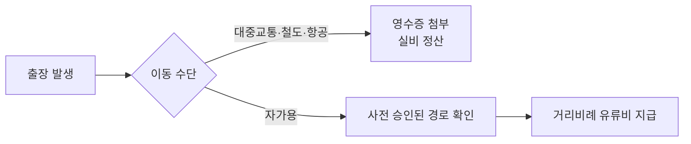

업무상 출장 시 발생하는 교통비·식비 정산 기준을 안내한다. 교통비는 복무규정 v1.0 제12조에 따라 실비로 정산하며[^1], 2024년 3월 인사위원회 의결에 따라 출장 식비가 1일 3만 원 정액으로 신설되어 2024년 4월 1일 이후 출발하는 출장부터 적용된다[^5].

## 교통비 지급 기준

교통비는 업무상 출장 시 **실비**로 정산한다[^1].

| 이동 수단 | 지급 방식 | 조건 |
|-----------|-----------|------|
| 대중교통·철도·항공 | 실비 | 영수증 첨부 필수 |
| 자가용 | 거리비례 유류비 | 사전 승인된 경로에 한함 |

왕복 대중교통·철도·항공 이용 시 영수증을 첨부하여 정산 신청한다[^3]. 자가용 이용 시에는 **사전 승인된 경로에 한해** 거리비례 유류비를 지급한다[^4].

## 식비 지급 기준

2024년 3월 14일 인사위원회에서 출장 식비 신설이 의결되었다[^5]. 종전까지 출장 시 교통비만 실비 지급하고 식비·숙박비는 별도 지침에 위임하던 방식에서[^2], 식비를 정액으로 지급하는 방식으로 바뀌었다[^6].

| 항목 | 기준 |
|------|------|
| 지급 방식 | 정액 지급 |
| 금액 | 1일 3만 원 |
| 적용 시점 | 2024년 4월 1일 이후 출발하는 출장 |
| 세부 집행 기준 | 재무팀 별도 공지[^7] |

정액 지급 방식은 실비 정산 대비 행정 부담이 적다는 점에서 채택되었다[^6].

숙박비 등 식비 외 그 밖의 출장 경비 기준은 별도 지침에서 정한다[^2].

[^1]: 01-service-rules-v1.docx, 4. 출장비 지급 제12조(출장 교통비) — "업무상 출장이 발생한 경우 **교통비**는 실비로 정산한다."
[^2]: 01-service-rules-v1.docx, 4. 출장비 지급 제12조(출장 교통비) — "식비 및 숙박비 등 그 밖의 출장 경비 기준은 별도 지침에서 정한다."
[^3]: 01-service-rules-v1.docx, 4. 출장비 지급 제12조(출장 교통비) — "왕복 대중교통, 철도, 항공 이용 시 영수증을 첨부하여 정산 신청한다."
[^4]: 01-service-rules-v1.docx, 4. 출장비 지급 제12조(출장 교통비) — "자가용 이용 시에는 사전 승인된 경로에 한해 거리비례 유류비를 지급한다."
[^5]: 02-hr-committee-minutes-2024-03.pdf, 의결 — "출장 시 **식비**를 1일 3만원 정액으로 신설하여 지급한다. 세부 집행 기준은 재무팀이 별도 공지한다. (찬성 4, 반대 0)"
[^6]: 02-hr-committee-minutes-2024-03.pdf, 안건 3: 출장 식비 신설 — "재무팀장 박하은은 정액 지급 방식이 실비 정산 대비 행정 부담이 적다는 점에서 타당하다고 의견을 제시하였다."
[^7]: 02-hr-committee-minutes-2024-03.pdf, 추가 논의: 시행 일정 — "출장 식비 신설은 2024년 4월 1일 이후 출발하는 출장부터 적용한다."
