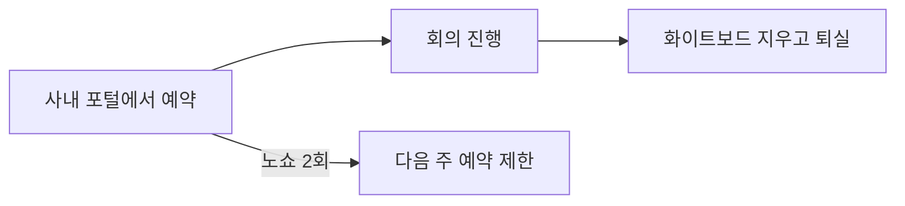

사내 회의실 A·B·C의 수용 인원, 예약 단위, 이용 규칙을 안내한다. 예약은 사내 포털에서 진행하며, 무단 불참(노쇼) 시 이용 제한이 적용된다. 화상 회의 등 비대면 소통 도구 사용 기준은 [소통 방식 및 협업 도구 안내](pages/c269f933b6a3.md)를 참고한다.

## 회의실 현황

아래 세 개 회의실을 운영한다[^1].

| 회의실 | 수용 인원 | 예약 단위 | 비고 |
|---|---|---|---|
| A (대) | 20명 | 1시간 | 화상회의 장비 비치 |
| B (중) | 8명 | 30분 | 화이트보드 비치 |
| C (소) | 4명 | 30분 | 집중 부스 |

## 예약 및 이용 규칙

예약부터 퇴실까지 지켜야 할 사항은 다음과 같다[^2].

- **예약:** 사내 포털에서 직접 신청한다[^3].
- **노쇼 제한:** 예약 후 미참석(노쇼)이 2회 누적되면 다음 주 예약이 제한된다[^4].
- **정리:** 회의 종료 후 화이트보드를 지우고 나온다[^5].
- **정기 회의:** 반복 예약은 최대 4주까지 설정할 수 있다[^6].

## 문의

시설팀 내선 2345[^7].

[^1]: 02-회의실 예약 지침.md, 회의실 예약 지침 — "회의실 | 수용 인원 | 예약 단위 | 비고"
[^2]: 02-회의실 예약 지침.md, 규칙 — "회의실 예약 규칙이 아래와 같이 정리되었습니다."
[^3]: 02-회의실 예약 지침.md, 규칙 — "예약은 사내 포털에서 한다."
[^4]: 02-회의실 예약 지침.md, 규칙 — "노쇼 2회 시 다음 주 예약이 제한된다."
[^5]: 02-회의실 예약 지침.md, 규칙 — "회의 종료 후 화이트보드는 지우고 나온다."
[^6]: 02-회의실 예약 지침.md, 규칙 — "정기 회의는 최대 4주 반복까지 걸 수 있다."
[^7]: 02-회의실 예약 지침.md, 회의실 예약 지침 — "문의: 시설팀 (내선 2345)"
