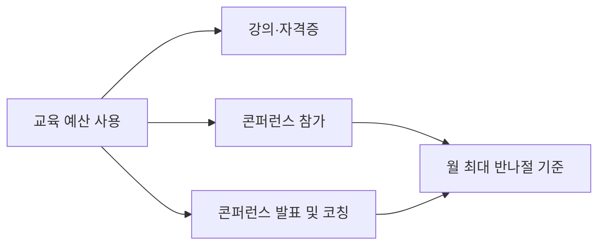

AJT는 구성원의 성장이 회사 전체의 성장으로 이어진다는 믿음 아래, 도서 구매와 교육 예산을 전 팀원에게 지원한다.[^1]

## 도서 구매

모든 구성원은 업무에 도움이 되는 도서를 직접 구매할 수 있다.[^2]

- 월 **5만 원 이하** 구매는 별도 승인 없이 가능하다.[^3]
- 오디오북·팟캐스트도 도서 예산으로 구매할 수 있다.[^4]
- 도서는 직접 담당 분야에 국한되지 않으며, 업무와 느슨하게 관련되면 충분하다.[^5]
  - 예: 관리자의 리더십 관련 위인전, 엔지니어의 디자인 책
- 매월 열리는 북클럽 **BookAJT**의 도서도 예산에 포함된다.[^6]

> 도서 품질은 출판 과정에서 검증되므로 인터넷 검색보다 깊이 있는 학습이 가능하다.[^7]

## 교육 예산

연간 교육 예산은 직급·연차에 관계없이 **모든 팀원**에게 동일하게 제공된다.[^8]

| 항목 | 내용 |
|------|------|
| 기본 예산 | **100만 원 / 연간** |
| 한도 초과 시 | 경영지원팀에 예산 증액 요청 가능 (통상 승인됨) |
| 사전 승인 | 불필요 (단, 매니저에게 먼저 상의 권장) |
| 사용 대상 | 관련 강의, 교육 과정, 공식 자격증, 콘퍼런스 참가 |

예산은 **엄격한 상한이 아니며**, 100만 원 초과 시 경영지원팀에 증액을 요청하면 통상적으로 승인된다.[^9]

### 기술 교육 권장

비기술 직군 구성원도 기초 프로그래밍 강의 수강을 강력히 권장한다.[^10] 이는 '당신이 드라이버' 문화의 일환으로, 모든 구성원이 소프트웨어 개발의 기본 개념을 이해하도록 장려한다.[^11]

- 추천 플랫폼: 사내 추천 온라인 강의 플랫폼 (Python, React 등 AJT 사용 기술 포함)

### 콘퍼런스

교육 예산으로 콘퍼런스 발표, 사용자 그룹 발표, 타인 코칭 활동도 지원된다.[^12] 국내 콘퍼런스 참석은 출장으로 처리되므로, 출장비 지급과 보고 절차는 [국내 출장 운영 지침](pages/77ebb05d7aeb.md)을 따른다.

- 콘퍼런스·사용자 그룹 활동은 월 **최대 반나절**이 기준이나, 이 역시 엄격한 상한이 아니다.[^13]
- 초과 필요 시 매니저와 먼저 상의한다.[^14]

## 학습 결과 공유

교육 수료 후에는 팀에 배운 내용을 공유하도록 권장한다.[^15]

[^1]: 01-training.md, 교육 및 도서 지원 — "여러분이 자신의 업무를 더 잘 해낼수록, AJT 전체도 그만큼 더 나아진다!"
[^2]: 01-training.md, 도서 — "AJT의 **모든 구성원**은 업무에 도움이 되는 도서를 구매할 자격이 있다."
[^3]: 01-training.md, 도서 — "일반적으로 월 5만 원까지는 별도의 추가 승인 없이 지출해도 무방하다."
[^4]: 01-training.md, 도서 — "원한다면 오디오북이나 팟캐스트 구매에도 도서 예산을 사용할 수 있다."
[^5]: 01-training.md, 도서 — "도서는 반드시 담당 분야에 직접 관련될 필요는 없으며, 업무와 느슨하게 관련되는 정도면 충분하다."
[^6]: 01-training.md, 도서 — "매월 **BookAJT**라는 북클럽을 운영하고 있으며, 이때 다루는 도서 구매에도 예산을 사용할 수 있다."
[^7]: 01-training.md, 도서 — "단순히 인터넷 검색으로 찾는 것보다 도서가 더 도움이 된다고 보는 이유는, 책으로 출판되기 위해서는 더 높은 수준의 품질이 요구되기 때문이다."
[^8]: 01-training.md, 교육 예산 — "직급·연차와 관계없이 모든 팀원에게 연간 교육 예산을 지급한다."
[^9]: 01-training.md, 교육 예산 — "교육 예산은 연간 100만 원이지만, 이는 **엄격한 상한이 아니다** — 이를 초과해 지출하고 싶다면 경영지원팀에 예산 증액을 요청하면 되고, 통상적으로 승인된다."
[^10]: 01-training.md, 교육 예산 — "비기술 직군 구성원에게도 초급 수준의 프로그래밍 강의 수강을 강력히 권장한다."
[^11]: 01-training.md, 교육 예산 — "모든 구성원이 소프트웨어 개발의 아주 기본적인 개념을 이해할 수 있어야 한다는 '당신이 드라이버' 문화의 일환이다."
[^12]: 01-training.md, 콘퍼런스 — "콘퍼런스나 사용자 그룹에서 발표하는 시간, 타인을 코칭하는 활동에도 교육 예산을 사용할 수 있다."
[^13]: 01-training.md, 콘퍼런스 — "이러한 활동에 월 최대 반나절 정도를 사용하는 것을 기준으로 한다."
[^14]: 01-training.md, 콘퍼런스 — "이보다 더 필요하다고 판단되면 먼저 매니저와 상의한다."
[^15]: 01-training.md, 교육 예산 — "가능하다면 교육을 마친 후 배운 내용을 팀에 공유해 주기 바란다!"
