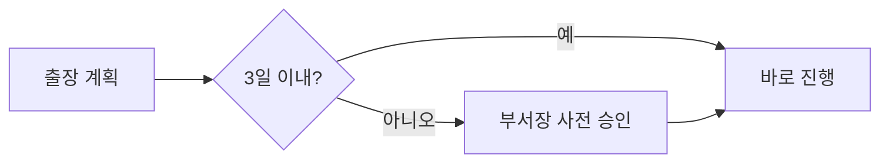
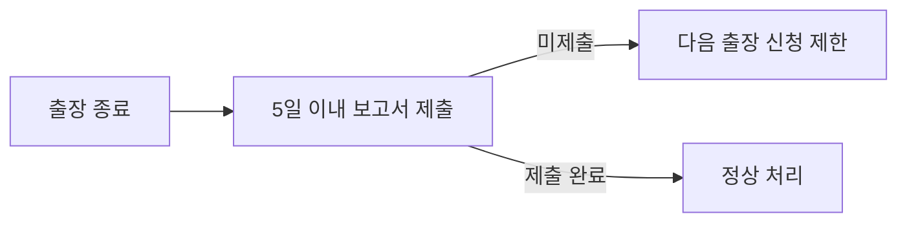

국내 출장의 기간 기준, 비용 지급 방식, 출장 후 보고 의무를 정리한 지침이다.

## 출장 기간

국내 출장의 기본 기간은 **3일**이다.[^2] 3일을 초과하는 출장은 부서장의 사전 승인이 필요하다.[^3] 콘퍼런스 참석을 위한 이동도 출장으로 처리하며, 콘퍼런스 참가 지원 기준은 [교육 및 도서 지원](pages/454c405163f2.md)을 참고한다.

## 출장비 지급

| 항목 | 기준 |
|------|------|
| 여비 지급 기준 | 전사 복무규정에 따름 |
| 부서 자체 기준 | 두지 않음 |

출장 중 발생하는 여비의 지급 기준은 **전사 복무규정**에 따른다.[^4] 개발부는 별도의 여비 지급 기준을 두지 않는다.[^5]

## 보고 의무

출장이 끝나면 **5일 이내**에 출장 보고서를 제출해야 한다.[^6] 보고서를 미제출하면 이후 출장 신청이 제한된다.[^7]

[^2]: 국내 출장 운영 지침.md, 1장 출장 기간 — "국내 출장의 기본 기간은 3일이다."
[^3]: 국내 출장 운영 지침.md, 1장 출장 기간 — "3일을 초과하는 출장은 부서장의 사전 승인을 받아야 한다."
[^4]: 국내 출장 운영 지침.md, 2장 출장비 지급 — "출장 중 발생하는 여비의 지급 기준은 전사 복무규정에 따른다."
[^5]: 국내 출장 운영 지침.md, 2장 출장비 지급 — "개발부는 별도의 여비 지급 기준을 두지 않는다."
[^6]: 국내 출장 운영 지침.md, 3장 보고 의무 — "출장 종료 후 5일 이내에 출장 보고서를 제출한다."
[^7]: 국내 출장 운영 지침.md, 3장 보고 의무 — "보고서 미제출 시 다음 출장 신청이 제한된다."
