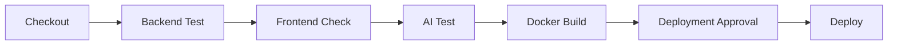
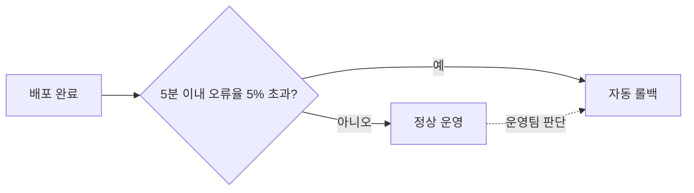

AJT는 백엔드·프론트엔드·AI 서버 세 구성 요소를 하나의 파이프라인에서 함께 빌드하고 검증한 뒤 배포한다.[^1] 파이프라인은 Jenkins로 운영하며, `develop` 병합과 `main` 병합 모두 동일한 파이프라인을 탄다.[^2]

## 파이프라인 단계

| 단계 | 내용 | 평균 소요 시간 |
|------|------|------|
| Checkout | 커밋 체크아웃, 배포 대상 환경 판별 | 1분 |
| Backend Test | `./gradlew clean test` 실행 | 8분 |
| Frontend Check | lint·단위 테스트·빌드 | 5분 |
| AI Test | AI 서버 컨테이너 빌드 후 테스트 실행 | 6분 |
| Docker Build | 세 이미지 빌드 | 4분 |
| Deploy | 무중단 배포와 헬스체크 | 3분 |

파이프라인 전체 제한 시간은 **60분**이며, 이를 초과하면 자동으로 실패 처리된다.[^3]

## 배포 승인

`main` 브랜치 배포는 **배포 승인**을 거친다.[^4] 승인 대기는 최대 **24시간**이며, 이 시간 안에 승인하지 않으면 파이프라인이 중단된다.[^5] `develop` 브랜치의 스테이징 배포는 승인 없이 자동으로 진행한다.[^6]

승인자는 배포 대상 이미지 태그와 변경 내역을 확인한 뒤 승인 여부를 결정한다.[^7] 승인자 이름은 파이프라인 로그에 기록한다.[^8]

## 배포 방식

배포는 **블루-그린 방식**으로 진행하여 서비스 중단 없이 신규 버전으로 전환한다.[^9] 신규 버전 컨테이너가 헬스체크에 3회 연속 성공하면 트래픽을 전환하고, 이전 버전 컨테이너는 전환 후 **10분간** 유지한 뒤 종료한다.[^10]

## 롤백 기준

배포 후 **5분 이내** 오류율이 **5%를 초과**하면 자동으로 이전 버전으로 롤백한다.[^11] 자동 롤백 조건에 해당하지 않더라도 운영팀 판단으로 수동 롤백을 요청할 수 있다.[^12] 롤백은 이전 버전 컨테이너를 그대로 재기동하는 방식이라 별도 빌드 없이 **3분 이내** 완료된다.[^13]

## 배포 전 준비

배포 파이프라인은 병합된 코드를 대상으로 하므로, Pull Request가 최소 2명의 승인을 받아 병합 조건을 충족했는지가 배포 전 마지막 확인 사항이다.[^14] 코드 리뷰 절차를 생략하고 병합된 변경이 발견되면 배포를 보류하고 [코딩 컨벤션 및 코드 리뷰](pages/1c05c98df2eb.md) 문서에 따라 재검토한다.[^15]

[^1]: 02-배포 파이프라인.md, 1. 개요 — "AJT는 백엔드·프론트엔드·AI 서버 세 구성 요소를 하나의 파이프라인에서 함께 빌드하고 검증한 뒤 배포한다."
[^2]: 02-배포 파이프라인.md, 1. 개요 — "파이프라인은 Jenkins로 운영하며, `develop` 병합과 `main` 병합 모두 동일한 파이프라인을 탄다."
[^3]: 02-배포 파이프라인.md, 2. 파이프라인 단계 — "파이프라인 전체 제한 시간은 **60분**이며, 이를 초과하면 자동으로 실패 처리된다."
[^4]: 02-배포 파이프라인.md, 3. 배포 승인 — "`main` 브랜치 배포는 **배포 승인**을 거친다."
[^5]: 02-배포 파이프라인.md, 3. 배포 승인 — "승인 대기는 최대 **24시간**이며, 이 시간 안에 승인하지 않으면 파이프라인이 중단된다."
[^6]: 02-배포 파이프라인.md, 3. 배포 승인 — "`develop` 브랜치의 스테이징 배포는 승인 없이 자동으로 진행한다."
[^7]: 02-배포 파이프라인.md, 3. 배포 승인 — "승인자는 배포 대상 이미지 태그와 변경 내역을 확인한 뒤 승인 여부를 결정한다."
[^8]: 02-배포 파이프라인.md, 3. 배포 승인 — "승인자 이름은 파이프라인 로그에 기록한다."
[^9]: 02-배포 파이프라인.md, 4. 배포 방식 — "배포는 **블루-그린 방식**으로 진행하여 서비스 중단 없이 신규 버전으로 전환한다."
[^10]: 02-배포 파이프라인.md, 4. 배포 방식 — "신규 버전 컨테이너가 헬스체크에 3회 연속 성공하면 트래픽을 전환하고, 이전 버전 컨테이너는 전환 후 **10분간** 유지한 뒤 종료한다."
[^11]: 02-배포 파이프라인.md, 5. 롤백 기준 — "배포 후 **5분 이내** 오류율이 **5%를 초과**하면 자동으로 이전 버전으로 롤백한다."
[^12]: 02-배포 파이프라인.md, 5. 롤백 기준 — "자동 롤백 조건에 해당하지 않더라도 운영팀 판단으로 수동 롤백을 요청할 수 있다."
[^13]: 02-배포 파이프라인.md, 5. 롤백 기준 — "롤백은 이전 버전 컨테이너를 그대로 재기동하는 방식이라 별도 빌드 없이 **3분 이내** 완료된다."
[^14]: 02-배포 파이프라인.md, 6. 배포 전 준비 — "배포 파이프라인은 병합된 코드를 대상으로 하므로, Pull Request가 최소 2명의 승인을 받아 병합 조건을 충족했는지가 배포 전 마지막 확인 사항이다."
[^15]: 02-배포 파이프라인.md, 6. 배포 전 준비 — "코드 리뷰 절차를 생략하고 병합된 변경이 발견되면 배포를 보류하고 코딩 컨벤션 및 코드 리뷰 가이드에 따라 재검토한다."
