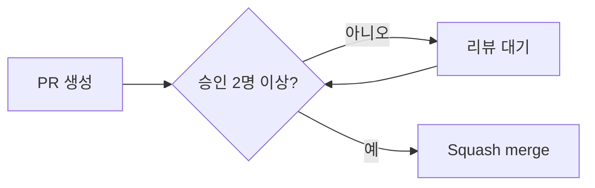

여러 팀이 같은 저장소에서 동시에 작업하다 보면 브랜치 이름과 커밋 메시지가 제각각이 되기 쉽고, 리뷰 없이 병합된 코드가 장애의 원인이 되는 일이 반복된다.[^1] 이를 막기 위해 개발부 전원이 지키는 최소한의 규칙을 정리한다.

## 브랜치 전략

### 브랜치 종류

| 브랜치 | 용도 |
|------|------|
| `main` | 배포 가능한 코드만 유지 |
| `develop` | 다음 배포에 포함할 작업을 모으는 브랜치 |
| `feature/*` | 새 기능 개발 |
| `fix/*` | 개발 중 발견한 버그 수정 |
| `hotfix/*` | 운영 환경의 긴급 오류 수정 |

`main`과 `develop`에는 직접 push하지 않는다.[^2]

### 브랜치 이름 규칙

브랜치 이름은 `<브랜치 종류>/<이슈 키>-<작업 설명>` 형식으로 짓는다.[^3]

```
feature/DEV-1024-login-retry
fix/DEV-1031-null-pointer-in-export
```

작업 설명은 영어 소문자와 하이픈으로 작성하고, 브랜치 이름에 작업자 이름을 넣지 않는다.[^4]

## 커밋 메시지 규칙

커밋 메시지는 `<타입>(<범위>): <한국어 설명>` 형식을 따른다.[^5]

| 타입 | 의미 |
|------|------|
| `feat` | 새로운 기능 추가 |
| `fix` | 버그 수정 |
| `refactor` | 동작 변경 없는 구조 개선 |
| `docs` | 문서 수정 |
| `test` | 테스트 코드 추가·수정 |
| `chore` | 빌드·의존성 등 잡무성 변경 |

한 커밋에는 하나의 작업 목적만 담고, 커밋 메시지 끝에 마침표를 붙이지 않는다.[^6]

## 코드 스타일

| 영역 | 도구 |
|------|------|
| 백엔드(Java) | Google Java Style + Checkstyle |
| 프론트엔드(TypeScript) | ESLint + Prettier |
| AI 서버(Python) | ruff + black |

커밋 전 포맷터를 돌리지 않아 CI에서 스타일 검사가 실패하는 경우가 잦으므로, pre-commit 훅 설치를 권장한다.[^7]

## 코드 리뷰



Pull Request는 **최소 2명**의 승인을 받아야 병합할 수 있다.[^8] 리뷰 요청 후 **24시간 이내**에 최소 1건의 피드백을 남기는 것을 원칙으로 한다.[^9] 작성자 본인이 자신의 PR을 승인하고 병합하는 self-merge는 금지한다.[^10]

PR 하나의 변경 규모는 리뷰 품질을 위해 **400줄 이하**를 권장하며, 이를 초과하면 작업을 나누는 것을 우선 검토한다.[^11]

리뷰 체크리스트는 다음을 포함한다.

- 테스트 커버리지가 기존 대비 낮아지지 않는가[^12]
- 함수·변수 이름이 역할을 명확히 드러내는가[^13]
- 예외 상황과 실패 케이스를 처리했는가[^14]
- 외부에 영향을 주는 변경(API, DB 스키마)은 관련 문서를 함께 갱신했는가[^15]

리뷰 관례나 스타일 기준이 헷갈릴 때는 팀 내부에서 추천하는 기술 서적을 먼저 참고하는 편이 검색보다 도움이 될 때가 많다.[^16] 도서 구매와 학습 비용은 [교육 및 도서 지원](pages/454c405163f2.md) 제도로 지원받을 수 있다.

## 병합과 배포 연계

`develop` 브랜치는 **Squash merge**로만 병합한다.[^17] PR이 병합되면 CI가 자동으로 빌드를 트리거하며, 이후 단계는 [배포 및 CI/CD 파이프라인](pages/94439bb14718.md) 문서를 따른다.[^18] 배포 승인 없이 병합만으로 운영 환경에 반영되지는 않는다.[^19]

[^1]: 01-코딩 컨벤션.md, 1. 목적 — "여러 팀이 같은 저장소에서 동시에 작업하다 보면 브랜치 이름과 커밋 메시지가 제각각이 되기 쉽고, 리뷰 없이 병합된 코드가 장애의 원인이 되는 일이 반복된다."
[^2]: 01-코딩 컨벤션.md, 2.1 브랜치 종류 — "`main`과 `develop`에는 직접 push하지 않는다."
[^3]: 01-코딩 컨벤션.md, 2.2 브랜치 이름 규칙 — "브랜치 이름은 `<브랜치 종류>/<이슈 키>-<작업 설명>` 형식으로 짓는다."
[^4]: 01-코딩 컨벤션.md, 2.2 브랜치 이름 규칙 — "작업 설명은 영어 소문자와 하이픈으로 작성하고, 브랜치 이름에 작업자 이름을 넣지 않는다."
[^5]: 01-코딩 컨벤션.md, 3. 커밋 메시지 규칙 — "커밋 메시지는 `<타입>(<범위>): <한국어 설명>` 형식을 따른다."
[^6]: 01-코딩 컨벤션.md, 3. 커밋 메시지 규칙 — "한 커밋에는 하나의 작업 목적만 담고, 커밋 메시지 끝에 마침표를 붙이지 않는다."
[^7]: 01-코딩 컨벤션.md, 4. 코드 스타일 — "커밋 전 포맷터를 돌리지 않아 CI에서 스타일 검사가 실패하는 경우가 잦으므로, pre-commit 훅 설치를 권장한다."
[^8]: 01-코딩 컨벤션.md, 5.1 리뷰 승인 조건 — "Pull Request는 **최소 2명**의 승인을 받아야 병합할 수 있다."
[^9]: 01-코딩 컨벤션.md, 5.1 리뷰 승인 조건 — "리뷰 요청 후 **24시간 이내**에 최소 1건의 피드백을 남기는 것을 원칙으로 한다."
[^10]: 01-코딩 컨벤션.md, 5.1 리뷰 승인 조건 — "작성자 본인이 자신의 PR을 승인하고 병합하는 self-merge는 금지한다."
[^11]: 01-코딩 컨벤션.md, 5.1 리뷰 승인 조건 — "PR 하나의 변경 규모는 리뷰 품질을 위해 **400줄 이하**를 권장하며, 이를 초과하면 작업을 나누는 것을 우선 검토한다."
[^12]: 01-코딩 컨벤션.md, 5.2 리뷰 체크리스트 — "테스트 커버리지가 기존 대비 낮아지지 않는가"
[^13]: 01-코딩 컨벤션.md, 5.2 리뷰 체크리스트 — "함수·변수 이름이 역할을 명확히 드러내는가"
[^14]: 01-코딩 컨벤션.md, 5.2 리뷰 체크리스트 — "예외 상황과 실패 케이스를 처리했는가"
[^15]: 01-코딩 컨벤션.md, 5.2 리뷰 체크리스트 — "외부에 영향을 주는 변경(API, DB 스키마)은 관련 문서를 함께 갱신했는가"
[^16]: 01-코딩 컨벤션.md, 5.2 리뷰 체크리스트 — "리뷰 관례나 스타일 기준이 헷갈릴 때는 팀 내부에서 추천하는 기술 서적을 먼저 참고하는 편이 검색보다 도움이 될 때가 많다."
[^17]: 01-코딩 컨벤션.md, 6. 병합과 배포 연계 — "`develop` 브랜치는 **Squash merge**로만 병합한다."
[^18]: 01-코딩 컨벤션.md, 6. 병합과 배포 연계 — "PR이 병합되면 CI가 자동으로 빌드를 트리거하며, 이후 단계는 배포 파이프라인 문서를 따른다."
[^19]: 01-코딩 컨벤션.md, 6. 병합과 배포 연계 — "배포 승인 없이 병합만으로 운영 환경에 반영되지는 않는다."
