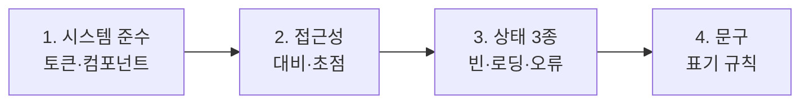

디자인 산출물을 검토하고 개발에 넘기는 절차를 안내한다. **리뷰를 거치지 않은 산출물은 개발에 전달하지 않는다**[^1].

## 주간 디자인 리뷰

| 항목 | 내용 |
|------|------|
| 시간 | 매주 화요일 14:00 ~ 15:30 |
| 장소 | 본사 3층 소회의실 |
| 참석 | 디자인부 전원 |
| 안건 마감 | **전날 18시**까지 공유 보드 등록 |

리뷰는 매주 화요일 14시부터 15시 30분까지 본사 3층 소회의실에서 열고 디자인부 전원이 참석한다[^2]. 대상은 **전날 18시까지 공유 보드에 올린 안건**으로 한정하며, 당일 추가된 안건은 다음 회차로 넘어간다[^3].

안건을 올릴 때에는 화면 시안과 함께 **무엇을 결정받고 싶은지 한 문장**으로 적는다[^4]. 결정 사항이 없는 공유용 안건은 따로 표시한다[^4].

## 리뷰에서 확인하는 네 가지

1. **디자인 시스템의 컴포넌트와 토큰을 그대로 썼는가.** 새 컴포넌트를 만들었다면 그 이유를 설명한다[^5]. 기준은 [디자인 시스템 가이드](pages/6dbe1b44ac33.md)에 있다
2. **명도 대비와 초점 순서**가 [접근성 가이드라인](pages/a1f3c7b20e94.md)을 지키는가[^6]
3. **빈 상태·로딩 상태·오류 상태**가 모두 그려져 있는가 — **셋 중 하나라도 빠지면 리뷰를 통과하지 못한다**[^7]
4. 문구가 [UX 라이팅 가이드](pages/7e94b1d03fa2.md)의 표기 규칙을 따르는가[^8]

## 결정 기록

리뷰에서 정한 사항은 **그 자리에서 안건에 덧붙여 기록**한다. **기록하지 않은 구두 합의는 결정으로 보지 않는다**[^9].

의견이 갈려 결론이 나지 않으면 디자인팀장이 판단하고 그 근거를 함께 남긴다[^10].

## 핸드오프 산출물

개발에 넘길 때에는 다음을 함께 전달한다[^11].

- 화면 시안과 상태별 변형
- 사용한 토큰 이름 목록
- 반응형 기준점별 배치
- 상호작용 설명 — 무엇을 누르면 무엇이 일어나는가

**이미지 파일만 전달하지 않는다**[^12]. 개발자가 값을 눈으로 재어 쓰게 되면 디자인 시스템과 어긋나기 때문이다[^12].

## 변경 처리

핸드오프 이후 시안이 바뀌면 **개발 담당자에게 직접 알리고** 변경 이력을 안건에 남긴다. **파일만 조용히 덮어쓰지 않는다**[^13].

배포 이후에 발견된 디자인 결함은 **다음 주간 리뷰의 첫 안건**으로 올린다[^14].

[^1]: 디자인 리뷰 및 핸드오프 절차.md, 도입 — "디자인 산출물을 검토하고 개발에 넘기는 절차를 정한다. 리뷰를 거치지 않은 산출물은 개발에 전달하지 아니한다."
[^2]: 디자인 리뷰 및 핸드오프 절차.md, 1. 주간 디자인 리뷰 — "주간 디자인 리뷰는 매주 화요일 14시부터 15시 30분까지 본사 3층 소회의실에서 연다. 디자인부 전원이 참석한다."
[^3]: 디자인 리뷰 및 핸드오프 절차.md, 1. 주간 디자인 리뷰 — "리뷰 대상은 전날 18시까지 공유 보드에 올린 안건으로 한정한다. 당일 추가된 안건은 다음 회차로 넘긴다."
[^4]: 디자인 리뷰 및 핸드오프 절차.md, 1. 주간 디자인 리뷰 — "안건을 올릴 때에는 화면 시안과 함께 무엇을 결정받고 싶은지 한 문장으로 적는다. 결정 사항이 없는 공유용 안건은 별도로 표시한다."
[^5]: 디자인 리뷰 및 핸드오프 절차.md, 2. 리뷰에서 확인하는 것 — "첫째, 디자인 시스템의 컴포넌트와 토큰을 그대로 썼는가. 새 컴포넌트를 만들었다면 그 이유를 설명한다."
[^6]: 디자인 리뷰 및 핸드오프 절차.md, 2. 리뷰에서 확인하는 것 — "둘째, 명도 대비와 초점 순서가 접근성 가이드라인을 지키는가."
[^7]: 디자인 리뷰 및 핸드오프 절차.md, 2. 리뷰에서 확인하는 것 — "셋째, 빈 상태·로딩 상태·오류 상태가 모두 그려져 있는가. 세 상태 중 하나라도 빠지면 리뷰를 통과하지 못한다."
[^8]: 디자인 리뷰 및 핸드오프 절차.md, 2. 리뷰에서 확인하는 것 — "넷째, 문구가 UX 라이팅 가이드의 표기 규칙을 따르는가."
[^9]: 디자인 리뷰 및 핸드오프 절차.md, 3. 결정 기록 — "리뷰에서 정한 사항은 그 자리에서 안건에 덧붙여 기록한다. 기록하지 않은 구두 합의는 결정으로 보지 아니한다."
[^10]: 디자인 리뷰 및 핸드오프 절차.md, 3. 결정 기록 — "의견이 갈려 결론이 나지 않으면 디자인팀장이 판단하고 그 근거를 함께 남긴다."
[^11]: 디자인 리뷰 및 핸드오프 절차.md, 4. 핸드오프 산출물 — "화면 시안과 상태별 변형"
[^12]: 디자인 리뷰 및 핸드오프 절차.md, 4. 핸드오프 산출물 — "이미지 파일만 전달하지 아니한다. 개발자가 값을 눈으로 재어 쓰게 되면 디자인 시스템과 어긋난다."
[^13]: 디자인 리뷰 및 핸드오프 절차.md, 5. 변경 처리 — "핸드오프 이후 시안이 바뀌면 변경 내용을 개발 담당자에게 직접 알리고 변경 이력을 안건에 남긴다. 파일만 조용히 덮어쓰지 아니한다."
[^14]: 디자인 리뷰 및 핸드오프 절차.md, 5. 변경 처리 — "배포 이후에 발견된 디자인 결함은 다음 주간 리뷰의 첫 안건으로 올린다."
