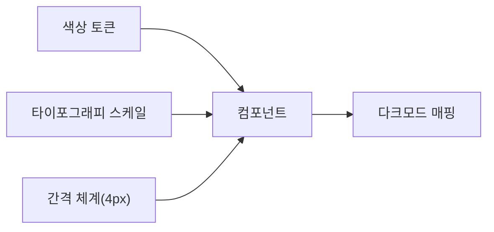

AJT는 모든 제품 화면에 일관된 시각 언어를 적용하기 위해 디자인 시스템을 운영한다.[^1] 신규 화면을 설계하거나 컴포넌트를 추가할 때는 이 문서를 우선 확인한다.

## 색상 토큰

색상은 역할 기반 토큰으로 관리하며, 화면에 직접 HEX 값을 하드코딩하지 않는다.[^2]

| 토큰 | HEX | 용도 |
|------|-----|------|
| `color-primary` | `#1B4DFF` | 주요 액션, 브랜드 강조 |
| `color-primary-dark` | `#1339CC` | 프라이머리 버튼 hover/active |
| `color-ink` | `#0F1222` | 본문 텍스트, 다크모드 배경 |
| `color-paper` | `#FFFFFF` | 라이트모드 배경 |
| `color-surface` | `#F7F8FA` | 카드·패널 배경 |
| `color-success`/`warning`/`danger` | `#1FA97A`/`#F5A623`/`#E5484D` | 상태 표시 |

프라이머리 컬러는 로고에도 동일하게 사용하는 브랜드 대표색이며, 로고 자체의 색상 사용 범위와 금지 사용례는 [브랜드 사용 규정](pages/43d3df8c2173.md)을 따른다.[^3]

`color-ink`를 `color-paper` 위에 올렸을 때 대비율은 18.1:1로, WCAG 2.1 AA 기준(본문 4.5:1 이상)을 크게 상회한다.[^4]

## 타이포그래피

기본 서체는 Pretendard이며, 시스템 폰트가 없는 환경을 대비해 `Pretendard, -apple-system, "Noto Sans KR", sans-serif` 순서로 폴백을 지정한다.[^5]

| 스타일 | 크기/행간 | 굵기 | 용도 |
|--------|-----------|------|------|
| H1 | 32px / 1.3 | 700 | 페이지 제목 |
| H2 | 24px / 1.35 | 600 | 섹션 제목 |
| Body | 16px / 1.6 | 400 | 본문 |
| Small/Caption | 14px·12px / 1.5·1.4 | 400 | 보조 설명·캡션 |

## 간격 체계

간격은 4px 배수를 기본 단위로 사용한다.[^6]

```
4px · 8px · 12px · 16px · 24px · 32px · 48px · 64px
```

카드 내부 여백은 16px, 섹션 간 여백은 48px을 기본값으로 하며, 컴포넌트 사이의 최소 간격은 8px이다.[^7]

## 컴포넌트 규칙

- **버튼**: 모서리 반경 8px, 높이 40px(기본)·32px(작게).[^8]
- **입력 필드**: 높이 40px, 테두리 1px `#D5D8DE`, 포커스 시 `color-primary` 테두리와 2px 아웃라인.
- **카드**: 배경 `color-surface`, 모서리 반경 12px, 그림자는 한 겹만 사용한다.
- **뱃지**: 상태 색상을 배경 10% 투명도로 적용하고, 텍스트는 해당 색상의 진한 톤을 쓴다.

새 컴포넌트를 추가할 때는 기존 토큰을 재사용하는 것을 우선하며, 새 색상이나 크기가 꼭 필요하면 디자인 리드의 승인을 받는다.[^9]



## 다크모드 대응

모든 색상 토큰은 라이트/다크 두 세트로 정의하며, 다크모드에서는 `color-paper`와 `color-ink`의 역할이 반전된다.[^10]

| 토큰 | 라이트 | 다크 |
|------|--------|------|
| `color-primary` | `#1B4DFF` | `#5B7CFF` |
| `color-ink` | `#0F1222` | `#F2F3F7` |
| `color-paper` | `#FFFFFF` | `#101223` |
| `color-surface` | `#F7F8FA` | `#181B2E` |

다크모드에서는 채도가 높은 프라이머리 컬러가 눈부심을 유발할 수 있어, `color-primary`를 한 단계 밝고 채도가 낮은 `#5B7CFF`로 교체한다.[^11]

## 접근성

- 클릭 가능한 요소의 최소 터치 영역은 44x44px로 한다.[^12]
- 색상만으로 상태를 구분하지 않는다. 아이콘이나 텍스트 라벨을 함께 표기한다.
- 포커스 상태는 반드시 시각적으로 구분되어야 하며, `outline: none`만 적용하고 대체 표시를 하지 않는 것을 금지한다.[^13]

## 적용과 검수

신규 화면은 배포 전 디자인 리드 검수를 거친다. 검수 항목은 색상 토큰 사용 여부, 타이포그래피 스케일 준수, 간격 체계 준수, 다크모드 매핑 여부 4가지이며, 하나라도 누락되면 반려한다.[^14]

[^1]: 01-디자인 시스템 가이드.md, 개요 — "디자인부는 AJT의 모든 제품 화면에 일관된 시각 언어를 적용하기 위해 디자인 시스템을 운영한다."
[^2]: 01-디자인 시스템 가이드.md, 색상 토큰 — "색상은 역할 기반 토큰으로 관리하며, 화면에 직접 HEX 값을 하드코딩하지 않는다."
[^3]: 01-디자인 시스템 가이드.md, 색상 토큰 — "프라이머리 컬러 `#1B4DFF`는 로고에도 동일하게 사용하는 브랜드 대표색이므로, 색상을 임의로 조정하지 않는다."
[^4]: 01-디자인 시스템 가이드.md, 색상 토큰 — "텍스트 대비는 WCAG 2.1 AA 기준(본문 4.5:1 이상)을 충족해야 하며, `color-ink`를 `color-paper` 위에 올렸을 때 대비율은 18.1:1로 기준을 크게 상회한다."
[^5]: 01-디자인 시스템 가이드.md, 타이포그래피 — "기본 서체는 **Pretendard**이며, 시스템 폰트가 없는 환경을 대비해 `Pretendard, -apple-system, "Noto Sans KR", sans-serif` 순서로 폴백을 지정한다."
[^6]: 01-디자인 시스템 가이드.md, 간격 체계 — "간격은 4px 배수를 기본 단위로 사용한다."
[^7]: 01-디자인 시스템 가이드.md, 간격 체계 — "카드 내부 여백은 16px, 섹션 간 여백은 48px을 기본값으로 한다. 컴포넌트 사이의 최소 간격은 8px이다."
[^8]: 01-디자인 시스템 가이드.md, 컴포넌트 규칙 — "**버튼**: 모서리 반경 8px, 높이 40px(기본)·32px(작게)."
[^9]: 01-디자인 시스템 가이드.md, 컴포넌트 규칙 — "새 컴포넌트를 추가할 때는 기존 토큰을 재사용하는 것을 우선하며, 새 색상이나 크기가 꼭 필요하면 디자인 리드의 승인을 받는다."
[^10]: 01-디자인 시스템 가이드.md, 다크모드 대응 — "모든 색상 토큰은 라이트/다크 두 세트로 정의한다. 다크모드에서는 `color-paper`와 `color-ink`의 역할이 반전된다."
[^11]: 01-디자인 시스템 가이드.md, 다크모드 대응 — "다크모드에서는 채도가 높은 프라이머리 컬러가 눈부심을 유발할 수 있어, `color-primary`를 한 단계 밝고 채도가 낮은 `#5B7CFF`로 교체한다."
[^12]: 01-디자인 시스템 가이드.md, 접근성 — "클릭 가능한 요소의 최소 터치 영역은 44x44px로 한다."
[^13]: 01-디자인 시스템 가이드.md, 접근성 — "포커스 상태는 반드시 시각적으로 구분되어야 하며, `outline: none`만 적용하고 대체 표시를 하지 않는 것을 금지한다."
[^14]: 01-디자인 시스템 가이드.md, 적용과 검수 — "신규 화면은 배포 전 디자인 리드 검수를 거친다. 검수 항목은 색상 토큰 사용 여부, 타이포그래피 스케일 준수, 간격 체계 준수, 다크모드 매핑 여부 4가지다."
