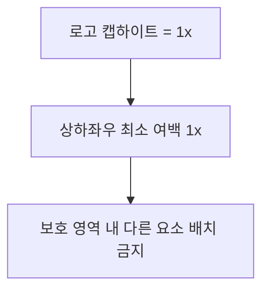
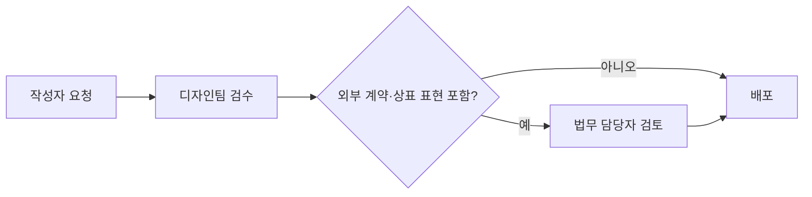

이 문서는 AJT 로고와 브랜드 자산을 사내외에서 사용할 때 지켜야 할 최소 규정을 정한다. 명함, 슬라이드, 보도자료, 파트너사 제출 자료 등 AJT 명의로 나가는 모든 자료에 적용한다.[^1]

## 로고 최소 여백

로고 주변에는 다른 요소(텍스트, 이미지, 테두리)가 침범할 수 없는 보호 영역을 둔다. 최소 여백은 로고에 포함된 "A" 글자의 캡하이트(cap height)를 1x로 하여, 사방으로 최소 1x 이상을 확보한다.[^2]

## 로고 최소 크기

| 매체 | 최소 크기 |
|------|-----------|
| 디지털 화면 | 높이 24px |
| 인쇄물 | 높이 15mm |
| 파비콘·앱 아이콘 | 32x32px (심볼만 단독 사용 허용) |

위 기준보다 작게 축소하면 로고의 획이 뭉개져 가독성이 떨어지므로 어떤 경우에도 축소하지 않는다.[^3]

## 금지 사용례

다음 사용은 예외 없이 금지한다.

- 로고를 회전하거나 기울여서 사용하는 것[^4]
- 로고의 가로세로 비율을 임의로 늘리거나 줄이는 것[^5]
- 로고에 그림자, 외곽선, 그라디언트 등 효과를 추가하는 것
- 로고 지정색 외의 임의 색상으로 재채색하는 것[^6]
- 로고와 대비가 낮은 배경 위에 배치하거나 다른 요소와 겹쳐서 배치하는 것

## 색상 코드

브랜드 대표색은 디자인 시스템의 `color-primary` 토큰과 동일한 값을 사용하며, 임의의 유사색으로 대체하지 않는다.[^7] 로고·색상 토큰의 구체적인 정의는 [디자인 시스템 가이드](pages/6dbe1b44ac33.md)를 함께 참고한다.

| 이름 | HEX | 용도 |
|------|-----|------|
| AJT 블루 (주 색상) | `#1B4DFF` | 로고, 주요 강조 |
| AJT 블루 다크 | `#1339CC` | 어두운 배경에서의 로고 |
| 잉크 | `#0F1222` | 로고 흑백 버전, 본문 텍스트 |
| 페이퍼 | `#FFFFFF` | 로고 반전 버전(흰색) |

`AJT 블루 다크`(`#1339CC`)는 어두운 배경 위에 로고를 얹을 때 쓰는 브랜드색이며, 다크모드 화면 UI의 프라이머리 색과는 별개다. 화면용 다크모드 토큰은 [디자인 시스템 가이드](pages/6dbe1b44ac33.md)의 다크모드 대응 표를 따른다.

로고는 컬러, 잉크(단색 다크), 페이퍼(단색 화이트) 세 가지 버전만 존재한다.[^8] 그 외 색상 버전은 만들지 않는다.

## 서체

브랜드 자료의 본문·제목 서체는 **Pretendard**로 통일한다. 파워포인트 등 Pretendard가 설치되지 않은 환경에서는 `맑은 고딕`을 대체 서체로 사용할 수 있다.[^9] 로고 옆에 브랜드명을 텍스트로 병기할 때도 Pretendard Bold를 사용하며, 임의의 장식 서체를 쓰지 않는다.

## 대외 자료 승인 절차

AJT 명의로 외부에 배포되는 자료는 배포 전 아래 절차를 거친다.

1. 작성자가 디자인팀에 검수를 요청한다.[^10]
2. 디자인팀은 로고·색상·서체가 이 규정을 준수하는지 확인하고, 필요 시 컴포넌트나 레이아웃 수정을 요청한다.
3. 외부 계약·상표 관련 표현이 포함된 경우 법무 담당자의 검토를 추가로 받는다.[^11]
4. 디자인팀과 법무 담당자(해당 시) 승인이 모두 완료된 후에만 배포한다.

승인 없이 배포된 자료에서 규정 위반이 발견되면 즉시 회수하고 재승인 절차를 거친다.[^12]

## 문의

로고 파일, 색상 팔레트, 서체 파일은 디자인팀 공유 드라이브의 브랜드 자산 폴더에서 받을 수 있다. 화면 컴포넌트에 적용할 색상·간격 값은 디자인 시스템 가이드의 토큰 정의를 따른다.

[^1]: 02-브랜드 사용 규정.md, 개요 — "명함, 슬라이드, 보도자료, 파트너사 제출 자료 등 AJT 명의로 나가는 모든 자료에 적용한다."
[^2]: 02-브랜드 사용 규정.md, 로고 최소 여백 — "최소 여백은 로고에 포함된 "A" 글자의 캡하이트(cap height)를 1x로 하여, 사방으로 최소 **1x** 이상을 확보한다."
[^3]: 02-브랜드 사용 규정.md, 로고 최소 크기 — "위 기준보다 작게 축소하면 로고의 획이 뭉개져 가독성이 떨어지므로 어떤 경우에도 축소하지 않는다."
[^4]: 02-브랜드 사용 규정.md, 금지 사용례 — "로고를 회전하거나 기울여서 사용하는 것"
[^5]: 02-브랜드 사용 규정.md, 금지 사용례 — "로고의 가로세로 비율을 임의로 늘리거나 줄이는 것"
[^6]: 02-브랜드 사용 규정.md, 금지 사용례 — "로고 지정색 외의 임의 색상으로 재채색하는 것"
[^7]: 02-브랜드 사용 규정.md, 색상 코드 — "브랜드 대표색은 디자인 시스템의 `color-primary` 토큰과 동일한 값을 사용하며, 임의의 유사색으로 대체하지 않는다."
[^8]: 02-브랜드 사용 규정.md, 색상 코드 — "로고는 컬러, 잉크(단색 다크), 페이퍼(단색 화이트) 세 가지 버전만 존재한다."
[^9]: 02-브랜드 사용 규정.md, 서체 — "브랜드 자료의 본문·제목 서체는 **Pretendard**로 통일한다. 파워포인트 등 Pretendard가 설치되지 않은 환경에서는 `맑은 고딕`을 대체 서체로 사용할 수 있다."
[^10]: 02-브랜드 사용 규정.md, 대외 자료 승인 절차 — "작성자가 디자인팀에 검수를 요청한다."
[^11]: 02-브랜드 사용 규정.md, 대외 자료 승인 절차 — "외부 계약·상표 관련 표현이 포함된 경우 법무 담당자의 검토를 추가로 받는다."
[^12]: 02-브랜드 사용 규정.md, 대외 자료 승인 절차 — "승인 없이 배포된 자료에서 규정 위반이 발견되면 즉시 회수하고 재승인 절차를 거친다."
