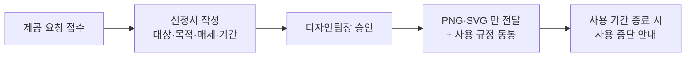

브랜드 자산을 **어디에 두고 어떻게 꺼내 쓰는지**, **사외에 줄 때 무엇을 확인하는지**를 안내한다. 사용 규정 자체는 [브랜드 사용 규정](pages/43d3df8c2173.md)이 정하고, 이 문서는 배포와 제공 절차를 다룬다[^1].

## 자산 보관

브랜드 자산은 사내 자산 저장소의 `brand` 공간 **한 곳에만** 둔다. 개인 드라이브나 메신저에 올린 사본은 자산으로 보지 않는다[^2].

| 묶음 | 내용 |
|------|------|
| 로고 | 기본형 · 가로형 · 심볼 단독형 |
| 서체 | 본문용 · 제목용 |
| 색상 | 팔레트 파일 · 토큰 정의 |

각 묶음에는 **최신본만** 둔다. 지난 판은 `archive` 하위로 옮기고 폴더 이름에 판번호를 적는다[^3].

## 파일 형식

로고는 **SVG 를 원본**으로 하고 PNG 를 함께 제공한다. 인쇄용이 필요한 경우에만 PDF 를 추가로 만든다[^4].

파일 이름은 `ajt-logo-<형태>-<색상>.<확장자>` 형식이다[^5].

## 사내 사용

사내 문서와 발표 자료는 **저장소의 최신본을 그대로** 쓴다. 색을 바꾸거나 비율을 조정하지 않는다[^6].

발표 자료 표지처럼 배경색이 정해지지 않은 자리에는 **단색형 로고**를 쓴다[^7].

## 외부 제공

사외에 자산을 제공할 때에는 **디자인팀장의 승인**을 받는다. **승인 없이 원본 파일을 전달하지 않는다**[^8].

신청서에는 **제공 대상·사용 목적·노출 매체·사용 기간**을 적고, 기간이 지나면 사용을 중단하도록 안내한다[^9].

외부 제공 파일은 **PNG 와 SVG 로 한정**한다. **서체 원본 파일은 어떤 경우에도 제공하지 않는다** — 서체 사용권이 회사에 한정되어 있기 때문이다[^10].

제공 시에는 브랜드 사용 규정의 **여백·최소 크기·금지 사용 조항을 함께 전달**한다[^11].

## 오사용 대응

사외에서 규정에 어긋난 사용을 발견하면 디자인부가 **사용 중단과 교체를 요청**한다. 요청 이력은 자산 저장소의 `report` 폴더에 남긴다[^12].

## 갱신

자산이 개정되면 **저장소를 먼저 갱신**하고 사내 공지와 함께 이전 판 사용 종료일을 알린다. 종료일 이전까지는 두 판을 함께 허용한다[^13].

[^1]: 브랜드 자산 배포 및 외부 제공 기준.md, 도입 — "사용 규정 자체는 브랜드 사용 규정이 정하며 이 문서는 자산의 배포와 제공 절차를 다룬다."
[^2]: 브랜드 자산 배포 및 외부 제공 기준.md, 1. 자산 보관 — "브랜드 자산은 사내 자산 저장소의 brand 공간 한 곳에만 둔다. 개인 드라이브나 메신저에 올린 사본은 자산으로 보지 아니한다."
[^3]: 브랜드 자산 배포 및 외부 제공 기준.md, 1. 자산 보관 — "각 묶음에는 최신본만 둔다. 지난 판은 archive 하위로 옮기고 폴더 이름에 판번호를 적는다."
[^4]: 브랜드 자산 배포 및 외부 제공 기준.md, 2. 파일 형식 — "로고는 SVG 를 원본으로 하고 PNG 를 함께 제공한다. 인쇄용이 필요한 경우에만 PDF 를 추가로 만든다."
[^5]: 브랜드 자산 배포 및 외부 제공 기준.md, 2. 파일 형식 — "로고 파일 이름은 ajt-logo-<형태>-<색상>.<확장자> 형식으로 적는다."
[^6]: 브랜드 자산 배포 및 외부 제공 기준.md, 3. 사내 사용 — "사내 문서와 발표 자료는 저장소의 최신본을 그대로 쓴다. 색을 바꾸거나 비율을 조정하지 아니한다."
[^7]: 브랜드 자산 배포 및 외부 제공 기준.md, 3. 사내 사용 — "발표 자료 표지처럼 배경색이 정해지지 않은 자리에는 단색형 로고를 쓴다."
[^8]: 브랜드 자산 배포 및 외부 제공 기준.md, 4. 외부 제공 — "사외에 브랜드 자산을 제공할 때에는 디자인팀장의 승인을 받는다. 승인 없이 원본 파일을 전달하지 아니한다."
[^9]: 브랜드 자산 배포 및 외부 제공 기준.md, 4. 외부 제공 — "제공 대상과 사용 목적, 노출 매체, 사용 기간을 신청서에 적는다. 사용 기간이 지나면 자산 사용을 중단하도록 안내한다."
[^10]: 브랜드 자산 배포 및 외부 제공 기준.md, 4. 외부 제공 — "외부에 제공하는 파일은 PNG 와 SVG 로 한정한다. 서체 원본 파일은 어떤 경우에도 제공하지 아니한다 — 서체는 사용권이 회사에 한정되어 있기 때문이다."
[^11]: 브랜드 자산 배포 및 외부 제공 기준.md, 4. 외부 제공 — "제공 시에는 브랜드 사용 규정의 여백·최소 크기·금지 사용 조항을 함께 전달한다."
[^12]: 브랜드 자산 배포 및 외부 제공 기준.md, 5. 오사용 대응 — "사외에서 규정에 어긋난 사용을 발견하면 디자인부가 사용 중단과 교체를 요청한다. 요청 이력은 자산 저장소의 report 폴더에 남긴다."
[^13]: 브랜드 자산 배포 및 외부 제공 기준.md, 6. 갱신 — "브랜드 자산이 개정되면 저장소를 먼저 갱신하고, 사내 공지와 함께 이전 판 사용 종료일을 알린다. 종료일 이전까지는 두 판을 함께 허용한다."
