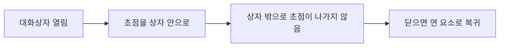

AJT 서비스 화면이 지켜야 할 접근성 기준을 안내한다. 기준은 **WCAG 2.1 AA** 를 따르며, [디자인 시스템 가이드](pages/6dbe1b44ac33.md)의 컴포넌트는 이 기준을 충족한 상태로 배포된다.

**사내외에 공개되는 모든 웹 화면**에 적용하며, **내부 관리자 화면도 예외가 아니다**[^1].

## 한눈에 보기

| 항목 | 기준 |
|------|------|
| 본문 명도 대비 | 4.5:1 이상 |
| 큰 글씨(18pt↑, 14pt 굵게) | 3:1 이상 |
| 테두리 등 의미 있는 그래픽 | 인접 색과 3:1 이상 |
| 키보드 | 마우스로 되는 것은 전부 키보드로도 |
| 자동 재생 움직임 | 5초 안에 멈추거나 멈출 수 있게 |

## 색과 명도 대비

본문 텍스트와 배경은 **4.5:1 이상**, 18pt 이상이거나 14pt 굵은 글씨는 **3:1 이상**이다[^2]. 버튼·입력창 테두리처럼 의미를 전달하는 그래픽 요소도 인접 색과 **3:1 이상**을 확보한다[^3].

**색만으로 정보를 전달하지 않는다**[^4]. 오류 표시는 붉은색과 함께 문구나 아이콘을 반드시 같이 쓴다[^4].

## 키보드 이동

마우스로 할 수 있는 모든 조작은 **키보드만으로도** 할 수 있어야 하고, 초점 순서는 화면에 보이는 순서와 같아야 한다[^5].

초점을 받은 요소에는 **눈에 보이는 초점 표시**를 남긴다[^6]. 기본 표시를 지웠다면 대비 3:1 이상의 대체 표시를 제공한다[^6].

대화상자를 열면 초점을 안으로 옮기고, 닫으면 그 대화상자를 연 요소로 되돌린다[^7].

## 대체 텍스트

정보를 담은 이미지에는 대체 텍스트를 넣고, **장식용 이미지는 빈 값**으로 두어 보조기기가 읽지 않게 한다[^8].

아이콘만 있는 버튼에는 **접근 가능한 이름을 반드시 부여**한다[^9]. 아이콘 모양이 아니라 그 버튼이 하는 일을 이름으로 쓴다[^9].

## 양식과 오류

입력창에는 **눈에 보이는 이름표**를 붙인다. 자리표시자로 이름표를 대신하지 않는다[^10].

오류가 나면 **어떤 항목이 왜 잘못되었는지 문장으로** 알리고 초점을 첫 오류 항목으로 옮긴다[^11]. 오류 문구를 쓰는 방법은 [UX 라이팅 가이드](pages/7e94b1d03fa2.md)를 참고한다.

## 동작과 시간

자동 재생되는 움직임은 **5초 안에 멈추거나 사용자가 멈출 수 있어야** 한다[^12]. 사용자가 운영체제에서 동작 줄이기를 켰다면 전환 효과를 생략한다[^12].

## 점검 절차

새 화면은 **디자인 리뷰에서 명도 대비와 초점 순서를 확인한 뒤** 개발에 넘긴다[^13]. 리뷰 진행 방식은 [디자인 리뷰 및 핸드오프 절차](pages/c8d20a4e17b6.md)에 있다.

**분기마다 접근성 점검 스프린트**를 열어 기존 화면을 화면 단위로 점검하고 결과를 기록한다[^14].

[^1]: 접근성 가이드라인.md, 1. 적용 범위 — "이 가이드라인은 사내외에 공개되는 모든 웹 화면에 적용한다. 내부 관리자 화면도 예외로 두지 아니한다."
[^2]: 접근성 가이드라인.md, 2. 색과 명도 대비 — "본문 텍스트와 배경의 명도 대비는 4.5:1 이상으로 한다. 18pt 이상이거나 14pt 굵은 글씨는 3:1 이상으로 한다."
[^3]: 접근성 가이드라인.md, 2. 색과 명도 대비 — "버튼·입력창의 테두리처럼 의미를 전달하는 그래픽 요소는 인접 색과 3:1 이상의 대비를 확보한다."
[^4]: 접근성 가이드라인.md, 2. 색과 명도 대비 — "색만으로 정보를 전달하지 아니한다. 오류 표시는 붉은색과 함께 문구나 아이콘을 반드시 같이 쓴다."
[^5]: 접근성 가이드라인.md, 3. 키보드 이동 — "마우스로 할 수 있는 모든 조작은 키보드만으로도 할 수 있어야 한다. 초점 순서는 화면에 보이는 순서와 같게 한다."
[^6]: 접근성 가이드라인.md, 3. 키보드 이동 — "초점을 받은 요소에는 눈에 보이는 초점 표시를 남긴다. 기본 초점 표시를 지우는 경우에는 대비 3:1 이상의 대체 표시를 제공한다."
[^7]: 접근성 가이드라인.md, 3. 키보드 이동 — "대화상자를 열면 초점을 대화상자 안으로 옮기고, 닫으면 대화상자를 연 요소로 되돌린다."
[^8]: 접근성 가이드라인.md, 4. 대체 텍스트 — "정보를 담은 이미지에는 대체 텍스트를 넣는다. 장식용 이미지는 대체 텍스트를 빈 값으로 두어 보조기기가 읽지 않도록 한다."
[^9]: 접근성 가이드라인.md, 4. 대체 텍스트 — "아이콘만 있는 버튼에는 접근 가능한 이름을 반드시 부여한다. 아이콘 모양이 아니라 그 버튼이 하는 일을 이름으로 쓴다."
[^10]: 접근성 가이드라인.md, 5. 양식과 오류 — "입력창에는 눈에 보이는 이름표를 붙인다. 자리표시자만으로 이름표를 대신하지 아니한다."
[^11]: 접근성 가이드라인.md, 5. 양식과 오류 — "오류가 발생하면 어떤 항목이 왜 잘못되었는지 문장으로 알리고, 초점을 첫 오류 항목으로 옮긴다."
[^12]: 접근성 가이드라인.md, 6. 동작과 시간 — "자동으로 재생되는 움직임은 5초 안에 멈추거나 사용자가 멈출 수 있어야 한다. 사용자가 운영체제에서 동작 줄이기를 켠 경우에는 전환 효과를 생략한다."
[^13]: 접근성 가이드라인.md, 7. 점검 절차 — "새 화면은 디자인 리뷰에서 명도 대비와 초점 순서를 확인한 뒤 개발에 넘긴다."
[^14]: 접근성 가이드라인.md, 7. 점검 절차 — "분기마다 접근성 점검 스프린트를 열어 기존 화면을 화면 단위로 점검하고 결과를 기록한다."
