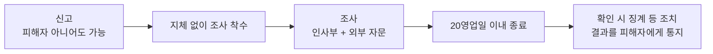

임직원의 고충을 처리하고 직장 내 괴롭힘을 예방·대응하는 절차를 안내한다. 근로기준법 제76조의2 및 제76조의3에 따른다[^1].

**모든 재직 임직원**에게 적용하며, **협력업체 인력과의 사이에서 발생한 사안에도 준용**한다[^2].

## 고충처리 창구

인사부에 고충처리 담당자를 두며, **인사부장이 지명하고 사내에 공지**한다[^3].

| 접수 방법 | 비고 |
|-----------|------|
| 대면 | |
| 사내 문의 시스템 | |
| 전용 메일 | |
| **익명 접수** | 받는다[^4] |

접수된 고충은 **접수일로부터 10영업일 이내**에 처리 결과를 알린다. 시간이 더 필요하면 **사유와 예상 기간을 먼저** 알린다[^5].

## 직장 내 괴롭힘이란

직장에서의 **지위 또는 관계 우위를 이용**하여 **업무상 적정 범위를 넘어** 다른 임직원에게 신체적·정신적 고통을 주거나 근무 환경을 악화시키는 행위다[^6].

**업무상 필요에 따른 정당한 지시와 지적은 괴롭힘으로 보지 않는다**[^7].

## 신고와 조사

**누구든지** 괴롭힘 발생 사실을 알게 되면 신고할 수 있다 — **피해자 본인이 아니어도** 된다[^8]. 신고를 받은 담당자는 **지체 없이** 사실 확인 조사에 착수한다[^9].

조사는 **인사부 담당자와 외부 자문 인력이 함께** 수행하며, 조사자는 **사안의 당사자와 이해관계가 없는 사람**으로 정한다[^10].

조사 과정에서 알게 된 사실은 **조사 목적 외에 사용하지 않으며** 참여자는 비밀을 유지한다[^11]. 조사는 **착수일로부터 20영업일 이내**에 마치는 것이 원칙이다[^12].

## 피해자 보호와 조치

조사 기간 중 피해자가 요청하면 **근무 장소 변경·유급휴가 부여** 등 필요한 조치를 하며, **피해자의 의사에 반하는 조치를 하지 않는다**[^13].

괴롭힘이 확인되면 행위자에 대하여 징계 등 필요한 조치를 하고 **그 조치 내용을 피해자에게 알린다**[^14].

## 신고자 보호

신고자·피해자·**조사에 협조한 사람**에게 해고를 포함한 **어떠한 불리한 처우도 하지 않는다**[^15].

신고를 이유로 한 불리한 처우가 확인되면 **그 자체를 별도의 징계 사유**로 본다[^16].

## 예방 교육

**연 1회 이상** 예방 교육을 실시하고 인사부가 이수 여부를 관리한다[^17]. 교육 일정은 온보딩 과정에도 포함된다 — [신입 온보딩 가이드](pages/51a1ea79db12.md)를 참고한다.

[^1]: 고충처리 및 직장 내 괴롭힘 예방 규정.md, 도입 — "임직원의 고충을 처리하고 직장 내 괴롭힘을 예방·대응하는 절차를 정한다. 근로기준법 제76조의2 및 제76조의3에 따른다."
[^2]: 고충처리 및 직장 내 괴롭힘 예방 규정.md, 1. 적용 범위 — "이 규정은 모든 재직 임직원에게 적용한다. 협력업체 인력과의 사이에서 발생한 사안에도 준용한다."
[^3]: 고충처리 및 직장 내 괴롭힘 예방 규정.md, 2. 고충처리 창구 — "인사부에 고충처리 담당자를 둔다. 담당자는 인사부장이 지명하고 사내에 공지한다."
[^4]: 고충처리 및 직장 내 괴롭힘 예방 규정.md, 2. 고충처리 창구 — "고충은 대면, 사내 문의 시스템, 전용 메일 중 어느 방법으로도 접수할 수 있다. 익명 접수도 받는다."
[^5]: 고충처리 및 직장 내 괴롭힘 예방 규정.md, 2. 고충처리 창구 — "접수된 고충은 접수일로부터 10영업일 이내에 처리 결과를 신청인에게 알린다. 처리에 시간이 더 필요한 경우에는 사유와 예상 기간을 먼저 알린다."
[^6]: 고충처리 및 직장 내 괴롭힘 예방 규정.md, 3. 직장 내 괴롭힘의 정의 — "직장에서의 지위 또는 관계 우위를 이용하여 업무상 적정 범위를 넘어 다른 임직원에게 신체적·정신적 고통을 주거나 근무 환경을 악화시키는 행위를 직장 내 괴롭힘으로 본다."
[^7]: 고충처리 및 직장 내 괴롭힘 예방 규정.md, 3. 직장 내 괴롭힘의 정의 — "업무상 필요에 따른 정당한 지시와 지적은 괴롭힘으로 보지 아니한다."
[^8]: 고충처리 및 직장 내 괴롭힘 예방 규정.md, 4. 신고 — "누구든지 직장 내 괴롭힘 발생 사실을 알게 된 경우 신고할 수 있다. 피해자 본인이 아니어도 신고할 수 있다."
[^9]: 고충처리 및 직장 내 괴롭힘 예방 규정.md, 4. 신고 — "신고를 받은 담당자는 지체 없이 사실 확인 조사에 착수한다."
[^10]: 고충처리 및 직장 내 괴롭힘 예방 규정.md, 5. 조사 — "조사는 인사부 담당자와 외부 자문 인력이 함께 수행한다. 조사자는 사안의 당사자와 이해관계가 없는 사람으로 정한다."
[^11]: 고충처리 및 직장 내 괴롭힘 예방 규정.md, 5. 조사 — "조사 과정에서 알게 된 사실은 조사 목적 외에 사용하지 아니하며, 조사에 참여한 사람은 비밀을 유지한다."
[^12]: 고충처리 및 직장 내 괴롭힘 예방 규정.md, 5. 조사 — "조사는 착수일로부터 20영업일 이내에 마치는 것을 원칙으로 한다."
[^13]: 고충처리 및 직장 내 괴롭힘 예방 규정.md, 6. 피해자 보호와 조치 — "조사 기간 중 피해자가 요청하면 근무 장소 변경, 유급휴가 부여 등 필요한 조치를 한다. 피해자의 의사에 반하는 조치를 하지 아니한다."
[^14]: 고충처리 및 직장 내 괴롭힘 예방 규정.md, 6. 피해자 보호와 조치 — "괴롭힘이 확인된 경우에는 행위자에 대하여 징계 등 필요한 조치를 하고, 그 조치 내용을 피해자에게 알린다."
[^15]: 고충처리 및 직장 내 괴롭힘 예방 규정.md, 7. 신고자 보호 — "신고자와 피해자, 조사에 협조한 사람에게 해고를 포함한 어떠한 불리한 처우도 하지 아니한다."
[^16]: 고충처리 및 직장 내 괴롭힘 예방 규정.md, 7. 신고자 보호 — "신고를 이유로 한 불리한 처우가 확인되면 그 자체를 별도의 징계 사유로 본다."
[^17]: 고충처리 및 직장 내 괴롭힘 예방 규정.md, 8. 예방 교육 — "회사는 연 1회 이상 직장 내 괴롭힘 예방 교육을 실시한다. 교육 이수 여부는 인사부가 관리한다."
