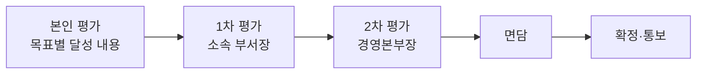

임직원 인사평가의 운영 기준을 안내한다. 평가는 보상과 승진의 근거가 되므로 **절차와 기록을 남기는 것을 원칙**으로 한다[^1].

## 주기와 대상

평가는 **반기마다** 실시한다 — 상반기 평가는 **7월**, 하반기 평가는 다음 해 **1월**이다[^2].

평가 기준일 현재 재직 중이고 **계속근로기간 3개월 이상**인 임직원이 대상이며, 수습 기간 중인 임직원은 수습 평가로 갈음한다[^3]. 평가 기간 중 휴직한 임직원은 **실제 근무한 기간**을 기준으로 평가한다[^4].

## 평가 항목

성과와 역량 두 축으로 본다[^5].

| 축 | 무엇을 보는가 |
|----|---------------|
| 성과 | 반기 시작 시점에 합의한 **목표 3~5개**의 달성도[^6] |
| 역량 | 협업 · 문제 해결 · 전문성 · 자기 주도[^7] |

목표가 기간 중 바뀌면 **변경 시점과 사유를 기록**한다[^6].

## 등급

| 등급 | 뜻 |
|------|-----|
| S | 기대를 크게 넘어섰다 |
| A | 기대를 넘어섰다 |
| B | 기대에 부합한다 |
| C | 일부 기대에 미치지 못했다 |
| D | 기대에 미치지 못했다 |

등급은 5단계다[^8]. **등급별 인원 비율을 미리 정해 두지 않는다** — 상대평가로 배분하면 협업이 줄기 때문이다[^9].

## 절차

본인 평가 → 1차 평가(소속 부서장) → 2차 평가(경영본부장) 순으로 진행한다[^10]. **2차 평가자가 1차와 다른 등급을 주는 경우에는 그 사유를 기록**한다[^11].

## 면담

부서장은 **평가 확정 전에** 대상자와 1:1 면담을 한다. 면담에서는 **등급 자체보다 근거와 다음 반기의 목표**를 다룬다[^12]. 면담 내용은 요지를 기록하고 대상자가 확인한다[^13].

## 통보와 이의신청

결과는 확정 후 **5영업일 이내**에 본인에게 통보한다[^14].

이의가 있으면 통보일로부터 **10영업일 이내**에 인사부에 신청할 수 있고, 인사부는 신청일로부터 **15영업일 이내**에 검토 결과를 회신한다[^15].

**이의신청 사실은 인사평가에 불이익으로 반영하지 않는다**[^16].

## 결과의 활용

평가 결과는 급여 리뷰와 승진 심사의 근거로 쓴다. 다만 **평가 결과만으로 승진이 결정되지 않으며**, 승진 요건은 [경력 개발 및 승진 체계](pages/a7a15a57c025.md)가 정한다[^17].

**D 등급을 연속 두 회** 받은 경우에는 직무 재배치 또는 역량 향상 계획을 수립한다[^18].

[^1]: 인사평가 운영 기준.md, 도입 — "임직원 인사평가의 운영 기준을 정한다. 평가는 보상과 승진의 근거가 되므로 절차와 기록을 남기는 것을 원칙으로 한다."
[^2]: 인사평가 운영 기준.md, 1. 평가 주기와 대상 — "인사평가는 반기마다 실시한다. 상반기 평가는 7월에, 하반기 평가는 다음 해 1월에 진행한다."
[^3]: 인사평가 운영 기준.md, 1. 평가 주기와 대상 — "평가 기준일 현재 재직 중이고 계속근로기간이 3개월 이상인 임직원을 대상으로 한다. 수습 기간 중인 임직원은 수습 평가로 갈음한다."
[^4]: 인사평가 운영 기준.md, 1. 평가 주기와 대상 — "평가 기간 중 휴직한 임직원은 실제 근무한 기간을 기준으로 평가한다."
[^5]: 인사평가 운영 기준.md, 2. 평가 항목 — "평가는 성과와 역량 두 축으로 한다."
[^6]: 인사평가 운영 기준.md, 2. 평가 항목 — "성과는 반기 시작 시점에 합의한 목표의 달성도로 본다. 목표는 3개에서 5개 사이로 정하고, 기간 중 목표가 바뀌면 변경 시점과 사유를 기록한다."
[^7]: 인사평가 운영 기준.md, 2. 평가 항목 — "역량은 협업, 문제 해결, 전문성, 자기 주도의 네 항목으로 본다."
[^8]: 인사평가 운영 기준.md, 3. 등급 — "등급은 5단계로 하며 각 등급의 뜻은 다음과 같다."
[^9]: 인사평가 운영 기준.md, 3. 등급 — "등급별 인원 비율을 미리 정해 두지 아니한다. 상대평가로 등급을 배분하면 협업이 줄어들기 때문이다."
[^10]: 인사평가 운영 기준.md, 4. 평가 절차 — "본인 평가는 임직원이 목표별 달성 내용을 스스로 적는다. 1차 평가는 소속 부서장이, 2차 평가는 경영본부장이 수행한다."
[^11]: 인사평가 운영 기준.md, 4. 평가 절차 — "2차 평가자가 1차 평가와 다른 등급을 부여하는 경우에는 그 사유를 기록한다."
[^12]: 인사평가 운영 기준.md, 5. 면담 — "부서장은 평가 확정 전에 대상자와 1:1 면담을 한다. 면담에서는 등급 자체보다 근거와 다음 반기의 목표를 다룬다."
[^13]: 인사평가 운영 기준.md, 5. 면담 — "면담 내용은 요지를 기록하고 대상자가 확인한다."
[^14]: 인사평가 운영 기준.md, 6. 결과 통보와 이의신청 — "평가 결과는 확정 후 5영업일 이내에 본인에게 통보한다."
[^15]: 인사평가 운영 기준.md, 6. 결과 통보와 이의신청 — "결과에 이의가 있는 임직원은 통보일로부터 10영업일 이내에 인사부에 이의신청을 할 수 있다. 인사부는 신청일로부터 15영업일 이내에 검토 결과를 회신한다."
[^16]: 인사평가 운영 기준.md, 6. 결과 통보와 이의신청 — "이의신청 사실은 인사평가에 불이익으로 반영하지 아니한다."
[^17]: 인사평가 운영 기준.md, 7. 결과의 활용 — "평가 결과는 급여 리뷰와 승진 심사의 근거로 활용한다. 다만 평가 결과만으로 승진이 결정되지 아니하며, 승진 요건은 경력 개발 및 승진 체계가 정하는 바에 따른다."
[^18]: 인사평가 운영 기준.md, 7. 결과의 활용 — "D 등급을 연속 두 회 받은 경우에는 직무 재배치 또는 역량 향상 계획을 수립한다."
