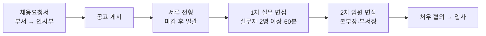

AJT 의 채용 절차를 안내한다. 모든 직군에 공통으로 적용한다[^1].

## 전형 한눈에 보기

전형은 **서류 → 1차 실무 면접 → 2차 임원 면접** 세 단계다[^2]. 각 단계 결과는 **종료 후 5영업일 이내**에 개별 통보하며, **불합격자에게도 반드시 통보한다**[^3].

## 채용 요청과 공고

인력이 필요한 부서는 채용요청서를 인사부에 제출한다. 요청서에는 담당 업무·필요 역량·희망 입사 시기를 적는다[^4].

인사부는 **조직개편 계획과 맞물리는지** 확인한 뒤 공고를 게시한다. 조직개편이 예정된 경우에는 **개편 확정 이후에** 공고에 반영한다[^5].

공고에는 담당 업무·자격 요건·우대 사항·전형 절차·접수 마감일을 반드시 포함하고, **급여는 구간으로 표기**한다[^6].

## 서류 전형

인사부와 요청 부서가 함께 검토한다. **접수 마감 이후에 일괄 진행하며 선착순으로 처리하지 않는다**[^7].

지원 서류는 전형 종료 후 **1년간 보관**하고 그 이후 파기한다[^8].

## 1차 실무 면접

요청 부서의 **실무자 2명 이상**이 참여하고, 면접 시간은 직군에 관계없이 **60분**을 기준으로 한다[^9].

면접관은 사전 배포된 평가표를 쓰고 **면접 종료 당일에** 평가를 제출한다. 평가는 역량 항목별 점수와 **근거 문장**을 함께 적는다[^10].

**나이·혼인 여부·출신 지역 등 직무와 무관한 사항을 묻지 않는다**[^11].

## 2차 임원 면접

**경영본부장과 해당 부서장**이 참여하여 조직 적합성과 성장 가능성을 확인한다[^12]. 1차 평가표는 2차 면접 시작 전에 참여자에게 공유한다[^13].

## 처우 협의와 입사

인사부가 처우를 안내하고 협의한다. 처우는 **직전 연봉이 아니라 직무와 역량 수준**을 기준으로 정한다[^14].

입사일이 확정되면 사내 계정 생성을 요청하고 입사 첫 주에 온보딩 프로그램을 배정한다[^15] — 과정은 [신입 온보딩 가이드](pages/51a1ea79db12.md)에 있다. 입사 이후의 성장 경로는 [경력 개발 및 승진 체계](pages/a7a15a57c025.md)를 참고한다.

## 사내 추천

임직원은 지원자를 추천할 수 있고, 추천 대상자가 **입사 후 3개월을 근속**하면 추천 포상금을 지급한다[^16].

추천은 전형 과정에 영향을 주지 않으며, **추천자는 해당 지원자의 면접에 참여하지 않는다**[^17].

[^1]: 채용 프로세스 안내.md, 도입 — "AJT 의 채용 절차를 정한다. 모든 직군에 공통으로 적용하며, 경력 채용과 신입 채용의 차이는 각 조에서 따로 밝힌다."
[^2]: 채용 프로세스 안내.md, 2. 전형 절차 — "전형은 서류 전형, 1차 실무 면접, 2차 임원 면접의 세 단계로 진행한다."
[^3]: 채용 프로세스 안내.md, 2. 전형 절차 — "각 단계의 결과는 단계 종료 후 5영업일 이내에 지원자에게 개별 통보한다. 불합격자에게도 반드시 통보한다."
[^4]: 채용 프로세스 안내.md, 1. 채용 요청과 공고 — "인력이 필요한 부서는 채용요청서를 인사부에 제출한다. 요청서에는 담당 업무, 필요 역량, 희망 입사 시기를 적는다."
[^5]: 채용 프로세스 안내.md, 1. 채용 요청과 공고 — "인사부는 요청서를 검토해 조직개편 계획과 맞물리는지 확인한 뒤 공고를 게시한다. 조직개편이 예정된 경우에는 개편 확정 이후에 공고에 반영한다."
[^6]: 채용 프로세스 안내.md, 1. 채용 요청과 공고 — "공고에는 담당 업무, 자격 요건, 우대 사항, 전형 절차, 접수 마감일을 반드시 포함한다. 급여는 구간으로 표기한다."
[^7]: 채용 프로세스 안내.md, 3. 서류 전형 — "서류 전형은 인사부와 요청 부서가 함께 검토한다. 검토는 접수 마감 이후에 일괄로 진행하며 선착순으로 처리하지 아니한다."
[^8]: 채용 프로세스 안내.md, 3. 서류 전형 — "지원 서류는 전형 종료 후 1년간 보관하고 그 이후 파기한다."
[^9]: 채용 프로세스 안내.md, 4. 1차 실무 면접 — "1차 면접은 요청 부서의 실무자 2명 이상이 참여한다. 면접 시간은 직군에 관계없이 60분을 기준으로 한다."
[^10]: 채용 프로세스 안내.md, 4. 1차 실무 면접 — "면접관은 사전에 배포된 평가표를 사용하고, 면접 종료 당일에 평가를 제출한다. 평가는 역량 항목별 점수와 근거 문장을 함께 적는다."
[^11]: 채용 프로세스 안내.md, 4. 1차 실무 면접 — "면접에서 나이·혼인 여부·출신 지역 등 직무와 무관한 사항을 묻지 아니한다."
[^12]: 채용 프로세스 안내.md, 5. 2차 임원 면접 — "2차 면접은 경영본부장과 해당 부서장이 참여한다. 조직 적합성과 성장 가능성을 중심으로 확인한다."
[^13]: 채용 프로세스 안내.md, 5. 2차 임원 면접 — "1차 면접 평가표는 2차 면접 시작 전에 참여자에게 공유한다."
[^14]: 채용 프로세스 안내.md, 6. 처우 협의와 입사 — "최종 합격자에게는 인사부가 처우를 안내하고 협의한다. 처우는 직전 연봉이 아니라 직무와 역량 수준을 기준으로 정한다."
[^15]: 채용 프로세스 안내.md, 6. 처우 협의와 입사 — "입사일이 확정되면 사내 계정 생성을 요청하고, 입사 첫 주에 온보딩 프로그램을 배정한다."
[^16]: 채용 프로세스 안내.md, 7. 사내 추천 — "임직원은 지원자를 추천할 수 있다. 추천자에게는 추천 대상자가 입사 후 3개월을 근속한 경우에 추천 포상금을 지급한다."
[^17]: 채용 프로세스 안내.md, 7. 사내 추천 — "추천은 전형 과정에 영향을 주지 아니하며, 추천자는 해당 지원자의 면접에 참여하지 아니한다."
