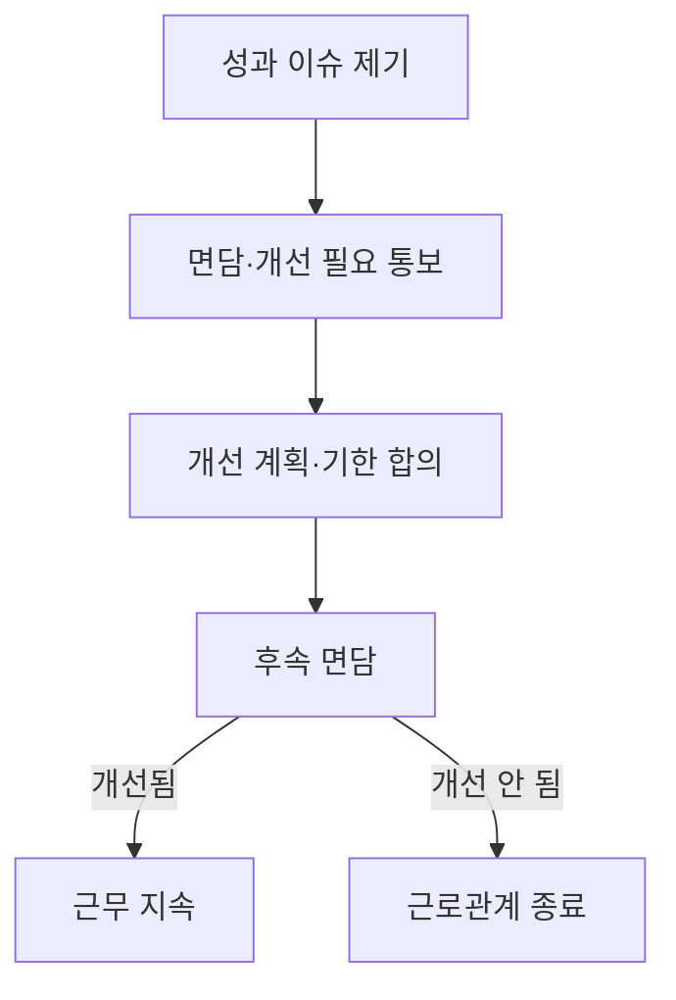

구성원의 퇴사 절차를 정리한다. 자발적 퇴사와 비자발적 퇴사의 처리 방식이 다르며, 최종급여와 스톡옵션 정산 기준도 함께 안내한다.

## 자발적 퇴사

구성원 본인의 선택으로 퇴사하는 경우, 원칙적으로 **30일**의 사전 통보 기간을 요청하며, 이 기간 동안 정상적으로 근무할 것을 기대한다[^1]. 팀장·인사팀과 대화한 뒤에도 퇴사가 최선이라고 판단되면 인사팀에 퇴사 의사를 통보한다[^2].

## 비자발적 퇴사

회사가 근로관계를 종료하는 경우로, 성과 문제로 인한 경우에는 이미 당사자에게 피드백을 전달하고 개선할 시간을 준 뒤에도 문제가 해결되지 않았을 때에 한한다[^3].

역할 자체가 더 이상 필요하지 않아 종료하는 경우에는 경영진이 결정한 뒤 곧바로 당사자에게 통보한다[^4].

## 재직증명 및 평판조회

회사는 전·현직 구성원에 대한 개인적·업무적 평판을 따로 제공하지 않으며, 외부에서 재직 여부를 문의하면 재직 기간만 안내한다[^5]. 재직 중인 구성원은 전·현직 동료에 대한 문의를 받으면 직접 답하지 말고 인사팀으로 넘긴다[^6].

## 퇴사 절차

퇴사가 결정되면 담당 부서가 계정과 접근 권한 해지를 함께 진행한다[^7]. 이후 퇴사자에게 다음 항목을 정리한 안내를 전달한다[^8].

### 최종급여

최종급여는 재직 기간과 퇴사 사유에 따라 다음과 같이 산정한다[^9].

| 퇴사 사유 | 지급 기준 |
| --- | --- |
| 자발적 퇴사 | 마지막 근무일까지 급여 지급, 미사용 연차는 회사 규정에 따라 수당으로 정산[^10] |
| 비자발적(재직 3개월 이상, 영업직군 6개월 이상) | 법정 예고수당을 포함해 4개월분 급여 지급[^11] |
| 비자발적(재직 3개월 미만) | 1개월분 급여 지급[^12] |
| 중대한 계약 위반에 따른 해고 | 법정 최소 기준만 지급, 별도 예고 없음[^13] |

법정 예고수당 이상의 보상을 받으려면 퇴사자는 퇴직 관련 합의서에 서명해야 한다[^14].

### 스톡옵션

스톡옵션을 부여받은 구성원이 퇴사하는 경우, 퇴사 후에도 8년의 행사 유예기간을 부여하며, 중대한 계약 위반으로 해고된 경우가 아니라면 대부분 우호적 퇴사자로 분류되어 이 유예기간을 적용받는다[^15].

## 퇴사자 체크리스트

퇴사자 체크리스트는 인사팀 내부 이슈 관리 시스템에 템플릿으로 등록되어 있으며, 퇴사자가 발생할 때마다 인사팀이 새 항목을 생성해 관리한다[^16]. 팀장이 퇴사하는 경우에는 후임 팀장 지정 계획을 퇴사 발표 전 또는 발표와 함께 준비한다[^17].

> **참고:** 입사와 수습기간 절차는 [신입 온보딩 가이드](pages/51a1ea79db12.md), 이직을 고려할 때의 성장 경로 논의는 [경력 개발 및 승진 체계](pages/a7a15a57c025.md) 참고.

[^1]: 02-퇴사 절차 안내.md, 자발적 퇴사 — "원칙적으로 30일의 사전 통보 기간을 요청하며(현지 법령상 다른 상한·하한이 있는 경우는 예외), 이 기간 동안 정상적으로 근무할 것을 기대한다."
[^2]: 02-퇴사 절차 안내.md, 자발적 퇴사 — "대화 후에도 퇴사가 최선이라고 판단되면 인사팀에 퇴사 의사를 통보한다"
[^3]: 02-퇴사 절차 안내.md, 비자발적 퇴사 — "성과 문제로 인한 경우에는 이미 당사자에게 피드백을 전달하고 개선할 시간을 준 뒤에도 문제가 해결되지 않았을 때에 한한다"
[^4]: 02-퇴사 절차 안내.md, 비자발적 퇴사 — "역할 자체가 더 이상 필요하지 않아 종료하는 경우에는 경영진이 결정한 뒤 곧바로 당사자에게 통보한다"
[^5]: 02-퇴사 절차 안내.md, 재직증명 및 평판조회 — "회사는 전·현직 구성원에 대한 개인적·업무적 평판을 따로 제공하지 않는다. 외부에서 재직 여부를 문의하면 재직 기간만 안내한다"
[^6]: 02-퇴사 절차 안내.md, 재직증명 및 평판조회 — "전·현직 동료에 대한 문의를 받으면 직접 답하지 말고 인사팀으로 넘긴다"
[^7]: 02-퇴사 절차 안내.md, 퇴사 절차 — "퇴사가 결정되면 담당 부서가 계정과 접근 권한 해지를 함께 진행한다"
[^8]: 02-퇴사 절차 안내.md, 퇴사 절차 — "이후 퇴사자에게 다음 항목을 정리한 안내를 전달한다"
[^9]: 02-퇴사 절차 안내.md, 최종급여 — "최종급여는 재직 기간과 퇴사 사유에 따라 다음과 같이 산정한다"
[^10]: 02-퇴사 절차 안내.md, 최종급여 — "마지막 근무일까지 급여 지급, 미사용 연차는 회사 규정에 따라 수당으로 정산"
[^11]: 02-퇴사 절차 안내.md, 최종급여 — "법정 예고수당을 포함해 4개월분 급여 지급"
[^12]: 02-퇴사 절차 안내.md, 최종급여 — "1개월분 급여 지급"
[^13]: 02-퇴사 절차 안내.md, 최종급여 — "법정 최소 기준만 지급, 별도 예고 없음"
[^14]: 02-퇴사 절차 안내.md, 최종급여 — "법정 예고수당 이상의 보상을 받으려면 퇴사자는 퇴직 관련 합의서에 서명해야 하며"
[^15]: 02-퇴사 절차 안내.md, 스톡옵션 — "퇴사 후에도 8년의 행사 유예기간을 부여하며, 중대한 계약 위반으로 해고된 경우가 아니라면 대부분 우호적 퇴사자로 분류되어 이 유예기간을 적용받는다"
[^16]: 02-퇴사 절차 안내.md, 퇴사자 체크리스트 — "퇴사자 체크리스트는 인사팀 내부 이슈 관리 시스템에 템플릿으로 등록되어 있으며, 퇴사자가 발생할 때마다 인사팀이 새 항목을 생성해 관리한다"
[^17]: 02-퇴사 절차 안내.md, 퇴사자 체크리스트 — "팀장이 퇴사하는 경우에는 후임 팀장 지정 계획을 퇴사 발표 전 또는 발표와 함께 준비한다"
