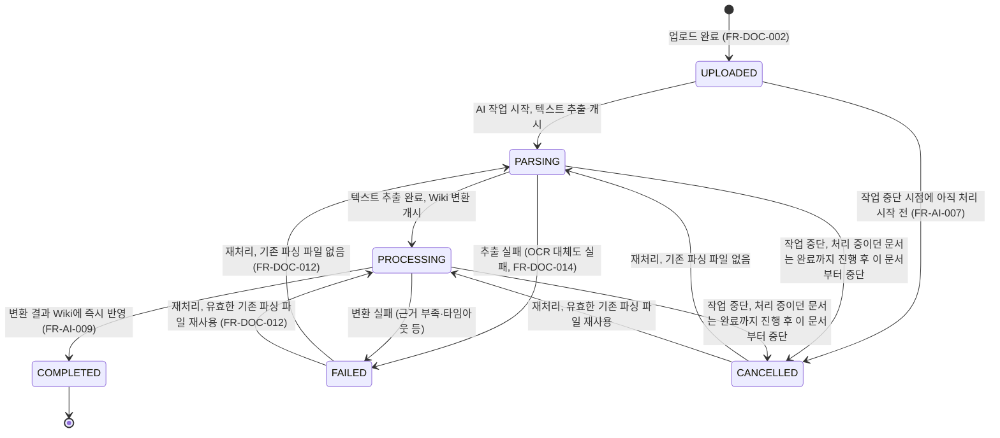
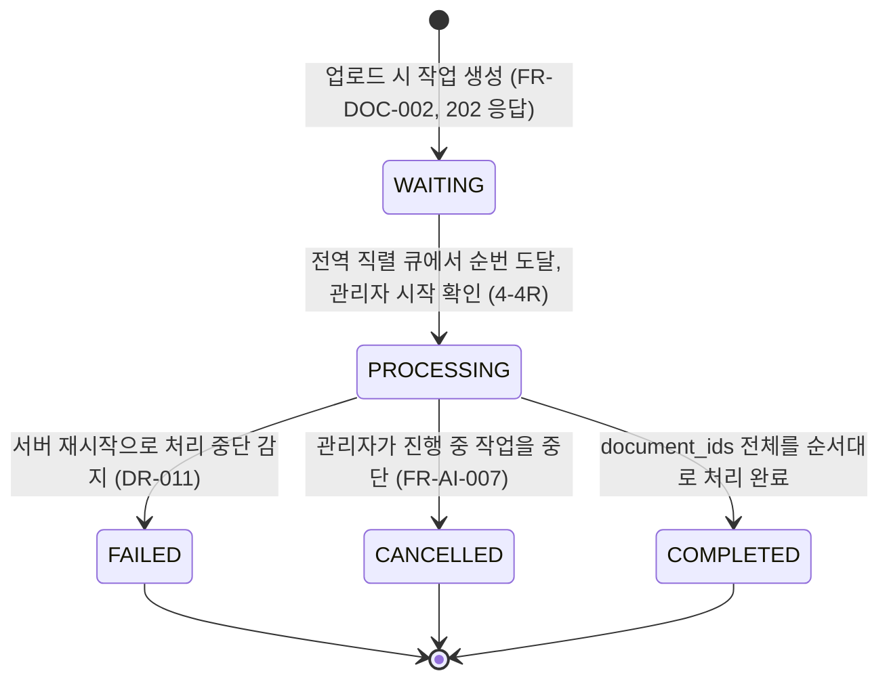

# 문서 관리 — 라우트/상태 확정 문서

문서 관리 와이어프레임 16화면 중 실제로 URL을 가지는 라우트와, 모달·다이얼로그·로컬 state로
처리해야 하는 화면을 구분하기 위한 문서입니다. 코드는 포함하지 않습니다.

**판단 기준**: 브라우저 뒤로가기로 돌아갈 수 있어야 하면 라우트, 아니면 상태(모달·다이얼로그·로컬 state)입니다.

값 출처: `docs/db/erd.sql`(`document.status`, `ai_job.status` CHECK 제약), `docs/requirements/요구사항정의서.md`
(FR-DOC-009, FR-DOC-012, FR-AI-001~003·007·008, DR-005, DR-011).

---

## 1. 문서 처리 상태 전이도

`document.status` (`docs/db/erd.sql` 78~114행): `UPLOADED`, `PARSING`, `PROCESSING`, `COMPLETED`, `FAILED`, `CANCELLED`

**주의**
- `FAILED`·`CANCELLED`만 재처리 가능합니다(FR-DOC-012). `COMPLETED` 문서는 재처리 대상이 아닙니다.
- OCR은 `PARSING` 내부 처리이며 별도 상태로 노출하지 않습니다(FR-DOC-014).
- 문서 교체·삭제(FR-DOC-015)는 해당 `scope_key`의 최신 원본문서 기준으로 재처리를 트리거하며, 이때도 이 전이도를 따릅니다.

---

## 2. AI 작업 상태 전이도

`ai_job.status` (`docs/db/erd.sql` 116~141행): `WAITING`, `PROCESSING`, `COMPLETED`, `FAILED`, `CANCELLED`

**도메인 규칙 (반드시 반영)**
- 작업 1건은 `document_ids`에 담긴 문서를 업로드 순서대로 1건씩 처리합니다(FR-AI-002·003). 동시에 두 작업이 `PROCESSING`일 수 없습니다.
- 개별 문서 실패는 작업 전체 실패가 아닙니다. 실패한 문서만 `document.status = FAILED`로 기록하고 나머지는 계속 진행하며, 작업은 `COMPLETED`로 끝날 수 있습니다(FR-AI-008).
- 작업 중단(`PROCESSING → CANCELLED`) 시 처리 중이던 문서는 강제 중단하지 않고 완료 후 멈춥니다. 이미 반영된 문서분은 유지하고, 남은 미처리 문서만 `document.status = CANCELLED`로 기록합니다(FR-AI-007). UI에서 "즉시 중단"으로 표현하면 안 됩니다.
- `ai_job.status = FAILED`는 서버 재시작으로 인한 작업 레벨 중단이며(DR-011), 개별 문서 변환 실패(FAILED 문서가 있어도 작업은 COMPLETED)와는 별개입니다.

---

## 3. 16화면 라우트/상태 매핑표

| 화면 ID | 화면명 | 구분 | 근거 |
|---|---|---|---|
| 4R | 문서 관리 목록 | **라우트** | 최초 진입점, 뒤로가기로 복귀해야 함 |
| 4-1R | 업로드 진행 중 | 상태 (모달) | 4R에서 여는 `DocumentUploadModal`. 업로드 중 닫기 불가 — 별도 URL 불필요 |
| 4-2R | AI 작업 대기 | **라우트** | 작업(`jobId`) 단위 화면. 새로고침·뒤로가기로 복귀 가능해야 함 |
| 4-2-1R | 공개 부서 선택 | 상태 (모달) | 4-2R 행에서 여는 부서 지정 모달 |
| 4-3R | 지정 완료 | 상태 (4-2R과 동일 라우트) | 모든 문서에 공개 범위 지정이 끝난 4-2R의 로컬 상태. 별도 라우트 아님 |
| 4-4R | 작업 시작 확인 | 상태 (다이얼로그) | `AiJobStartDialog`. 확인 즉시 진행 화면으로 전환되므로 URL 불필요 |
| 4-5R | 처리 중 | **라우트** | `ai_job.status = PROCESSING` 표시 화면. 폴링 중 새로고침해도 복귀해야 함 |
| 4-6R | 작업 요약 목록 | **라우트** | `ai_job.status`가 종료 상태(`COMPLETED`/`FAILED`/`CANCELLED`)일 때의 결과 화면 |
| 4-7R | 원본 문서 목록 | **라우트** | 검색·필터형 목록(FR-DOC-010), 뒤로가기로 복귀해야 함 |
| 4-7-1R | 원본 문서 상세 | **라우트** | `documentId` 단위 상세, 직접 링크·뒤로가기 필요 |
| 4-7-2R | 삭제 확인 | 상태 (다이얼로그) | 상세 화면 위 `ConfirmDialog`의 `confirm` 상태 |
| 4-7-3R | 삭제 처리 중 | 상태 (다이얼로그) | 같은 다이얼로그의 `processing` 상태. 닫기 불가 |
| 4-7-4R | 삭제 완료 | 상태 (다이얼로그) | 같은 다이얼로그의 `done` 상태. 확인 시 4-7R로 이동 |
| 4-8R | 카테고리 관리 | **라우트** | `scopeKey` 선택형 목록, 뒤로가기로 복귀해야 함 |
| 4-8-1R | 카테고리 추가·수정 | 상태 (모달) | 4-8R에서 여는 단일 모달, 추가/수정 모드만 다름 |
| 4-8-2R | 카테고리 삭제 확인 | 상태 (다이얼로그) | 4-8R 행 액션에서 여는 `ConfirmDialog` |

**요약**: 16화면 중 **라우트 7개**, **상태(모달/다이얼로그/로컬 state) 9개**.

---

## 4. 확정 라우트 목록과 하위 상태

| # | 라우트 | 화면 | 하위 상태 |
|---|---|---|---|
| 1 | `/documents` | 4R | 목록 로딩/빈 목록(`EmptyState`)/필터링됨 · 업로드 모달(4-1R: idle/uploading/error) |
| 2 | `/documents/jobs/:jobId` | 4-2R / 4-3R | 부서 미지정(4-2R) ↔ 지정 완료(4-3R, 모든 문서에 `visibilityType` 지정됨) · 부서 선택 모달(4-2-1R) · 시작 확인 다이얼로그(4-4R) |
| 3 | `/documents/jobs/:jobId/progress` | 4-5R | `ai_job.status = PROCESSING`일 때만 유효. 문서별 진행률 폴링 · 작업 중단 확인 다이얼로그 |
| 4 | `/documents/jobs/:jobId/summary` | 4-6R | `ai_job.status ∈ {COMPLETED, FAILED, CANCELLED}`일 때 진입. 문서별 요약/실패 사유 + 재처리 버튼 |
| 5 | `/documents/source` | 4-7R | 목록 로딩/빈 목록/검색·필터링됨 |
| 6 | `/documents/source/:documentId` | 4-7-1R | 상세 조회 · 파일 교체 진행 · 삭제 다이얼로그(4-7-2R confirm → 4-7-3R processing → 4-7-4R done) |
| 7 | `/documents/categories` | 4-8R | 목록(`scopeKey` 선택 전/후) · 추가·수정 모달(4-8-1R) · 삭제 확인 다이얼로그(4-8-2R) |

**주의**
- `/documents/jobs/:jobId`, `/.../progress`, `/.../summary`는 같은 `jobId`를 공유하지만 `ai_job.status`에 따라 서로 다른 라우트로 분리했습니다. 진행 중(`PROCESSING`)이거나 종료된 작업으로 잘못된 라우트에 진입하면 올바른 라우트로 리다이렉트해야 합니다.
- `/documents`(4R, 관리 목록)와 `/documents/source`(4-7R, 원본 문서 목록)는 같은 `GET /documents` API를 쓰지만 목적이 다릅니다: 4R은 업로드·작업 상태 중심의 관리 뷰, 4-7R은 완료된 원본문서를 검색·열람하는 뷰입니다(FR-DOC-010, FR-DOC-013).
