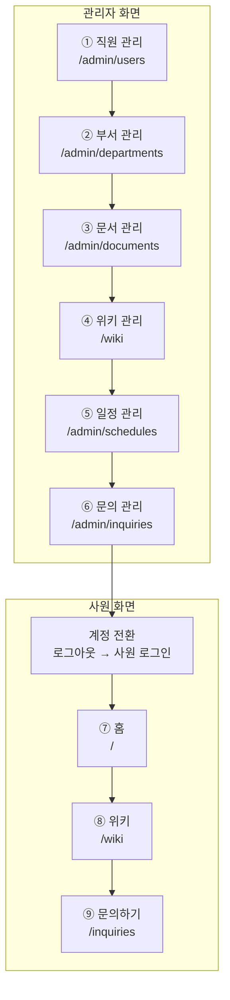

# 04. 시연 시나리오

시연 순서에 따른 화면·경로·클릭 위치를 기술한다.

> **표기 기준**
> 경로(URL)·메뉴명·화면 제목뿐 아니라 **버튼·입력창 문구까지 프론트 소스에서 확인한 정본이다.**
> 큰따옴표로 감싼 문구는 화면에 그대로 나타난다.

---

## 1. 사전 준비

### 1.1 접속 정보

| 항목 | 값 |
| --- | --- |
| 서비스 URL | https://i15b106.p.ssafy.io |
| 데모 스택 | https://\<서버\>:8090 — `docker-compose.demo.yml` |

### 1.2 시연 계정

| 역할 | 계정 | 비고 |
| --- | --- | --- |
| 최고관리자 | `SUPER_ADMIN_EMAIL` 계정 | `bootstrap-admin.sh` 로 생성. 가입 승인·직원 상세 권한 |
| 부서관리자 | 부서 manager로 지정된 admin | 부서 범위로 제한됨 |
| 사원 | 승인된 employee 계정 | |
| 데모 스택 | `superadmin@ajt.com`(관리자), `seongho.bae@ajt.com`(사원) / `password123!` | 전 계정 동일 비밀번호 |

### 1.3 준비물

- [ ] 업로드용 원본문서 (DOCX / PDF / TXT / MD) — 사내 규정·매뉴얼 성격 2~3건
- [ ] 일정이 포함된 문서 (DOCX / PDF / CSV / XLSX) 1건
- [ ] 관리자·사원 시연 계정 (승인 완료 상태로 미리 생성 — 회원가입 화면은 시연하지 않음)
- [ ] 승인 대기(`pending`) 상태 계정 1건 — ①의 가입 승인 시연용
- [ ] AI 응답 대기 시간 확보 (위키 변환은 수 분 소요 가능)

### 1.4 권한 체계

| 역할 | 판정 기준 |
| --- | --- |
| 사원 (`employee`) | `member.role = employee` |
| 관리자 (`admin`) | `member.role = admin` |
| **최고관리자** | `admin` 이면서 이메일이 `SUPER_ADMIN_EMAIL` 과 일치 + `APPROVED` + `ACTIVE` |

가입 상태: `pending` → `approved` / `rejected`  ·  계정 상태: `active` / `inactive`

### 1.5 사이드바 메뉴 구성

| 사원 | 관리자 |
| --- | --- |
| 홈 (`/`) | 직원 관리 (`/admin/users`) |
| 위키 (`/wiki`) | 부서 관리 (`/admin/departments`) |
| 문의하기 (`/inquiries`) | 문서 관리 (`/admin/documents`) |
| | 위키 관리 (`/wiki`) |
| | 일정 관리 (`/admin/schedules`) |
| | 문의 관리 (`/admin/inquiries`) |

---

## 2. 시연 흐름 요약

관리자 화면 6개를 사이드바 순서대로 훑은 뒤, 사원 계정으로 전환해 사원 화면 3개를 보여준다.

**총 예상 시간: 12~15분** (AI 작업 대기 포함)

---

## 3. 상세 시나리오 — 관리자 화면

시작: `/login`에서 **관리자 계정으로 로그인** → 사이드바 순서대로 진행한다.

### ① 직원 관리

| 화면 | 경로 |
| --- | --- |
| 직원 관리 | `/admin/users` |
| 직원 상세 | `/admin/users/:userId` (최고관리자 전용) |
| 가입 승인 관리 | `/admin/signup-requests` (최고관리자 전용) |

**순서**

1. 사이드바 **[직원 관리]** 클릭 → `/admin/users`
2. **직원들을 관리하는 페이지**임을 설명 — 목록에서 이름·이메일·소속 부서·역할·계정 상태 확인
3. 검색창에 이름·이메일·**부서명**을 입력해 검색되는 것을 보여준다
4. 직원 행 클릭 → 직원 상세에서 역할·소속 부서·계정 상태를 볼 수 있음을 확인
5. 화면 우측 상단 **"가입 승인"** 버튼 클릭 → `/admin/signup-requests`
   - 버튼 옆에 **대기 건수 배지**가 붙는다. 버튼은 **최고관리자에게만 보인다**
6. **"가입 요청"** 표에서 대기 건의 **"승인"** 클릭 (반려는 **"거부"**)
   - 토스트 `가입을 승인했습니다.` 확인
7. 좌측 상단 **"직원 관리"** 링크로 돌아가 승인된 계정이 목록에 나타나는 것을 확인

**시연 포인트**
- 가입은 신청 즉시 사용 불가 — **관리자 승인 후에만 로그인**할 수 있다.
- 검색은 이름·이메일뿐 아니라 **소속 부서명까지 OR 조건으로** 조회된다.
- 상세·수정과 가입 승인은 **최고관리자 전용**이다.

---

### ② 부서 관리

| 화면 | 경로 |
| --- | --- |
| 부서 관리 | `/admin/departments` |

**순서**

1. 사이드바 **[부서 관리]** 클릭
2. 부서 목록 확인 — 부서명, 소속 인원 등
2. **"부서 현황"** 표에서 부서명·인원 수·부서 관리자를 확인
3. **부서 추가** — 우측 **"부서 추가"** 폼의 입력창(`추가할 부서명 입력`)에 이름을 넣고 **"부서 추가"** 클릭
   - 토스트 `부서가 추가되었습니다.` 확인
4. 방금 만든 부서 행의 **"삭제"** 클릭 → 확인 창 **"부서를 삭제할까요?"** 에서 **"삭제"**

**시연 포인트**
- 부서는 문서·위키·일정의 **공개 범위 기준**이 되는 단위다.
- **소속 인원이 1명이라도 있으면 삭제 버튼이 비활성**된다(툴팁으로 인원 수를 알려준다).
  그래서 삭제 시연은 방금 만든 빈 부서로 한다.
- 기본 부서 **"미지정"** 은 수정·삭제가 막혀 있고 `기본 부서` 라고만 표시된다.

---

### ③ 문서 관리

| 화면 | 경로 |
| --- | --- |
| 업로드 | `/admin/documents` |
| 원본 문서 목록 | `/admin/documents/source` |
| AI 작업 처리 중 | `/admin/documents/jobs/:jobId/progress` |
| 요약 목록 | `/admin/documents/summaries` |

**순서**

1. 사이드바 **[문서 관리]** 클릭 → `/admin/documents`. 탭은 **"업로드" · "원본 문서" · "요약 목록"** 셋이다
2. 업로드 카드 두 개를 보여준다 — **"문서 파일"**(규정·안내문 등)과 **"일정 파일"**(회의·교육·행사)
3. 드롭존(`파일을 끌어다 놓거나 클릭하여 업로드`)에 파일을 넣거나 **"파일 선택"** 클릭
4. 아래 **"AI 작업 대기"** 목록에서 그 파일의 **"공개 부서"** 와 **"카테고리"** 를 지정한다
   - 공개 부서는 **"전체 공개"** 또는 부서 다중 선택 후 **"적용"**
   - **둘 다 지정해야 작업을 시작할 수 있다**
5. **"AI 작업 시작"** 클릭 → 확인 창(`N개 파일의 AI 작업을 시작할까요?`)에서 다시 **"AI 작업 시작"**
6. **"원본 문서"** 탭에서 업로드된 원본 목록과 미리보기를 확인
7. **"요약 목록"** 탭으로 이동 → 미리 완료해 둔 작업의 **"요약 보기"** 클릭
8. 모달에서 **"반영 내용"**(무엇을 어떻게 바꿨는지)과 **"반영된 위키"**(링크) 확인
   - 목록의 **"생성·변경된 위키 문서"** 열에서도 같은 정보를 볼 수 있다

**시연 포인트**
- 지원 형식: 위키 원본은 **TXT·MD·DOCX·PDF**, 일정 원본은 여기에 **CSV·XLSX** 추가
- 용량 제한: **파일당 20MB, 요청 총 100MB**
- 스캔 PDF는 **비전 OCR**로 텍스트를 추출한다 (Gemini 사용)
- 변환은 수 분이 걸릴 수 있다(백엔드 read timeout **10분**). 4번에서 작업만 시작해 두고, **미리 완료해 둔 결과**로 6번을 진행해 대기 시간을 없앤다.
- 사용 모델: `claude-sonnet-4-6` (Anthropic API — 경유 여부는 `ANTHROPIC_BASE_URL` 이 정한다. 02번 문서 1절 참고)

---

### ④ 위키 관리

| 화면 | 경로 |
| --- | --- |
| 위키 | `/wiki`, `/wiki/:wikiId` |

**순서**

1. 사이드바 **[위키 관리]** 클릭
2. 좌측에서 **부서**와 **위키 목록 카테고리** 구조를 보여준다
3. 위키 문서를 선택해 본문 확인 — Markdown 렌더링, 표·코드블록, **Mermaid 다이어그램**
4. 본문 아래 **"근거와 관련 문서"** 에서 **"출처 원본"**(이 위키를 생성할 때 참고한 원본 문서)과
   **"관련 위키"**(서로 연결된 다른 위키)를 확인한다. 원본을 클릭하면 미리보기가 열린다
5. 우측 **"AI 문서 편집"** 패널의 입력창(`메시지를 입력하세요...`)에 수정 요청을 적고 보낸다
   - 예: *"연차 신청 절차에 반차 규정을 추가해줘"*
6. 에이전트 답변 확인 — 무엇을 어떻게 바꿨는지 설명과 근거가 함께 온다

**시연 포인트**
- 위키는 **권한 범위(전사/부서) 안의 것만** 보인다.
- 사람이 직접 문서를 고치는 대신 **에이전트에게 요청**하면 되고, 결과는 근거와 함께 제시된다.
- **"AI 문서 편집" 패널은 관리자에게만 보인다.** 최고관리자는 모든 위키에서, 부서관리자는
  자기 부서 위키에서만 열린다. 사원 화면(⑧)에는 아예 없다 — 대조 포인트로 쓴다.
- 원본문서 → 위키의 **추적 가능성**이 이 서비스의 핵심 가치다.

---

### ⑤ 일정 관리

| 화면 | 경로 |
| --- | --- |
| 일정 관리 | `/admin/schedules` |

**순서**

1. 사이드바 **[일정 관리]** 클릭
2. 화면 아래 **"승인 대기 일정 목록"** 확인 — ③에서 올린 일정 파일에서 AI가 뽑은 초안이다
   (설명: `AI가 문서에서 추출한 일정입니다. 승인해야 캘린더에 반영됩니다`)
3. 항목의 **"상세 보기"** 클릭 → **"일정 상세"** 모달에서 제목·시간·장소·출처 문서를 검토한 뒤
   **"승인"** (반려는 **"거부"**, 거부하면 즉시 삭제되고 되돌릴 수 없다)
4. 화면 위쪽 달력으로 이동 → **"월" / "주"** 뷰를 바꾸고 이전/다음 달로 넘겨 보여준다
5. 달력 위 탭에서 **"전체 일정"** 과 부서 탭을 오가며 범위별로 나뉘는 것을 보여준다

**시연 포인트**
- 일정 상태는 **초안(draft) → 확정(approved)** 2단계다. AI 추출 결과를 사람이 검수한다.
- 일정 추출은 `claude-haiku-4-5-20251001`을 쓰는 **단발 호출**이며 최대 180초다.
- 시각 변환·연도 추론은 LLM이 아니라 **코드가 처리**해 정확도를 보장한다.

---

### ⑥ 문의 관리

| 화면 | 경로 |
| --- | --- |
| 문의 관리 | `/admin/inquiries` |
| 문의 상세 | `/admin/inquiries/:inquiryId` |

**순서**

1. 사이드바 **[문의 관리]** 클릭
2. 사원이 **위키/일정에 대해 남긴 문의**가 모이는 곳임을 설명 — 상태는 **"미처리" / "처리완료"** 로 표시된다
3. 문의 행의 **"상세"** 클릭 → 상세 화면 진입
4. **"답변 작성"** 영역에 내용을 적고 **"답변 등록"** 클릭 → 확인 창에서 **"등록하기"**
   - 등록하면 상태가 **"처리완료"** 로 바뀐다. 이후 ⑨에서 사원 화면으로 확인한다

---

## 3-2. 상세 시나리오 — 사원 화면

**계정 전환:** 로그아웃 → 사원 계정으로 로그인.
사이드바가 **홈 / 위키 / 문의하기** 3개로 줄어든 것을 먼저 보여준다.

### ⑦ 홈

| 화면 | 경로 |
| --- | --- |
| 홈 | `/` |

**순서**

1. 로그인 직후 홈 화면에서 **내게 공개된 일정**(전사·부서·개인)을 확인
2. 우측 상단 **"일정 추가"** 클릭 → **"새 일정 추가"** 모달에서 **제목·시작·종료**(장소·상세는 선택)
   를 채우고 **"추가"**
3. 달력에 방금 추가한 개인 일정이 표시되는 것을 확인

**시연 포인트**
- 사원에게는 **권한 범위 안의 일정만** 보인다. 관리자 화면(⑤)과 대조한다.

---

### ⑧ 위키

| 화면 | 경로 |
| --- | --- |
| 위키 | `/wiki`, `/wiki/:wikiId` |

**순서**

1. 사이드바 **[위키]** 클릭
2. 위키가 **부서별로 제공되는지** 확인 — 관리자 화면(④)보다 목록이 좁아진 것을 대조해 보여준다
3. 화면 우하단 **떠 있는 버튼**을 눌러 **"AI 검색 어시스턴트"** 를 연다
   - 사이드바 메뉴가 아니라 **모든 화면에 떠 있는 버튼**이다. 부제는 `사내 위키와 일정 기반으로 답변해요`
4. 입력창(`질문을 입력하세요...`)에 질문을 넣는다 — 예: *"연차 신청은 어떻게 하나요?"*
5. 답변 아래 **"위키 출처"**(또는 **"일정 출처"**) 카드를 클릭해 해당 위키 문서로 이동하는 것을 보여준다

**시연 포인트**
- 질문 유형은 **위키 / 일정 / 혼합**으로 분류되어 처리된다.
- 답변 근거는 `answer_source`로 저장되어 **출처를 항상 제시**한다.
- 권한 범위 밖 지식·일정은 검색 대상에서 제외된다 — **보안 시연 포인트**

---

### ⑨ 문의하기

| 화면 | 경로 |
| --- | --- |
| 문의 목록 | `/inquiries` |
| 문의 작성 | `/inquiries/new` |

**순서**

1. 사이드바 **[문의하기]** 클릭
2. **위키/일정에 대해 관리자에게 문의할 수 있는 페이지**임을 설명
3. **"문의하기"** 버튼 클릭 → 작성 화면(`어떤 도움이 필요하신가요?`)
4. **제목 · 상세 내용 · 문의 담당자 · 우선순위**를 채우고(첨부 파일은 선택) **"제출하기"**
   - 첨부는 PNG·JPG·JPEG, 최대 5개·파일당 20MB·총 100MB
   - 완료 화면 `문의가 접수됐어요` → **"내 문의 확인하기"**
5. **"내 문의"** 목록에서 방금 등록한 건과, ⑥에서 관리자가 답변해 **"처리완료"** 가 된 건을 함께 확인

---

## 4. 부가 시연 (시간 여유 시)

| 기능 | 경로 | 내용 |
| --- | --- | --- |
| 비밀번호 찾기 | `/password/find` → `/password/reset` | 이메일로 **6자리 인증번호** 발송 → 검증 → 재설정 (유효 30분) |
| 내 정보 | `/me` | 프로필 확인·수정, 비밀번호 변경 |

---

## 5. 시연 전 체크리스트

- [ ] 서비스가 HTTPS로 정상 응답하는가 — `curl -k https://<도메인>/api/v1/health`
- [ ] 4개 컨테이너가 모두 `healthy` 인가 — `docker compose -p ajt-prod ps`
- [ ] 최고관리자 계정으로 로그인되는가
- [ ] 사원·부서관리자 시연 계정이 준비됐는가
- [ ] 업로드용 문서 파일이 준비됐는가 (20MB 이하)
- [ ] **AI 변환 결과가 미리 1건 이상 만들어져 있는가** (대기 시간 대비)
- [ ] `ANTHROPIC_API_KEY` / `GEMINI_API_KEY` 크레딧·할당량이 남아 있는가
- [ ] SMTP 일일 발송 한도에 여유가 있는가 (비밀번호 찾기 시연 시)
- [ ] 브라우저 캐시·이전 세션 쿠키를 정리했는가 (시크릿 창 권장)
