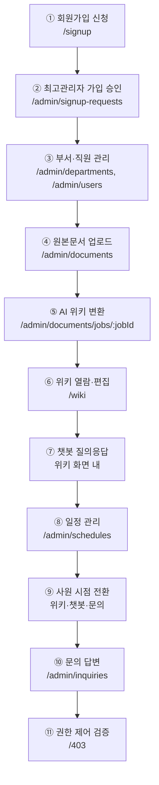

# 04. 시연 시나리오

시연 순서에 따른 화면·경로·클릭 위치를 기술한다.

> **표기 기준**
> 경로(URL), 사이드바 메뉴명, 화면 제목은 코드(`frontend/src/routes/index.jsx`,
> `frontend/src/components/layout/navConfig.jsx`)에서 확인한 정본이다.
> 화면 **내부의 세부 버튼 문구**는 시연 리허설 때 실제 화면과 대조해 확정한다 (⚠️ 표시).

---

## 1. 사전 준비

### 1.1 접속 정보

| 항목 | 값 |
| --- | --- |
| 서비스 URL | https://i15b106.p.ssafy.io |
| 데모 스택(선택) | https://\<서버\>:8090 — `docker-compose.demo.yml` |

### 1.2 시연 계정

| 역할 | 계정 | 비고 |
| --- | --- | --- |
| 최고관리자 | `SUPER_ADMIN_EMAIL` 계정 | `bootstrap-admin.sh` 로 생성. 가입 승인·직원 상세 권한 |
| 부서관리자 | 부서 manager로 지정된 admin | 부서 범위로 제한됨 |
| 사원 | 승인된 employee 계정 | |
| 데모 스택 | `admin@ajt.com` / `password123!` | 전 계정 동일 비밀번호 |

### 1.3 준비물

- [ ] 업로드용 원본문서 (DOCX / PDF / TXT / MD) — 사내 규정·매뉴얼 성격 2~3건
- [ ] 일정이 포함된 문서 (DOCX / PDF / CSV / XLSX) 1건
- [ ] 신규 가입 시연용 미사용 이메일 1개
- [ ] AI 응답 대기 시간 확보 (위키 변환은 수 분 소요 가능)

### 1.4 권한 체계

| 역할 | 판정 기준 |
| --- | --- |
| 사원 (`employee`) | `member.role = employee` |
| 관리자 (`admin`) | `member.role = admin` |
| **최고관리자** | `admin` 이면서 이메일이 `SUPER_ADMIN_EMAIL` 과 일치 + `APPROVED` + `ACTIVE` |

가입 상태: `pending` → `approved` / `rejected`  ·  계정 상태: `active` / `inactive`

### 1.5 사이드바 메뉴 구성

| 사원 | 관리자 |
| --- | --- |
| 홈 (`/`) | 직원 관리 (`/admin/users`) |
| 위키 (`/wiki`) | 부서 관리 (`/admin/departments`) |
| 문의하기 (`/inquiries`) | 문서 관리 (`/admin/documents`) |
| | 위키 관리 (`/wiki`) |
| | 일정 관리 (`/admin/schedules`) |
| | 문의 관리 (`/admin/inquiries`) |

---

## 2. 시연 흐름 요약

**총 예상 시간: 12~15분** (AI 변환 대기 포함)

---

## 3. 상세 시나리오

### ① 회원가입 신청 — 사원 시점

| 항목 | 내용 |
| --- | --- |
| 경로 | `/signup` |
| 화면 | 회원가입 |

**순서**

1. 브라우저에서 서비스 URL 접속 → 로그인 화면(`/login`)이 표시된다.
2. 하단 **"이미 계정이 있으신가요?"** 영역의 반대편, 또는 로그인 화면의 회원가입 링크를 클릭 → `/signup` 이동
3. 폼 입력 (위에서부터)

   | 필드 | 입력값 | 제약 |
   | --- | --- | --- |
   | 이름 | 홍길동 | 최대 30자, 한글·영문만, 공백은 단어 사이 한 칸 |
   | 이메일 | `demo@company.com` | 최대 30자, **대문자 입력 시 자동 소문자 변환** |
   | 소속 부서 | 드롭다운에서 선택 | 필수 |
   | 비밀번호 | `Password1!` | 8~15자, 대·소문자·숫자·특수문자 각 1자 이상 |
   | 비밀번호 확인 | 동일 입력 | |

4. **[가입 신청]** 버튼 클릭
5. **"가입 신청이 접수됐어요"** 완료 화면 확인 → **[로그인 화면으로]** 클릭

**시연 포인트**
- 이메일 칸에 대문자를 타이핑하면 **즉시 소문자로 바뀌는 것**을 보여준다 (서버 정규화와 일치).
- 30자를 넘겨 입력하면 **더 이상 입력되지 않는 것**을 보여준다.
- 승인 전에는 로그인이 불가함을 언급한다.

---

### ② 가입 승인 — 최고관리자 시점

| 항목 | 내용 |
| --- | --- |
| 경로 | `/admin/signup-requests` (최고관리자 전용) |
| 화면 | 가입 승인 관리 |

**순서**

1. `/login`에서 최고관리자 계정으로 로그인
2. 사이드바 **[직원 관리]** 클릭 → `/admin/users`
3. 가입 승인 관리 화면(`/admin/signup-requests`)으로 이동 ⚠️*(진입 버튼/탭 문구 확인 필요)*
4. 목록에서 ①에서 신청한 계정을 찾아 **승인** 처리
5. `/admin/users`로 돌아가 해당 계정이 목록에 나타나는지 확인

**시연 포인트**
- 이 화면은 **최고관리자 전용**이다. 부서관리자가 URL로 직접 접근하면 `/403`으로 이동한다(⑪에서 시연).

---

### ③ 부서·직원 관리 — 최고관리자 시점

| 화면 | 경로 |
| --- | --- |
| 부서 관리 | `/admin/departments` |
| 직원 관리 | `/admin/users` |
| 직원 상세 | `/admin/users/:userId` (최고관리자 전용) |
| 직원 정보 수정 | `/admin/users/:userId/edit` (최고관리자 전용) |

**순서**

1. 사이드바 **[부서 관리]** → 부서 목록 확인, 부서 추가/수정 시연 ⚠️
2. 사이드바 **[직원 관리]** → 검색창에 이름·이메일·**부서명**을 입력해 검색되는 것을 보여준다
3. 직원 행 클릭 → 직원 상세(`/admin/users/:userId`)
4. 수정 진입 → 역할(`admin`/`employee`)·소속 부서·계정 상태 변경 시연 ⚠️

**시연 포인트**
- 검색은 이름·이메일뿐 아니라 **소속 부서명까지 OR 조건으로** 조회된다.
- 사용자 목록은 부서관리자도 볼 수 있으나, **상세·수정은 최고관리자 전용**이다.

---

### ④ 원본문서 업로드 — 관리자 시점

| 화면 | 경로 |
| --- | --- |
| 업로드 | `/admin/documents` |
| 카테고리 관리 | `/admin/documents/categories` |
| 원본 문서 목록 | `/admin/documents/source` |
| 원본 문서 상세 | `/admin/documents/source/:documentId` |

**순서**

1. 사이드바 **[문서 관리]** 클릭 → `/admin/documents` (화면 제목 **"업로드"**)
2. 먼저 카테고리 관리(`/admin/documents/categories`)로 이동해 카테고리를 확인/추가 ⚠️
3. 업로드 화면으로 돌아와 공개 범위(전사/부서)와 카테고리를 선택 ⚠️
4. 준비한 원본문서를 첨부 → 업로드 실행
5. 원본 문서 목록(`/admin/documents/source`)에서 업로드된 문서 확인
6. 문서 행 클릭 → 원본 문서 상세에서 **미리보기**(PDF/DOCX 렌더링) 확인

**시연 포인트**
- 지원 형식: 위키 원본은 **TXT·MD·DOCX·PDF**, 일정 원본은 여기에 **CSV·XLSX** 추가
- 용량 제한: **파일당 20MB, 요청 총 100MB**
- 스캔 PDF는 **비전 OCR**로 텍스트를 추출한다 (Gemini 사용)

---

### ⑤ AI 위키 변환 — 관리자 시점

| 화면 | 경로 | 제목 |
| --- | --- | --- |
| AI 작업 대기 | `/admin/documents/jobs/:jobId` | AI 작업 대기 |
| AI 작업 처리 중 | `/admin/documents/jobs/:jobId/progress` | AI 작업 처리 중 |
| AI 작업 요약 | `/admin/documents/jobs/:jobId/summary` | AI 작업 요약 |
| 요약 목록 | `/admin/documents/summaries` | 요약 목록 |

**순서**

1. 업로드한 문서를 선택해 **AI 위키 변환 작업을 생성** ⚠️
2. **AI 작업 대기** 화면에서 변환 대상 문서 목록 확인 → 실행
3. **AI 작업 처리 중** 화면에서 진행 상태가 갱신되는 것을 보여준다
4. 완료 후 **AI 작업 요약** 화면에서 결과 확인
   - 어떤 위키 문서가 **생성/수정**되었는지
   - 각 변경의 **근거 원본문서**
5. `/admin/documents/summaries`에서 지난 작업 요약 이력 확인

**시연 포인트**
- 에이전트는 라이브 위키를 **읽기 전용**으로 참조하고, 모든 쓰기는 작업 공간에서 이뤄진 뒤 검수를 거쳐 반영된다.
- 변환은 수 분이 걸릴 수 있다(백엔드 read timeout **10분**). **미리 변환해 둔 결과를 함께 준비**해 대기 시간을 메운다.
- 사용 모델: `claude-sonnet-4-6` (SSAFY GMS 경유)

---

### ⑥ 위키 열람 — 관리자/사원 공통

| 화면 | 경로 |
| --- | --- |
| 위키 | `/wiki`, `/wiki/:wikiId` |

**순서**

1. 사이드바 **[위키 관리]**(관리자) 또는 **[위키]**(사원) 클릭
2. 좌측 목차/카테고리에서 ⑤에서 생성된 위키 문서 선택
3. 본문 확인 — Markdown 렌더링, 표·코드블록, **Mermaid 다이어그램** 지원
4. 문서 내 **각주·출처 링크**를 눌러 근거 원본문서로 이동하는 것을 보여준다
5. 위키 참조 관계 그래프 확인 ⚠️ *(제공 화면 여부 확인 필요)*

**시연 포인트**
- 위키는 **권한 범위(전사/부서) 안의 것만** 보인다.
- 원본문서 → 위키의 **추적 가능성**이 이 서비스의 핵심 가치다.

---

### ⑦ 챗봇 질의응답

**순서**

1. 위키 화면에서 챗봇 입력창에 질문 입력 ⚠️ *(진입 위치 확인 필요)*
2. 지식 질문 예: *"연차 신청은 어떻게 하나요?"*
3. 답변과 함께 표시되는 **근거 출처(위키 문서 링크)** 확인
4. 일정 질문 예: *"다음 주 부서 일정 알려줘"*
5. 사원 계정으로 같은 질문을 했을 때 **권한 밖 정보는 답변에 포함되지 않음**을 보여준다

**시연 포인트**
- 질문 유형은 **위키 / 일정 / 혼합**으로 분류되어 처리된다.
- 답변 근거는 `answer_source`로 저장되어 **출처를 항상 제시**한다.
- 권한 범위 밖 지식·일정은 검색 대상에서 제외된다 — **보안 시연 포인트**

---

### ⑧ 일정 관리 — 관리자 시점

| 화면 | 경로 |
| --- | --- |
| 일정 관리 | `/admin/schedules` |

**순서**

1. 사이드바 **[일정 관리]** 클릭
2. 달력에서 전사·부서·개인 일정이 구분 표시되는 것을 확인
3. **일정 직접 등록** — 제목·기간·공개범위(전사/부서/개인) 입력 후 저장 ⚠️
4. **일정 문서 업로드 → AI 자동 추출**
   - 일정이 담긴 문서(DOCX/PDF/CSV/XLSX)를 업로드
   - AI가 추출한 **일정 초안(draft)** 목록 확인
   - 초안을 검토·수정 후 **확정(approved)** 처리 ⚠️

**시연 포인트**
- 일정 상태는 **초안(draft) → 확정(approved)** 2단계다. AI 추출 결과를 사람이 검수한다.
- 일정 추출은 `claude-haiku-4-5-20251001`을 쓰는 **단발 호출**이며 최대 180초다.
- 시각 변환·연도 추론은 LLM이 아니라 **코드가 처리**해 정확도를 보장한다.

---

### ⑨ 사원 시점 전환

**순서**

1. 로그아웃 후 사원 계정으로 로그인
2. 사이드바가 **홈 / 위키 / 문의하기** 3개로 줄어든 것을 보여준다
3. **[위키]** — 권한 범위 내 문서만 보이는 것 확인 (관리자 화면과 대조)
4. 챗봇으로 같은 질문 → 답변 범위가 좁혀지는 것 확인
5. **[문의하기]**(`/inquiries`) → **문의 작성**(`/inquiries/new`)
   - 제목·내용 입력, 첨부파일 추가 후 등록 ⚠️
6. `/me`(내 정보)에서 프로필·비밀번호 변경 화면 확인

---

### ⑩ 문의 답변 — 관리자 시점

| 화면 | 경로 |
| --- | --- |
| 문의 관리 | `/admin/inquiries` |
| 문의 상세 | `/admin/inquiries/:inquiryId` |

**순서**

1. 관리자로 재로그인 → 사이드바 **[문의 관리]**
2. ⑨에서 등록한 문의를 목록에서 확인 → 클릭해 상세 진입
3. 답변 작성 후 등록 ⚠️
4. 사원 계정에서 `/inquiries`로 답변이 도착한 것을 확인

---

### ⑪ 권한 제어 검증

**순서**

1. **부서관리자** 계정으로 로그인
2. 주소창에 `/admin/signup-requests` 직접 입력 → **`/403` 접근 거부 화면**으로 이동
3. `/admin/users/1` 직접 입력 → 동일하게 `/403`
4. 비로그인 상태에서 `/admin/users` 접근 → 로그인 화면으로 리다이렉트
5. 존재하지 않는 경로 입력 → **404 화면**

**시연 포인트**
- 접근 제어는 화면 숨김이 아니라 **라우트 가드 + 서버 검증** 2중으로 동작한다.
  - `GuestRoute` (비로그인 전용) / `ProtectedRoute` (로그인 필요) / `RoleRoute` (역할) / `SuperAdminRoute` (최고관리자)

---

## 4. 부가 시연 (시간 여유 시)

| 기능 | 경로 | 내용 |
| --- | --- | --- |
| 비밀번호 찾기 | `/password/find` → `/password/reset` | 이메일로 **6자리 인증번호** 발송 → 검증 → 재설정 (유효 30분) |
| 내 정보 | `/me` | 프로필 확인·수정 |
| 홈 대시보드 | `/` | 역할별 홈 화면(`RoleHomePage`) |

---

## 5. 시연 전 체크리스트

- [ ] 서비스가 HTTPS로 정상 응답하는가 — `curl -k https://<도메인>/api/v1/health`
- [ ] 4개 컨테이너가 모두 `healthy` 인가 — `docker compose -p ajt-prod ps`
- [ ] 최고관리자 계정으로 로그인되는가
- [ ] 사원·부서관리자 시연 계정이 준비됐는가
- [ ] 업로드용 문서 파일이 준비됐는가 (20MB 이하)
- [ ] **AI 변환 결과가 미리 1건 이상 만들어져 있는가** (대기 시간 대비)
- [ ] `ANTHROPIC_API_KEY` / `GEMINI_API_KEY` 크레딧·할당량이 남아 있는가
- [ ] SMTP 일일 발송 한도에 여유가 있는가 (비밀번호 찾기 시연 시)
- [ ] 브라우저 캐시·이전 세션 쿠키를 정리했는가 (시크릿 창 권장)

---

## 6. 시연 중 문제 발생 시

| 증상 | 즉시 조치 |
| --- | --- |
| AI 변환이 오래 걸림 | 미리 만들어 둔 완료 작업(`/admin/documents/summaries`)으로 전환 |
| 챗봇 응답 없음 | GMS 키 할당량 확인. 위키 열람 시연으로 우회 |
| 스캔 PDF 텍스트 깨짐 | `GEMINI_API_KEY` 확인. 텍스트 PDF로 대체 |
| 메일이 오지 않음 | 네이버 일일 한도. 비밀번호 찾기 시연 생략 |
| 로그인 직후 로그아웃 | HTTP로 접속했는지 확인 (쿠키 `secure=true`) |
| 화면이 갱신되지 않음 | 강력 새로고침(Ctrl+Shift+R) — `index.html`은 `no-cache` |
