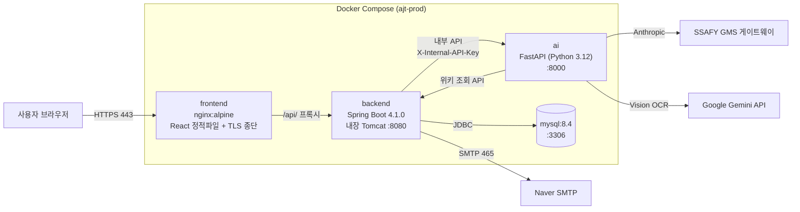

# AJT 포팅 매뉴얼

**AJT (AUTO Janitor Tool)** — 사내 LLM Wiki 및 일정 관리 시스템

관리자가 업로드한 원본문서를 AI 위키 편집자 에이전트가 사내 위키로 변환하고,
전사·부서·개인 일정을 관리하며, 챗봇으로 권한 범위 내 지식·일정에 질의응답하는 서비스.

| 항목 | 값 |
| --- | --- |
| 서비스 URL | https://i15b106.p.ssafy.io |
| 형상관리 | GitLab `s15-webmobile2-sub1/S15P11B106` |
| 배포 브랜치 | `master`(운영, 443) / `develop`(검증, 8090) |
| 문서 작성일 | 2026-08-06 |

---

## 1. 문서 구성

| 파일 | 내용 | 제출 요구항목 |
| --- | --- | --- |
| [01_빌드_및_배포_가이드.md](01_빌드_및_배포_가이드.md) | JVM·웹서버·WAS 버전과 설정값, 빌드 환경변수, 배포 특이사항, 프로퍼티 파일 목록 | 1번 |
| [02_외부서비스_정보.md](02_외부서비스_정보.md) | 외부 서비스 가입·발급·설정 정보 | 2번 |
| [03_DB_덤프_가이드.md](03_DB_덤프_가이드.md) | DB 스키마 구성과 덤프 생성·복원 절차 | 3번 |
| [04_시연_시나리오.md](04_시연_시나리오.md) | 화면별 시연 순서와 클릭 위치 | 4번 |

> DB 덤프 파일 실물은 `exec/db/` 아래에 둔다. 생성 절차는 03번 문서 참고.

---

## 2. 시스템 아키텍처

Docker Compose 단일 호스트에 4개 컨테이너로 구성한다.
외부에 열리는 포트는 **443(HTTPS) 하나**이며, 나머지는 Compose 내부 네트워크에서만 통신한다.



### 컨테이너 구성

| 서비스 | 이미지 | 포트 | 역할 |
| --- | --- | --- | --- |
| `frontend` | `ajt-frontend:<commit>` | **443 → 호스트 공개** | React 빌드 산출물 서빙, TLS 종단, `/api/` 리버스 프록시 |
| `backend` | `ajt-backend:<commit>` | 8080 (내부) | REST API, 인증, 파일 저장, AI 오케스트레이션 |
| `ai` | `ajt-ai:<commit>` | 8000 (내부, `expose`) | 문서 파싱·위키 변환 에이전트·일정 추출·챗봇 응답 |
| `mysql` | `mysql:8.4` | 3306 (내부) | 데이터 저장 |

### 데이터 영속화 (볼륨)

| 볼륨 | 마운트 | 내용 |
| --- | --- | --- |
| `ajt-prod-mysql-data` | `mysql:/var/lib/mysql` | DB 데이터 |
| `ajt-prod-files` | `backend:/data/ajt` | 업로드 원본문서·일정 원본·문의 첨부 |
| `/etc/letsencrypt` (bind, ro) | `frontend:/etc/letsencrypt` | TLS 인증서 |

> 볼륨 이름은 `MYSQL_VOLUME_NAME` / `AJT_FILES_VOLUME_NAME` 로 환경별 분리한다.
> 같은 서버의 `develop` 검증 스택과 운영 스택이 데이터를 공유하지 않게 하기 위함이다.

---

## 3. 빠른 시작 (요약)

전체 절차는 [01_빌드_및_배포_가이드.md](01_빌드_및_배포_가이드.md) 참고.

```bash
# 1. 소스 클론
git clone https://lab.ssafy.com/s15-webmobile2-sub1/S15P11B106.git
cd S15P11B106

# 2. 환경변수 파일 작성 (.env.example 를 복사해 실제 값 채우기)
cp .env.example .env
#    필수 비밀값: AJT_ACCESS_TOKEN_SECRET, AJT_PASSWORD_RESET_SECRET,
#                MYSQL_ROOT_PASSWORD, MYSQL_PASSWORD, SPRING_DATASOURCE_PASSWORD,
#                AI_INTERNAL_API_KEY, ANTHROPIC_API_KEY, GEMINI_API_KEY
#    비밀키 생성: openssl rand -base64 48

# 3. 이미지 빌드 (커밋 SHA 태그)
export IMAGE_TAG=$(git rev-parse --short=12 HEAD)
docker build --tag "ajt-backend:${IMAGE_TAG}" backend
docker build --tag "ajt-frontend:${IMAGE_TAG}" frontend
docker build --target runtime --tag "ajt-ai:${IMAGE_TAG}" ai

# 4. 기동
docker compose --project-name ajt-prod --env-file .env up -d

# 5. 최초 1회 — 최고관리자 계정 생성
bash scripts/bootstrap-admin.sh

# 6. 헬스체크
curl -k https://127.0.0.1/api/v1/health
```

---

## 4. 저장소 구조

| 경로 | 내용 |
| --- | --- |
| `backend/` | Spring Boot API 서버 (Gradle, Java 21) |
| `frontend/` | React 19 + Vite + Tailwind 4 SPA |
| `ai/` | FastAPI AI 서버 (Python 3.12, uv) |
| `docs/` | 공통 문서 단일 관리 지점 (요구사항·컨벤션·ERD·API 계약) |
| `docs/db/erd.sql` | **DB 스키마 SSOT** — MySQL 컨테이너 초기화 스크립트로도 사용 |
| `docs/api/` | API 계약 (Postman Collection) |
| `scripts/` | 배포·부트스트랩 스크립트 |
| `Jenkinsfile` | CI/CD 파이프라인 |
| `docker-compose.yml` | 운영 배포 정의 |
| `docker-compose.demo.yml` | 시연용 (H2 인메모리 + 더미데이터) |
| `exec/` | **본 포팅 매뉴얼** |
